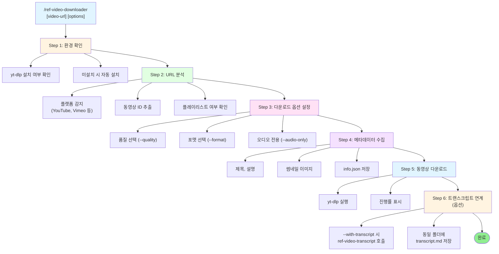

# ref-video-downloader

동영상을 다운로드하여 로컬에 저장하는 스킬.

## 목적

- YouTube, Vimeo 등 동영상 플랫폼에서 동영상 다운로드
- 품질/포맷 선택 지원
- 메타데이터 (제목, 설명, 썸네일) 자동 저장
- 배치 다운로드 (플레이리스트) 지원
- [@skills/ref-video-transcript/SKILL.md]와 연계하여 트랜스크립트 동시 저장

## 사용법

```
/ref-video-downloader https://www.youtube.com/watch?v=xxxxx
/ref-video-downloader https://www.youtube.com/watch?v=xxxxx --quality 1080p
/ref-video-downloader https://www.youtube.com/watch?v=xxxxx --audio-only
/ref-video-downloader https://www.youtube.com/playlist?list=xxxxx --playlist
```

## 옵션

| 옵션 | 설명 | 기본값 |
|------|------|--------|
| `--quality` | 동영상 품질 (480p, 720p, 1080p, 4K) | 720p |
| `--format` | 출력 포맷 (mp4, webm) | mp4 |
| `--audio-only` | 오디오만 추출 (mp3) | false |
| `--playlist` | 플레이리스트 전체 다운로드 | false |
| `--with-transcript` | 트랜스크립트 함께 저장 | false |
| `--lang` | 자막 언어 (ko, en, ja 등) | ko |

## 프로세스



## 출력 구조

```
docs/references/videos/
├── {sanitized-title}/
│   ├── video.mp4            # 다운로드된 동영상
│   ├── info.json            # 메타데이터 (제목, 설명, URL, 날짜)
│   ├── thumbnail.jpg        # 썸네일 이미지
│   └── transcript.md        # (선택) ref-video-transcript 연계 시
```

## 핵심 명령어

### yt-dlp 설치 확인 및 자동 설치

```bash
# 설치 확인
which yt-dlp || pip install yt-dlp

# 버전 확인
yt-dlp --version
```

### 품질별 다운로드

```bash
# 720p 다운로드
yt-dlp -f "bestvideo[height<=720]+bestaudio/best[height<=720]" \
  --merge-output-format mp4 \
  -o "docs/references/videos/%(title)s/video.%(ext)s" \
  "VIDEO_URL"

# 1080p 다운로드
yt-dlp -f "bestvideo[height<=1080]+bestaudio/best[height<=1080]" \
  --merge-output-format mp4 \
  -o "docs/references/videos/%(title)s/video.%(ext)s" \
  "VIDEO_URL"

# 4K 다운로드
yt-dlp -f "bestvideo[height<=2160]+bestaudio/best[height<=2160]" \
  --merge-output-format mp4 \
  -o "docs/references/videos/%(title)s/video.%(ext)s" \
  "VIDEO_URL"
```

### 오디오 전용 추출

```bash
yt-dlp -x --audio-format mp3 --audio-quality 0 \
  -o "docs/references/videos/%(title)s/audio.%(ext)s" \
  "VIDEO_URL"
```

### 메타데이터 저장

```bash
yt-dlp --write-info-json --write-thumbnail \
  --skip-download \
  -o "docs/references/videos/%(title)s/info" \
  "VIDEO_URL"
```

### 플레이리스트 다운로드

```bash
yt-dlp --yes-playlist \
  -f "bestvideo[height<=720]+bestaudio/best[height<=720]" \
  --merge-output-format mp4 \
  -o "docs/references/videos/playlist/%(playlist_index)s-%(title)s/video.%(ext)s" \
  "PLAYLIST_URL"
```

## 메타데이터 템플릿 (info.json)

```json
{
  "title": "동영상 제목",
  "description": "동영상 설명",
  "url": "원본 URL",
  "uploader": "채널명",
  "upload_date": "YYYYMMDD",
  "duration": 3600,
  "view_count": 10000,
  "downloaded_at": "2026-01-21T10:00:00Z",
  "quality": "720p",
  "format": "mp4"
}
```

## 예제

```
User: /ref-video-downloader https://www.youtube.com/watch?v=xyz123

Claude:
=== 동영상 다운로드 ===

URL: https://www.youtube.com/watch?v=xyz123

[1/5] 환경 확인 중...
  - yt-dlp 버전: 2026.01.15

[2/5] 동영상 정보 수집 중...
  - 제목: "FastAPI 완전 정복 2026"
  - 채널: TechTutorials
  - 길이: 1:23:45
  - 품질: 720p (기본값)

[3/5] 메타데이터 저장 중...
  - info.json 저장 완료
  - thumbnail.jpg 저장 완료

[4/5] 동영상 다운로드 중...
  [████████████████████] 100%
  - video.mp4 (512MB)

[5/5] 완료

=== 다운로드 완료 ===

저장 위치: docs/references/videos/fastapi-complete-2026/
├── video.mp4 (512MB)
├── info.json
└── thumbnail.jpg

💡 트랜스크립트도 필요하시면:
   /ref-video-transcript https://www.youtube.com/watch?v=xyz123
```

## 오디오 추출 예제

```
User: /ref-video-downloader https://www.youtube.com/watch?v=xyz123 --audio-only

Claude:
=== 오디오 추출 ===

URL: https://www.youtube.com/watch?v=xyz123

[1/3] 동영상 정보 확인...
  - 제목: "Podcast Episode 42"
  - 길이: 45:30

[2/3] 오디오 추출 중...
  [████████████████████] 100%

[3/3] MP3 변환 중...
  - audio.mp3 (42MB)

=== 완료 ===

저장 위치: docs/references/videos/podcast-episode-42/audio.mp3
```

## 플레이리스트 예제

```
User: /ref-video-downloader https://www.youtube.com/playlist?list=PLxxx --playlist

Claude:
=== 플레이리스트 다운로드 ===

URL: https://www.youtube.com/playlist?list=PLxxx

플레이리스트 정보:
- 제목: "Python 기초 강의"
- 동영상 수: 10개
- 총 길이: 약 5시간

계속 진행할까요? (Y/n)
→ Y

[1/10] 다운로드: "01. Python 소개" ✓
[2/10] 다운로드: "02. 변수와 타입" ✓
...
[10/10] 다운로드: "10. 마무리" ✓

=== 완료 ===

저장 위치: docs/references/videos/playlist/python-basics/
├── 01-python-intro/video.mp4
├── 02-variables-types/video.mp4
...
└── 10-conclusion/video.mp4
```

## 오류 처리

| 오류 | 원인 | 해결 |
|------|------|------|
| `yt-dlp not found` | yt-dlp 미설치 | 자동 설치 진행 |
| `Video unavailable` | 지역 제한/비공개 | VPN 또는 다른 영상 선택 |
| `Format not available` | 요청 품질 없음 | 낮은 품질로 자동 대체 |
| `Disk full` | 저장공간 부족 | 저장공간 확보 후 재시도 |

## 관련 스킬

| 스킬명 | 관계 | 설명 |
|--------|------|------|
| [@skills/ref-video-transcript/SKILL.md] | 연계 | 트랜스크립트 추출 |
| [@skills/prd-workflow/SKILL.md] | 부모 | 레퍼런스 수집 단계 |
| [@skills/markdown-converter/SKILL.md] | 관련 | 변환 도구 |

## Changelog

| 날짜 | 변경 내용 |
|------|----------|
| 2026-01-21 | 초기 스킬 생성 |
