# ref-video-transcript

동영상에서 트랜스크립트를 추출하는 스킬.

## 목적

- YouTube 등 동영상 자막 추출
- 다국어 자막 지원 (한국어, 영어, 일본어 등)
- 자동 생성 자막 품질 표시
- 트랜스크립트 마크다운 변환
- 기술 강연/튜토리얼 레퍼런스화
- [@skills/ref-video-downloader/SKILL.md]와 연계 가능

## 사용법

```
/ref-video-transcript https://www.youtube.com/watch?v=xxxxx
/ref-video-transcript https://www.youtube.com/watch?v=xxxxx --lang ko
/ref-video-transcript https://www.youtube.com/watch?v=xxxxx --lang ko,en
/ref-video-transcript https://www.youtube.com/watch?v=xxxxx --auto-generated
/ref-video-transcript https://www.youtube.com/watch?v=xxxxx --with-download
```

## 옵션

| 옵션 | 설명 | 기본값 |
|------|------|--------|
| `--lang` | 자막 언어 (ko, en, ja, zh 등, 쉼표로 다중 선택) | ko |
| `--auto-generated` | 자동 생성 자막 허용 | true |
| `--with-download` | 동영상 다운로드 연계 (ref-video-downloader) | false |
| `--format` | 출력 형식 (md, srt, vtt) | md |
| `--timestamps` | 타임스탬프 포함 여부 | true |

## 프로세스

```mermaid
flowchart TD
    Start(["/ref-video-transcript<br/>[video-url] [options]"]) --> Step1["Step 1: URL 분석"]

    Step1 --> Step1a["플랫폼 감지<br/>(YouTube, Vimeo 등)"]
    Step1a --> Step1b["동영상 ID 추출"]
    Step1b --> Step2["Step 2: 메타데이터 수집"]

    Step2 --> Step2a["제목, 채널명"]
    Step2a --> Step2b["길이, 업로드일"]
    Step2b --> Step3["Step 3: 자막 정보 조회"]

    Step3 --> Step3a["사용 가능한<br/>자막 언어 목록"]
    Step3a --> Step3b["수동 자막 vs<br/>자동 생성 자막 구분"]
    Step3b --> Step3c["자막 품질 평가"]
    Step3c --> Step4["Step 4: 트랜스크립트 추출"]

    Step4 --> Step4a["yt-dlp --write-sub<br/>--sub-lang {lang}"]
    Step4a --> Step4b["다중 언어 시<br/>각각 추출"]
    Step4b --> Step4c["자막 파일 파싱"]
    Step4c --> Step5["Step 5: 품질 분석<br/>(자동 생성 자막)"]

    Step5 --> Step5a["정확도 추정<br/>(낮음/중간/높음)"]
    Step5a --> Step5b["주의 표시 추가"]
    Step5b --> Step6["Step 6: 마크다운 변환"]

    Step6 --> Step6a["타임스탬프 포함"]
    Step6a --> Step6b["섹션 자동 구분<br/>(3분 간격 또는 주제 변경)"]
    Step6b --> Step6c["품질 표시 포함"]
    Step6c --> Step7["Step 7: 파일 저장"]

    Step7 --> Step7a["docs/references/videos/<br/>{title}/transcript.md"]
    Step7a --> Step7b["(연계 시)<br/>동일 폴더에 저장"]
    Step7b --> End([완료])

    style Start fill:#e1f5ff,stroke:#333,stroke-width:2px
    style Step1 fill:#fff4e1,stroke:#333,stroke-width:2px
    style Step2 fill:#e1ffe1,stroke:#333,stroke-width:2px
    style Step3 fill:#ffe1f5,stroke:#333,stroke-width:2px
    style Step4 fill:#f5e1ff,stroke:#333,stroke-width:2px
    style Step5 fill:#e1f5ff,stroke:#333,stroke-width:2px
    style Step6 fill:#fff4e1,stroke:#333,stroke-width:2px
    style Step7 fill:#e1ffe1,stroke:#333,stroke-width:2px
    style End fill:#ffe1f5,stroke:#333,stroke-width:2px
```



## 자막 언어 코드

| 코드 | 언어 |
|------|------|
| `ko` | 한국어 |
| `en` | 영어 |
| `ja` | 일본어 |
| `zh` | 중국어 |
| `es` | 스페인어 |
| `de` | 독일어 |
| `fr` | 프랑스어 |

## 자막 유형 및 품질

### 자막 유형

| 유형 | 설명 | 품질 |
|------|------|------|
| `manual` | 제작자가 직접 작성한 자막 | 높음 |
| `auto-generated` | YouTube 자동 생성 자막 | 중간~낮음 |
| `community` | 커뮤니티 기여 자막 | 다양함 |

### 자동 생성 자막 품질 표시

```markdown
> ⚠️ **자동 생성 자막**
> 이 트랜스크립트는 YouTube 자동 생성 자막을 기반으로 합니다.
> 추정 정확도: 중간 (약 85%)
> 전문 용어나 고유명사에서 오류가 있을 수 있습니다.
```

## 출력 템플릿

```markdown
# {동영상 제목}

> **채널**: {channel}
>
> **URL**: {video-url}
>
> **길이**: {duration}
>
> **업로드일**: {upload-date}
>
> **자막 유형**: {manual | auto-generated} ({language})
>
> **추정 정확도**: {정확도} (자동 생성 시)

---

## 요약

{AI 생성 요약 - 핵심 내용 3-5줄}

---

## 트랜스크립트

### 00:00 - 소개

{트랜스크립트 내용}

### 05:30 - 주요 개념

{트랜스크립트 내용}

### 15:45 - 실습

{트랜스크립트 내용}

### 25:00 - 정리

{트랜스크립트 내용}

---

## 핵심 포인트

- {포인트 1}
- {포인트 2}
- {포인트 3}

---

## 다국어 자막 (선택)

### 영어 (English)

{영어 트랜스크립트 - --lang ko,en 사용 시}
```

## 핵심 명령어

### 사용 가능한 자막 조회

```bash
yt-dlp --list-subs "VIDEO_URL"
```

### 특정 언어 자막 추출

```bash
# 한국어 자막
yt-dlp --write-sub --sub-lang ko --skip-download \
  -o "docs/references/videos/%(title)s/subtitle" \
  "VIDEO_URL"

# 다중 언어
yt-dlp --write-sub --sub-lang ko,en --skip-download \
  -o "docs/references/videos/%(title)s/subtitle" \
  "VIDEO_URL"
```

### 자동 생성 자막 허용

```bash
yt-dlp --write-auto-sub --sub-lang ko --skip-download \
  -o "docs/references/videos/%(title)s/subtitle" \
  "VIDEO_URL"
```

### 자막 형식 지정

```bash
# SRT 형식
yt-dlp --write-sub --sub-format srt --skip-download "VIDEO_URL"

# VTT 형식
yt-dlp --write-sub --sub-format vtt --skip-download "VIDEO_URL"
```

## 예제

### 기본 사용

```
User: /ref-video-transcript https://www.youtube.com/watch?v=xyz123

Claude:
=== 트랜스크립트 추출 ===

URL: https://www.youtube.com/watch?v=xyz123

[1/5] 동영상 정보 수집 중...
  - 제목: "FastAPI 튜토리얼 2026"
  - 채널: TechTalk
  - 길이: 45:30

[2/5] 자막 정보 조회 중...
  - 사용 가능한 자막:
    • ko (수동) ✓
    • en (수동)
    • ja (자동 생성)

[3/5] 자막 추출 중...
  - 언어: 한국어 (수동 자막)
  - 자막 유형: manual

[4/5] 트랜스크립트 정리 중...
  - 8개 섹션 감지
  - 타임스탬프 추가

[5/5] 파일 저장...

=== 완료 ===

파일: docs/references/videos/fastapi-tutorial-2026/transcript.md

### 핵심 포인트
1. Pydantic v2 마이그레이션 필수
2. async/await 패턴 권장
3. 의존성 주입으로 테스트 용이성 향상
```

### 다국어 자막 추출

```
User: /ref-video-transcript https://www.youtube.com/watch?v=xyz123 --lang ko,en

Claude:
=== 트랜스크립트 추출 (다국어) ===

URL: https://www.youtube.com/watch?v=xyz123

[1/5] 동영상 정보 수집 중...
  - 제목: "System Design Interview"
  - 채널: TechPrep

[2/5] 자막 정보 조회 중...
  - ko: 자동 생성 (⚠️ 정확도: 중간)
  - en: 수동 자막 (✓ 정확도: 높음)

[3/5] 자막 추출 중...
  - 한국어 추출 중... ✓
  - 영어 추출 중... ✓

[4/5] 트랜스크립트 정리 중...
  - 한국어 섹션: 10개
  - 영어 섹션: 10개

[5/5] 파일 저장...

=== 완료 ===

파일: docs/references/videos/system-design-interview/
├── transcript-ko.md (자동 생성, 정확도: 중간)
└── transcript-en.md (수동 자막, 정확도: 높음)
```

### 동영상 다운로드 연계

```
User: /ref-video-transcript https://www.youtube.com/watch?v=xyz123 --with-download

Claude:
=== 트랜스크립트 + 다운로드 ===

[1단계] ref-video-downloader 호출 중...
  - 동영상 다운로드: 720p
  - video.mp4 저장 완료

[2단계] 트랜스크립트 추출 중...
  - transcript.md 저장 완료

=== 완료 ===

저장 위치: docs/references/videos/video-title/
├── video.mp4
├── info.json
├── thumbnail.jpg
└── transcript.md
```

## 출력 구조

```
docs/references/videos/
├── {sanitized-title}/
│   ├── transcript.md            # 기본 트랜스크립트
│   ├── transcript-ko.md         # 다국어 시 (한국어)
│   ├── transcript-en.md         # 다국어 시 (영어)
│   └── (ref-video-downloader 연계 시)
│       ├── video.mp4
│       ├── info.json
│       └── thumbnail.jpg
```

## 오류 처리

| 오류 | 원인 | 해결 |
|------|------|------|
| `No subtitles available` | 자막 없음 | --auto-generated 옵션 사용 |
| `Subtitle lang not found` | 요청 언어 없음 | 사용 가능한 언어로 대체 |
| `Private video` | 비공개 동영상 | 접근 불가, 다른 영상 선택 |
| `yt-dlp not found` | yt-dlp 미설치 | 자동 설치 진행 |

## 관련 스킬

| 스킬명 | 관계 | 설명 |
|--------|------|------|
| [@skills/ref-video-downloader/SKILL.md] | 연계 | 동영상 다운로드 (--with-download) |
| [@skills/ref-web-search/SKILL.md] | 관련 | 관련 동영상 검색 |
| [@skills/prd-workflow/SKILL.md] | 부모 | 레퍼런스 수집 단계 |
| [@skills/markdown-converter/SKILL.md] | 관련 | 변환 도구 |

## Changelog

| 날짜 | 변경 내용 |
|------|----------|
| 2026-01-21 | 다국어 자막 지원 추가 (--lang 옵션) |
| 2026-01-21 | 자동 생성 자막 품질 표시 추가 |
| 2026-01-21 | ref-video-downloader 연계 옵션 추가 (--with-download) |
| 2026-01-21 | 초기 스킬 생성 |
