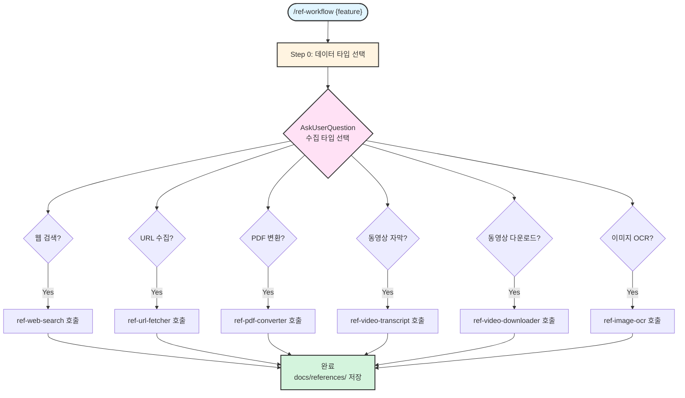

# ref-workflow

> 레퍼런스 데이터 수집 통합 워크플로우

---

## 목적

1. **다양한 소스 지원**: 웹, URL, PDF, 동영상, 이미지에서 정보 수집
2. **자동 변환**: 모든 데이터를 마크다운으로 변환
3. **중앙 저장소**: docs/references/ 디렉토리에 체계적으로 저장
4. **PRD 연계**: 수집된 정보는 PRD, Spec 작성 시 자동 참조

---

## 사용법

```bash
# 자동 모드 (AskUserQuestion으로 타입 선택)
/ref-workflow user-authentication

# 특정 타입 지정
/ref-workflow user-authentication --type web,pdf
/ref-workflow api-design --type url,video
/ref-workflow ui-components --type web,image

# 개별 스킬 직접 호출
/ref-web-search "JWT authentication best practices"
/ref-url-fetcher "https://auth0.com/docs/jwt"
/ref-pdf-converter "./auth-guide.pdf"
```

---

## 스킬 유형

**Composite Skill** - 6개 레퍼런스 수집 스킬을 통합

| 순서 | 스킬 | 수집 대상 | 출력 형식 |
|------|------|----------|----------|
| 1 | [@skills/ref-web-search/SKILL.md] | 웹 검색 결과 | 마크다운 |
| 2 | [@skills/ref-url-fetcher/SKILL.md] | 특정 URL 문서 | 마크다운 |
| 3 | [@skills/ref-pdf-converter/SKILL.md] | PDF 파일 | 마크다운 |
| 4 | [@skills/ref-video-transcript/SKILL.md] | 동영상 자막 | 마크다운 |
| 5 | [@skills/ref-video-downloader/SKILL.md] | 동영상 파일 | MP4 + 메타데이터 |
| 6 | [@skills/ref-image-ocr/SKILL.md] | 이미지 텍스트 | 마크다운 |

---

## 실행 프로세스

### Mode 1: auto (자동 모드)



---

## AskUserQuestion 활용 지점

### 지점 1: 데이터 수집 타입 선택

**시점**: 인자 없이 /ref-workflow 호출 또는 --type 플래그 없을 때

```yaml
AskUserQuestion:
  questions:
    - question: "어떤 방식으로 레퍼런스를 수집할까요?"
      header: "수집 타입"
      multiSelect: true
      options:
        - label: "웹 검색 - 키워드 기반 자동 검색 (권장)"
          description: "검색어로 관련 문서/블로그/공식 문서 자동 수집 | 빠름 | 예: 'JWT 인증 방법'"
        - label: "URL 수집 - 특정 웹페이지"
          description: "URL 제공 시 해당 페이지 내용 추출 | 정확함 | 예: 'https://docs.example.com'"
        - label: "PDF 변환 - PDF 문서"
          description: "PDF 파일을 마크다운으로 변환 | 구조 보존 | 로컬 파일 또는 URL"
        - label: "동영상 자막 - 유튜브/Vimeo"
          description: "동영상 자막/트랜스크립트 추출 | 학습 자료 | 다국어 지원"
        - label: "동영상 다운로드 - 로컬 저장"
          description: "동영상을 로컬에 다운로드 | 오프라인 참조 | 메타데이터 포함"
        - label: "이미지 OCR - 스크린샷/다이어그램"
          description: "이미지에서 텍스트 추출 | 다이어그램/표 인식 | Tesseract OCR"
```

### 지점 2: 웹 검색 상세 설정

**시점**: 웹 검색 선택 시

```yaml
AskUserQuestion:
  questions:
    - question: "웹 검색 설정을 선택해주세요"
      header: "검색 옵션"
      multiSelect: false
      options:
        - label: "공식 문서 우선 (권장)"
          description: "공식 문서, API 레퍼런스 우선 검색"
        - label: "블로그/튜토리얼 포함"
          description: "실전 예제가 포함된 블로그, 튜토리얼 포함"
        - label: "전체 검색"
          description: "모든 타입의 웹 문서 검색"

    - question: "검색 결과 개수는?"
      header: "결과 개수"
      multiSelect: false
      options:
        - label: "5개 (권장)"
          description: "핵심 문서만 수집"
        - label: "10개"
          description: "상세한 정보 필요 시"
        - label: "20개"
          description: "포괄적인 조사 필요 시"
```

### 지점 3: URL 입력 (URL 수집 선택 시)

**시점**: URL 수집 선택 시

```yaml
AskUserQuestion:
  questions:
    - question: "수집할 URL을 입력해주세요 (여러 개는 줄바꿈으로 구분)"
      header: "URL 입력"
      # 텍스트 입력 필드 (Other 옵션 활용)
```

### 지점 4: PDF 파일 경로 (PDF 변환 선택 시)

**시점**: PDF 변환 선택 시

```yaml
AskUserQuestion:
  questions:
    - question: "PDF 파일 경로 또는 URL을 입력해주세요"
      header: "PDF 경로"
      multiSelect: false
      options:
        - label: "로컬 파일"
          description: "예: ./docs/reference.pdf"
        - label: "URL"
          description: "예: https://example.com/guide.pdf"
```

### 지점 5: 동영상 URL (동영상 선택 시)

**시점**: 동영상 자막 또는 다운로드 선택 시

```yaml
AskUserQuestion:
  questions:
    - question: "동영상 URL을 입력해주세요"
      header: "동영상 URL"
      multiSelect: false
      options:
        - label: "YouTube"
          description: "예: https://youtube.com/watch?v=..."
        - label: "Vimeo"
          description: "예: https://vimeo.com/..."

    - question: "자막 언어 선택 (자막 추출 시)"
      header: "자막 언어"
      multiSelect: false
      options:
        - label: "한국어 (ko)"
          description: "한국어 자막 우선"
        - label: "영어 (en)"
          description: "영어 자막 우선"
        - label: "자동 (auto)"
          description: "자동 생성 자막 (품질 낮음)"
```

---

## 출력 디렉토리 구조

```
docs/references/
├── web/                      # 웹 검색 결과
│   ├── {feature}-web-1.md
│   ├── {feature}-web-2.md
│   └── ...
├── urls/                     # URL 수집 문서
│   ├── {feature}-{domain}.md
│   └── ...
├── pdfs/                     # PDF 변환 결과
│   ├── {feature}-{filename}.md
│   └── ...
├── videos/                   # 동영상 자막
│   ├── {feature}-{video-id}-transcript.md
│   └── ...
├── downloads/                # 동영상 파일
│   ├── {feature}-{video-id}.mp4
│   └── {feature}-{video-id}-metadata.json
└── images/                   # 이미지 OCR 결과
    ├── {feature}-{image-name}.md
    └── ...
```

---

## 통합 워크플로우 예시

### 시나리오 1: 새 기능 조사

```bash
# Step 1: 레퍼런스 수집
/ref-workflow user-authentication
→ 웹 검색: "JWT 인증 방법"
→ URL 수집: https://jwt.io/introduction
→ PDF 변환: ./oauth2-guide.pdf

# Step 2: PRD 생성 (수집된 레퍼런스 자동 참조)
/prd-workflow user-authentication
→ docs/references/web/user-authentication-web-1.md 참조
→ tasks/user-authentication-prd.md 생성
```

### 시나리오 2: 학습 자료 수집

```bash
# 동영상 자막 + 공식 문서
/ref-workflow react-hooks --type video,web
→ YouTube 강의 자막 추출
→ React 공식 문서 수집
→ docs/references/에 저장
```

---

## 관련 스킬

| 스킬 | 관계 | 설명 |
|------|------|------|
| [@skills/ref-web-search/SKILL.md] | 하위 | 웹 검색 기반 문서 수집 |
| [@skills/ref-url-fetcher/SKILL.md] | 하위 | 특정 URL 문서 수집 |
| [@skills/ref-pdf-converter/SKILL.md] | 하위 | PDF → 마크다운 변환 |
| [@skills/ref-video-transcript/SKILL.md] | 하위 | 동영상 자막 추출 |
| [@skills/ref-video-downloader/SKILL.md] | 하위 | 동영상 다운로드 |
| [@skills/ref-image-ocr/SKILL.md] | 하위 | 이미지 OCR |
| [@skills/prd-workflow/SKILL.md] | 연계 | 수집된 레퍼런스 활용 |
| [@skills/doc-prd/SKILL.md] | 연계 | 레퍼런스 기반 PRD 생성 |

---

## 주의사항

1. **저작권**: 공개된 문서만 수집 권장
2. **용량**: 동영상 다운로드 시 디스크 공간 확인
3. **API 제한**: YouTube API 제한 주의 (일일 quota)
4. **OCR 품질**: 이미지 품질에 따라 OCR 정확도 차이

---

## Changelog

| 날짜 | 변경 내용 |
|------|----------|
| 2026-01-28 | 초기 생성 - ref-* 스킬 통합, AskUserQuestion 상세 구현 |
