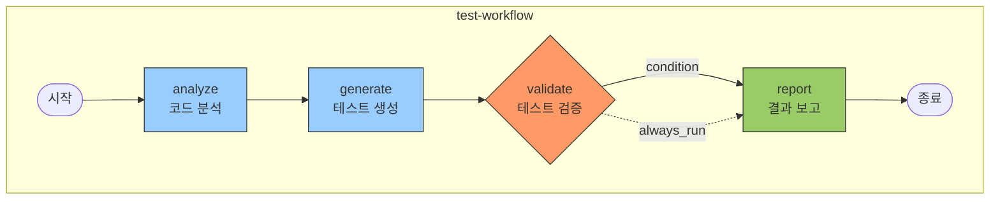

# workflow-builder

워크플로우를 정의하고 실행하는 스킬.

## 목적

- 워크플로우 정의 (YAML/JSON)
- 단계별 실행 및 의존성 관리
- 조건부 분기 및 반복 지원
- 다른 스킬에서 재사용 가능한 워크플로우 제공
- 워크플로우 시각화 (diagram-generator 연계)

## 사용법

```
/workflow-builder create my-workflow
/workflow-builder run my-workflow
/workflow-builder list
/workflow-builder validate my-workflow
/workflow-builder visualize my-workflow
```

## 액션

| 액션 | 설명 | 예시 |
|------|------|------|
| `create` | 워크플로우 정의 생성 | `/workflow-builder create test-workflow` |
| `run` | 워크플로우 실행 | `/workflow-builder run test-workflow` |
| `list` | 사용 가능한 워크플로우 목록 | `/workflow-builder list` |
| `validate` | 워크플로우 문법 검증 | `/workflow-builder validate test-workflow` |
| `visualize` | 워크플로우 다이어그램 생성 | `/workflow-builder visualize test-workflow` |

### AskUserQuestion 활용 지점

**지점 1: 워크플로우 템플릿 선택 (create 액션)**

```yaml
AskUserQuestion:
  questions:
    - question: "워크플로우 템플릿을 선택해주세요"
      header: "템플릿"
      multiSelect: false
      options:
        - label: "basic - 기본 순차 실행"
          description: "단계별 순차 실행 | 의존성 단순"
        - label: "parallel - 병렬 실행"
          description: "독립적 단계 동시 실행 | 성능 최적화"
        - label: "conditional - 조건부 분기"
          description: "조건에 따라 다른 경로 실행"
        - label: "loop - 반복 실행"
          description: "특정 단계 반복 | 배치 처리"
        - label: "ci-cd - CI/CD 파이프라인"
          description: "빌드 → 테스트 → 배포"
```

**지점 2: 워크플로우 입력 파라미터 확인**

```yaml
AskUserQuestion:
  questions:
    - question: "입력 파라미터 [name]의 기본값을 설정할까요?"
      header: "파라미터 설정"
      multiSelect: false
      options:
        - label: "예 - 기본값 설정 (권장)"
          description: "사용자가 값을 제공하지 않으면 기본값 사용"
        - label: "아니오 - 필수 입력"
          description: "항상 사용자 입력 필요"
```

**지점 3: 조건부 분기 로직 선택**

```yaml
AskUserQuestion:
  questions:
    - question: "단계의 조건 로직을 어떻게 정의할까요?"
      header: "조건 로직"
      multiSelect: false
      options:
        - label: "항상 실행"
          description: "조건 없이 항상 실행"
        - label: "조건부 실행"
          description: "condition 필드 기반 실행"
        - label: "오류 시 건너뛰기"
          description: "이전 단계 실패 시 건너뛰기"
```

## 워크플로우 정의 형식

### YAML 형식 (권장)

```yaml
# workflows/test-generation-workflow.yaml
name: test-generation-workflow
description: 테스트 생성 워크플로우
version: 1.0

inputs:
  - name: target_file
    type: path
    required: true
    description: 테스트 대상 파일 경로
  - name: coverage_target
    type: number
    default: 80
    description: 목표 커버리지 (%)

steps:
  - id: analyze
    name: 코드 분석
    action: analyze_code
    inputs:
      file: ${{ inputs.target_file }}
    outputs:
      - functions
      - classes

  - id: generate
    name: 테스트 생성
    action: generate_tests
    depends_on: [analyze]
    inputs:
      functions: ${{ steps.analyze.outputs.functions }}
      classes: ${{ steps.analyze.outputs.classes }}
    outputs:
      - test_file

  - id: validate
    name: 테스트 검증
    action: run_tests
    depends_on: [generate]
    condition: ${{ inputs.coverage_target > 0 }}
    inputs:
      test_file: ${{ steps.generate.outputs.test_file }}
    outputs:
      - coverage
      - passed

  - id: report
    name: 결과 보고
    action: generate_report
    depends_on: [validate]
    always_run: true
    inputs:
      coverage: ${{ steps.validate.outputs.coverage }}
      passed: ${{ steps.validate.outputs.passed }}

outputs:
  test_file: ${{ steps.generate.outputs.test_file }}
  coverage: ${{ steps.validate.outputs.coverage }}
```

### JSON 형식

```json
{
  "name": "test-generation-workflow",
  "description": "테스트 생성 워크플로우",
  "version": "1.0",
  "inputs": [
    {
      "name": "target_file",
      "type": "path",
      "required": true
    }
  ],
  "steps": [
    {
      "id": "analyze",
      "name": "코드 분석",
      "action": "analyze_code",
      "inputs": {
        "file": "${{ inputs.target_file }}"
      }
    }
  ],
  "outputs": {
    "test_file": "${{ steps.generate.outputs.test_file }}"
  }
}
```

## 워크플로우 스펙

### 입력 정의 (inputs)

```yaml
inputs:
  - name: target_file        # 입력 이름
    type: path               # 타입: string, number, boolean, path, array
    required: true           # 필수 여부
    default: null            # 기본값
    description: "설명"      # 설명
```

### 단계 정의 (steps)

```yaml
steps:
  - id: step_id              # 고유 ID
    name: "단계명"           # 표시 이름
    action: action_name      # 실행할 액션
    depends_on: [prev_step]  # 의존하는 단계들
    condition: ${{ expr }}   # 조건부 실행 (선택)
    always_run: false        # 실패해도 항상 실행 (선택)
    timeout: 300             # 타임아웃 초 (선택)
    retry: 3                 # 재시도 횟수 (선택)
    inputs:                  # 입력 파라미터
      param: value
    outputs:                 # 출력 변수
      - output_var
```

### 조건 표현식

```yaml
# 비교 연산
condition: ${{ inputs.coverage > 80 }}
condition: ${{ steps.analyze.outputs.count >= 5 }}

# 논리 연산
condition: ${{ inputs.run_tests && inputs.coverage_target > 0 }}
condition: ${{ inputs.env == 'production' || inputs.force }}

# 존재 여부
condition: ${{ steps.analyze.outputs.functions }}
```

### 반복 (for_each)

```yaml
steps:
  - id: process_files
    name: 파일 처리
    action: process_file
    for_each: ${{ inputs.files }}
    inputs:
      file: ${{ item }}
      index: ${{ item_index }}
```

### 에러 핸들링

```yaml
steps:
  - id: risky_step
    name: 위험한 단계
    action: risky_action
    on_error: continue       # continue, fail, retry
    retry: 3
    retry_delay: 10          # 재시도 간격 (초)
```

## 내장 액션

### 코드 분석

| 액션 | 설명 | 입력 | 출력 |
|------|------|------|------|
| `analyze_code` | 코드 분석 | file | functions, classes, imports |
| `analyze_deps` | 의존성 분석 | directory | dependencies |
| `analyze_complexity` | 복잡도 분석 | file | complexity_score |

### 테스트

| 액션 | 설명 | 입력 | 출력 |
|------|------|------|------|
| `generate_tests` | 테스트 생성 | functions, classes | test_file |
| `run_tests` | 테스트 실행 | test_file | passed, coverage |
| `lint_code` | 린트 검사 | file | issues |

### 파일 처리

| 액션 | 설명 | 입력 | 출력 |
|------|------|------|------|
| `read_file` | 파일 읽기 | path | content |
| `write_file` | 파일 쓰기 | path, content | success |
| `copy_file` | 파일 복사 | source, dest | success |
| `delete_file` | 파일 삭제 | path | success |

### 유틸리티

| 액션 | 설명 | 입력 | 출력 |
|------|------|------|------|
| `shell` | 쉘 명령 실행 | command | stdout, stderr, exit_code |
| `notify` | 알림 전송 | message | success |
| `generate_report` | 리포트 생성 | data | report_path |
| `wait` | 대기 | seconds | - |

## uv 환경 설정

> **참조**: `@.claude/docs/references/research/uv-best-practices.md`

워크플로우에서 Python 프로젝트를 다룰 때 uv를 기본 패키지 관리자로 사용한다.

### uv 명령어 패턴

| 워크플로우 단계 | uv 명령어 |
|----------------|-----------|
| 의존성 설치 | `uv sync` |
| 테스트 실행 | `uv run pytest tests/ -v` |
| 린트 검사 | `uv run ruff check .` |
| 타입 체크 | `uv run mypy src/` |
| 스크립트 실행 | `uv run python script.py` |
| 패키지 추가 | `uv add {package}` |

### 워크플로우 내 uv 사용 예시

```yaml
steps:
  - id: setup
    name: 환경 설정
    action: shell
    inputs:
      command: "uv sync --frozen"  # lockfile 기반 동기화

  - id: lint
    name: 린트 검사
    action: shell
    depends_on: [setup]
    inputs:
      command: "uv run ruff check . --fix"

  - id: test
    name: 테스트 실행
    action: shell
    depends_on: [setup]
    inputs:
      command: "uv run pytest tests/ -v --cov=src"
```

### uv 관련 내장 액션

| 액션 | 설명 | 실행 명령 |
|------|------|----------|
| `uv_sync` | 의존성 동기화 | `uv sync` |
| `uv_add` | 패키지 추가 | `uv add {package}` |
| `uv_run` | 명령 실행 | `uv run {command}` |

## 워크플로우 디렉토리 구조

```
.claude/
├── workflows/                    # 워크플로우 정의
│   ├── test-generation.yaml
│   ├── code-review.yaml
│   ├── deploy.yaml
│   └── templates/               # 템플릿
│       ├── basic.yaml
│       └── ci-cd.yaml
└── workflow-outputs/            # 실행 결과
    └── {workflow}-{timestamp}/
        ├── log.txt
        ├── outputs.json
        └── report.md
```

## 예제 워크플로우

### 1. 3-Step Workflow 정의

```yaml
name: 3-step-workflow
description: Discuss-Plan-Execute 워크플로우
version: 1.0

inputs:
  - name: task_description
    type: string
    required: true
  - name: mode
    type: string
    default: "normal"

steps:
  - id: discuss
    name: Discuss 단계
    action: discuss_phase
    inputs:
      task: ${{ inputs.task_description }}
    outputs:
      - requirements
      - context

  - id: confirm_discuss
    name: Discuss 확인
    action: user_confirm
    depends_on: [discuss]
    inputs:
      message: "Discuss 단계를 완료했습니다. 계속 진행할까요?"

  - id: plan
    name: Plan 단계
    action: plan_phase
    depends_on: [confirm_discuss]
    condition: ${{ steps.confirm_discuss.outputs.confirmed }}
    inputs:
      requirements: ${{ steps.discuss.outputs.requirements }}
      context: ${{ steps.discuss.outputs.context }}
    outputs:
      - tasks
      - dependencies

  - id: confirm_plan
    name: Plan 확인
    action: user_confirm
    depends_on: [plan]
    inputs:
      message: "Plan 단계를 완료했습니다. 실행을 진행할까요?"

  - id: execute
    name: Execute 단계
    action: execute_phase
    depends_on: [confirm_plan]
    condition: ${{ steps.confirm_plan.outputs.confirmed }}
    for_each: ${{ steps.plan.outputs.tasks }}
    inputs:
      task: ${{ item }}

outputs:
  completed_tasks: ${{ steps.execute.outputs }}
```

### 2. PRD 워크플로우 정의

```yaml
name: prd-workflow
description: PRD 생성 워크플로우
version: 1.0

inputs:
  - name: project_name
    type: string
    required: true
  - name: references
    type: array
    default: []

steps:
  - id: collect_scenarios
    name: 시나리오 수집
    action: save_scenario
    inputs:
      project: ${{ inputs.project_name }}
    outputs:
      - scenarios

  - id: gather_references
    name: 레퍼런스 수집
    action: gather_refs
    depends_on: [collect_scenarios]
    for_each: ${{ inputs.references }}
    inputs:
      url: ${{ item }}
    outputs:
      - ref_docs

  - id: generate_prd
    name: PRD 생성
    action: doc_prd
    depends_on: [collect_scenarios, gather_references]
    inputs:
      scenarios: ${{ steps.collect_scenarios.outputs.scenarios }}
      references: ${{ steps.gather_references.outputs.ref_docs }}
    outputs:
      - prd_file

  - id: add_diagrams
    name: 다이어그램 추가
    action: diagram_generator
    depends_on: [generate_prd]
    inputs:
      prd: ${{ steps.generate_prd.outputs.prd_file }}
      types: ["flow", "usecase"]
    outputs:
      - diagrams

outputs:
  prd: ${{ steps.generate_prd.outputs.prd_file }}
  diagrams: ${{ steps.add_diagrams.outputs.diagrams }}
```

### 3. CI/CD 워크플로우 정의

```yaml
name: ci-cd-workflow
description: CI/CD 파이프라인
version: 1.0

inputs:
  - name: branch
    type: string
    default: "main"
  - name: deploy_env
    type: string
    default: "staging"

steps:
  - id: checkout
    name: 코드 체크아웃
    action: shell
    inputs:
      command: "git checkout ${{ inputs.branch }}"

  - id: install
    name: 의존성 설치
    action: shell
    depends_on: [checkout]
    inputs:
      command: "uv sync"

  - id: lint
    name: 린트 검사
    action: shell
    depends_on: [install]
    inputs:
      command: "uv run ruff check ."
    on_error: continue

  - id: test
    name: 테스트 실행
    action: shell
    depends_on: [install]
    inputs:
      command: "uv run pytest tests/ -v"
    outputs:
      - exit_code

  - id: build
    name: 빌드
    action: shell
    depends_on: [test]
    condition: ${{ steps.test.outputs.exit_code == 0 }}
    inputs:
      command: "docker build -t app:latest ."

  - id: deploy
    name: 배포
    action: shell
    depends_on: [build]
    condition: ${{ inputs.deploy_env != 'production' || steps.test.outputs.exit_code == 0 }}
    inputs:
      command: "kubectl apply -f k8s/${{ inputs.deploy_env }}/"

outputs:
  deployed: ${{ steps.deploy.outputs.success }}
```

## 실행 예제

### 워크플로우 생성

```
User: /workflow-builder create test-workflow

Claude:
=== 워크플로우 생성 ===

워크플로우 템플릿을 선택하세요:

1. basic - 기본 순차 실행
2. parallel - 병렬 실행
3. conditional - 조건부 분기
4. loop - 반복 처리

→ 1

[1/3] 워크플로우 정보 입력...
  - 이름: test-workflow
  - 설명: 테스트 생성 워크플로우

[2/3] 단계 정의...
  - Step 1: 코드 분석 (analyze)
  - Step 2: 테스트 생성 (generate)
  - Step 3: 테스트 실행 (validate)

[3/3] 파일 생성...
  ✓ .claude/workflows/test-workflow.yaml

=== 완료 ===

생성된 파일: .claude/workflows/test-workflow.yaml

실행: /workflow-builder run test-workflow
검증: /workflow-builder validate test-workflow
시각화: /workflow-builder visualize test-workflow
```

### 워크플로우 실행

```
User: /workflow-builder run test-workflow --input target_file=src/utils.py

Claude:
=== 워크플로우 실행 ===

워크플로우: test-workflow
입력:
  - target_file: src/utils.py
  - coverage_target: 80 (기본값)

[1/4] analyze - 코드 분석
  ⏳ 실행 중...
  ✓ 완료 (2.3s)
  - functions: 5개 발견
  - classes: 2개 발견

[2/4] generate - 테스트 생성
  ⏳ 실행 중...
  ✓ 완료 (5.1s)
  - test_file: tests/test_utils.py

[3/4] validate - 테스트 검증
  ⏳ 실행 중...
  ✓ 완료 (3.2s)
  - coverage: 85%
  - passed: true

[4/4] report - 결과 보고
  ⏳ 실행 중...
  ✓ 완료 (0.5s)

=== 실행 완료 ===

결과:
  - test_file: tests/test_utils.py
  - coverage: 85%

실행 로그: .claude/workflow-outputs/test-workflow-20260121-143022/log.txt
```

### 워크플로우 시각화

```
User: /workflow-builder visualize test-workflow

Claude:
=== 워크플로우 시각화 ===

diagram-generator 호출 중...



저장됨: docs/diagrams/workflow-test-workflow.md
```

## 통합 대상

| 스킬 | 통합 방식 |
|------|----------|
| [@skills/3-step-workflow/SKILL.md] | Discuss-Plan-Execute 단계를 워크플로우로 정의 |
| [@skills/test-generator/SKILL.md] | 테스트 생성 파이프라인 |
| [@skills/prd-workflow/SKILL.md] | PRD 생성 전체 흐름 |
| [@skills/code-review/SKILL.md] | 리뷰 체크 단계들 |
| [@skills/subagent-driven-dev/SKILL.md] | 태스크별 서브에이전트 실행 |

## 관련 스킬

| 스킬명 | 관계 | 설명 |
|--------|------|------|
| [@skills/3-step-workflow/SKILL.md] | 사용 | 3단계 워크플로우 정의 |
| [@skills/prd-workflow/SKILL.md] | 사용 | PRD 워크플로우 정의 |
| [@skills/test-generator/SKILL.md] | 사용 | 테스트 생성 워크플로우 |
| [@skills/diagram-generator/SKILL.md] | 연계 | 워크플로우 다이어그램 생성 |
| [@skills/setup-uv-env/SKILL.md] | 연계 | uv 환경 설정 |

## 참조

- uv 베스트 프랙티스: `@.claude/docs/references/research/uv-best-practices.md`

## Changelog

| 날짜 | 변경 내용 |
|------|----------|
| 2026-01-21 | 초기 스킬 생성 |
| 2026-01-21 | YAML/JSON 워크플로우 정의 형식 |
| 2026-01-21 | 내장 액션 정의 |
| 2026-01-21 | 예제 워크플로우 3개 추가 |
| 2026-01-21 | uv 환경 설정 섹션 및 uv 관련 내장 액션 추가 |
