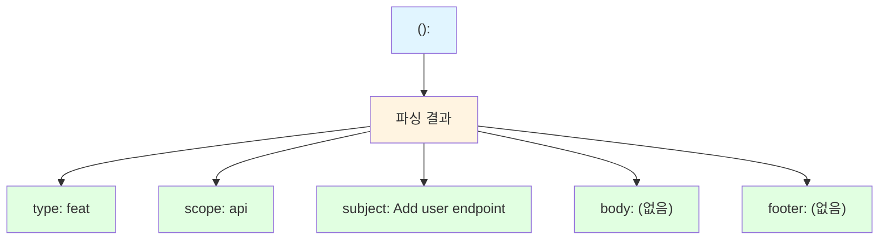

# 커밋 메시지 검증

Git 커밋 메시지의 형식과 품질을 검증한다.

## 목적

- Conventional Commits 형식 준수 검증
- 커밋 타입 유효성 검사
- 제목(subject) 규칙 검증
- 본문(body) 및 푸터(footer) 형식 검증

## 사용법

```
/check-commit-message "feat(api): Add user endpoint"
/check-commit-message --recent 5
/check-commit-message --staged
```

| 옵션 | 설명 |
|------|------|
| `"메시지"` | 특정 커밋 메시지 검증 |
| `--recent N` | 최근 N개 커밋 검증 |
| `--staged` | 스테이지된 변경에 대한 메시지 제안 |

---

## 검증 프로세스

### 1단계: 형식 파싱

커밋 메시지를 파싱하여 구성 요소 추출:



### 2단계: 규칙 검증

| 항목 | 규칙 |
|------|------|
| type | 유효한 타입 (feat, fix, docs 등) |
| scope | 선택적, 괄호로 감싸기 |
| subject | 50자 이내, 명령형, 마침표 없음 |
| body | 72자 줄바꿈, 빈 줄로 구분 |
| footer | BREAKING CHANGE, Fixes # 형식 |

### 3단계: 결과 보고

```markdown
## 커밋 메시지 검증 결과

### 메시지
feat(api): Add user endpoint

### 검증 결과: ✓ 통과

| 항목 | 값 | 상태 |
|------|-----|------|
| type | feat | ✓ |
| scope | api | ✓ |
| subject | Add user endpoint | ✓ |
| 길이 | 28자 | ✓ (≤50) |
| 형식 | 명령형 | ✓ |
| 마침표 | 없음 | ✓ |
```

---

## 검증 규칙

**이 스킬은 검증(validation)만 수행합니다.**
**규칙 정의는 [@skills/convention-commit/SKILL.md] 스킬을 참조하세요.**

→ `@skills/convention-commit/SKILL.md`

### 검증 항목 요약

| 항목 | 검증 내용 | 심각도 |
|------|----------|--------|
| **형식** | Conventional Commits 형식 준수 | Critical |
| **타입** | 유효한 타입 (상세: convention-commit 참조) | Critical |
| **제목** | 50자 이내, 명령형, 한국어 | Critical |
| **본문** | 한국어, 기술 용어는 영어, 72자 줄바꿈 | Warning |
| **푸터** | Co-Authored-By 사용 금지 | Critical |

**상세 규칙 (타입 목록, 스코프, 본문 작성법 등)**: `/convention-commit` 실행

### 심각도 기준

| 심각도 | 의미 | 동작 |
|--------|------|------|
| Critical | 필수 규칙 위반 | 실패 처리 |
| Warning | 권장 규칙 위반 | 경고 표시 |
| Info | 개선 권장 | 정보 표시 |

---

## 예시

### 예시 1: 단일 메시지 검증

```
/check-commit-message "feat(auth): Add OAuth2 support"
```

**출력**:
```
## 커밋 메시지 검증 결과

### 검증 결과: ✓ 통과

| 항목 | 값 | 상태 |
|------|-----|------|
| type | feat | ✓ |
| scope | auth | ✓ |
| subject | Add OAuth2 support | ✓ |
| 길이 | 30자 | ✓ |
```

### 예시 2: 위반 사례

```
/check-commit-message "Added new feature."
```

**출력**:
```
## 커밋 메시지 검증 결과

### 검증 결과: ✗ 실패

### 위반 목록

| 항목 | 문제 | 권장 수정 |
|------|------|----------|
| type | 누락 | `feat:` 접두사 추가 |
| 형식 | 과거형 사용 | "Added" → "Add" |
| 마침표 | 끝에 마침표 | 마침표 제거 |

### 권장 메시지
feat: Add new feature
```

### 예시 3: 최근 커밋 검증

```
/check-commit-message --recent 3
```

**출력**:
```
## 최근 3개 커밋 검증 결과

### 요약
- 검사: 3개
- 통과: 2개
- 실패: 1개

### 상세

| 커밋 | 메시지 | 상태 |
|------|--------|------|
| a1b2c3d | feat(api): Add user endpoint | ✓ |
| e4f5g6h | fix: Handle null values | ✓ |
| i7j8k9l | updated readme | ✗ |

### 위반 상세: i7j8k9l
- type 누락: `docs:` 접두사 필요
- 대문자 시작: "Updated" → "Update"

### 권장 수정
git commit --amend -m "docs: Update README"
```

### 예시 4: 스테이지 기반 제안

```
/check-commit-message --staged
```

**출력**:
```
## 스테이지된 변경 분석

### 변경 파일
- src/api/users.py (수정)
- tests/test_users.py (추가)

### 권장 커밋 메시지

**옵션 1** (권장):
feat(api): Add user management endpoints

Add CRUD operations for user resource:
- GET /users
- POST /users
- PUT /users/{id}
- DELETE /users/{id}

**옵션 2**:
feat(users): Implement user API with tests
```

---

## Git Hook 통합

pre-commit hook으로 자동 검증 설정:

```bash
# .git/hooks/commit-msg
#!/bin/bash
/path/to/check-commit-message "$1"
```

또는 commitlint 사용:

```bash
npm install --save-dev @commitlint/cli @commitlint/config-conventional
echo "module.exports = {extends: ['@commitlint/config-conventional']}" > commitlint.config.js
```

---

## 관련 스킬

| 스킬 | 역할 |
|------|------|
| [@skills/convention-commit/SKILL.md] | 커밋 컨벤션 참조 |
| [@skills/git-commit-push/SKILL.md] | 커밋 및 푸시 자동화 |

---

## Changelog

| 날짜 | 버전 | 변경 내용 |
|------|------|----------|
| 2026-01-22 | 1.2.0 | convention-commit 참조 방식으로 리팩토링, 한국어 본문 규칙 추가 |
| 2026-01-22 | 1.1.0 | Co-Authored-By 푸터 금지 규칙 추가 |
| 2026-01-21 | 1.0.0 | 초기 생성 - Conventional Commits 검증 |

## Gotchas (실패 포인트)

- scope 없는 commit `feat: add` → `feat(scope): add`로 수정 필요
- 제목 50자 초과 탐지 — GitHub UI에서 잘림
- Co-Authored-By 푸터 탐지 (팀 규칙: 사용 금지)
- 한국어 제목은 문자 수 계산이 달라질 수 있음 — 바이트 vs 문자 구분
