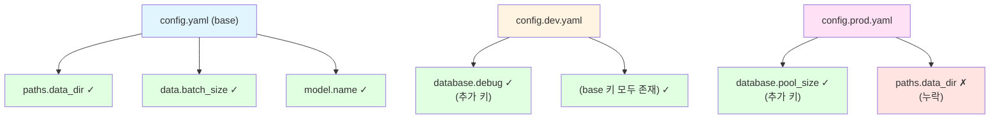

# 설정 파일 검증

설정 파일의 구문과 스키마 준수 여부를 검증한다.

## 목적

- YAML 구문 유효성 검사
- Pydantic 스키마 준수 검증
- 환경별 설정 일관성 확인
- 하드코딩 패턴 탐지
- 누락된 필수 설정 식별

## 사용법

```
/check-config-validation config/
/check-config-validation config/config.yaml
/check-config-validation --all
```

| 옵션 | 설명 |
|------|------|
| `경로` | 특정 파일 또는 디렉토리 검증 |
| `--all` | 모든 환경 설정 파일 검증 |
| `--schema` | 스키마 파일과 비교 검증 |

---

## 검증 프로세스

### 1단계: YAML 구문 검사

```python
import yaml

try:
    with open("config/config.yaml") as f:
        config = yaml.safe_load(f)
    print("✓ YAML 구문 유효")
except yaml.YAMLError as e:
    print(f"✗ YAML 구문 오류: {e}")
```

### 2단계: 스키마 검증

Pydantic 스키마와 비교하여 타입 및 제약조건 검증:

```python
from config.schemas.config_schema import Config
from omegaconf import OmegaConf

raw = OmegaConf.load("config/config.yaml")
try:
    config = Config(**OmegaConf.to_container(raw))
    print("✓ 스키마 검증 통과")
except ValidationError as e:
    print(f"✗ 스키마 검증 실패: {e}")
```

### 3단계: 환경 일관성 검사

모든 환경 파일(dev, prod, test)의 키 일관성 검증:



### 4단계: 결과 보고

```markdown
## 설정 파일 검증 결과

### 요약
- 검사 파일: 4개
- 통과: 3개
- 실패: 1개

### 파일별 결과

| 파일 | YAML | 스키마 | 상태 |
|------|------|--------|------|
| config.yaml | ✓ | ✓ | 통과 |
| config.dev.yaml | ✓ | ✓ | 통과 |
| config.prod.yaml | ✓ | ✗ | 실패 |
| config.test.yaml | ✓ | ✓ | 통과 |

### 위반 상세: config.prod.yaml

| 항목 | 문제 | 권장 수정 |
|------|------|----------|
| model.learning_rate | 타입 오류 (str → float) | "0.001" → 0.001 |
| paths.output_dir | 누락 | 필수 필드 추가 |
```

---

## 검증 규칙

**이 스킬은 검증(validation)만 수행합니다.**
**규칙 정의는 [@skills/convention-config/SKILL.md] 스킬을 참조하세요.**

→ `@skills/convention-config/SKILL.md`

### 검증 항목 요약

| 카테고리 | 검증 내용 | 심각도 |
|----------|----------|--------|
| **YAML 구문** | 들여쓰기, 중복 키, 문자셋 | Critical/Warning |
| **스키마 검증** | 타입 일치, 필수 필드, 범위 제약 | Critical/Warning |
| **환경 일관성** | dev/prod/test 간 키 및 타입 일치 | Critical/Warning |
| **안티패턴** | 하드코딩 경로, 민감 정보, 매직 넘버 | Critical/Warning/Info |

**상세 규칙 (디렉토리 구조, Pydantic 스키마 예시, 오버라이드 패턴 등)**: `/convention-config` 실행

### 심각도 기준

| 심각도 | 의미 | 동작 |
|--------|------|------|
| Critical | 런타임 오류 가능 | 즉시 수정 필요 |
| Warning | 유지보수 저하 | 수정 권장 |
| Info | 개선 권장 | 선택적 수정 |

---

## 예시

### 예시 1: 단일 파일 검증

```
/check-config-validation config/config.yaml
```

**출력**:
```
## 설정 파일 검증 결과

### config/config.yaml

#### YAML 구문: ✓ 유효

#### 스키마 검증: ✓ 통과

#### 안티패턴 검사: 1개 경고

| 라인 | 문제 | 권장 수정 |
|------|------|----------|
| 12 | 하드코딩 경로 `/home/user/data` | 상대 경로 `./data` 사용 |

### 결과: 경고 1개 (Critical 없음)
```

### 예시 2: 전체 환경 검증

```
/check-config-validation --all
```

**출력**:
```
## 전체 설정 파일 검증 결과

### 요약
- 검사 파일: 4개
- 통과: 4개
- Critical: 0개
- Warning: 2개

### 환경 일관성 검사

#### 키 매트릭스
| 키 | base | dev | prod | test |
|----|------|-----|------|------|
| paths.data_dir | ✓ | ✓ | ✓ | ✓ |
| data.batch_size | ✓ | ✓ | ✓ | ✓ |
| database.debug | - | ✓ | ✓ | ✓ |
| database.pool_size | - | - | ✓ | - |

#### 경고
- `database.pool_size`: prod에만 존재 (의도적이면 무시)

### 타입 일관성: ✓ 모든 환경에서 동일
```

### 예시 3: 스키마 불일치

```
/check-config-validation config/config.yaml --schema
```

**출력**:
```
## 스키마 검증 결과

### 위반 목록

#### Critical
| 필드 | 현재 값 | 예상 타입 | 문제 |
|------|---------|----------|------|
| model.epochs | "100" | int | str 타입 |
| data.batch_size | -1 | int (ge=1) | 범위 위반 |

#### 수정 필요
config.yaml:
  model:
    epochs: 100      # "100" → 100 (따옴표 제거)
  data:
    batch_size: 32   # -1 → 32 (양수로 변경)
```

---

## 자동 수정

일부 문제는 자동 수정 가능:

```bash
# YAML 포맷팅
yamlfmt config/

# 타입 변환 (주의 필요)
# "100" → 100 등은 수동 확인 후 수정 권장
```

민감 정보, 스키마 불일치는 수동 수정 필요.

---

## 관련 스킬

| 스킬 | 역할 |
|------|------|
| [@skills/convention-config/SKILL.md] | 설정 관리 컨벤션 참조 |
| [@skills/project-init/SKILL.md] | 프로젝트 초기화 (설정 파일 생성) |

---

## Changelog

| 날짜 | 버전 | 변경 내용 |
|------|------|----------|
| 2026-01-22 | 1.1.0 | convention-config 참조 방식으로 리팩토링 |
| 2026-01-21 | 1.0.0 | 초기 생성 - YAML 구문, 스키마, 환경 일관성 검증 |
