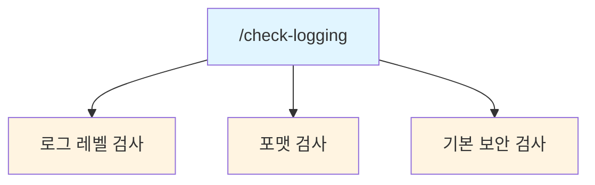
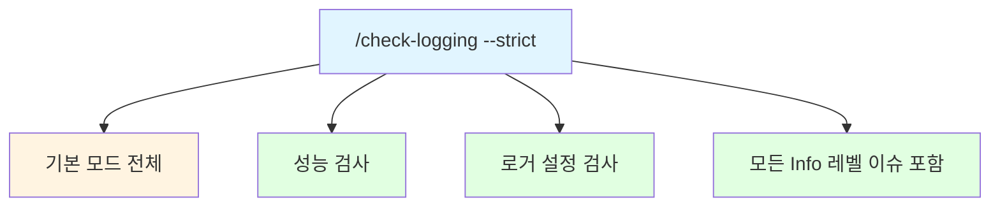
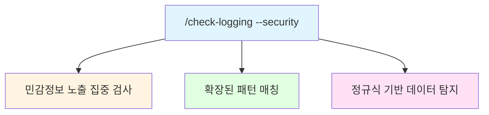

# 로깅 컨벤션 검증

Python 코드의 로깅 패턴을 검증하는 스킬.

## 목적

- 로그 레벨 적절성 검사
- 민감정보 노출 탐지
- 로깅 성능 문제 탐지
- 메시지 포맷 일관성 검사

## 사용법

```bash
/check-logging                    # 전체 프로젝트 검사
/check-logging src/               # 특정 경로 검사
/check-logging --strict           # 엄격 검사 (모든 규칙)
/check-logging --security         # 보안 중심 검사
```

---

## 검증 규칙

**이 스킬은 검증(validation)만 수행합니다.**
**규칙 정의는 [@skills/convention-logging/SKILL.md] 스킬을 참조하세요.**

→ `@skills/convention-logging/SKILL.md`

### 검증 항목 요약

| 카테고리 | 검증 내용 | 심각도 |
|----------|----------|--------|
| **로그 레벨** | DEBUG/INFO/WARNING/ERROR 적절성 | Warning |
| **민감정보** | 비밀번호, 토큰, API 키 노출 | Critical |
| **성능** | Lazy evaluation, 루프 내 로깅 | Warning |
| **포맷** | 컨텍스트 부족, exc_info 누락 | Warning |
| **로거 설정** | `__name__` 사용, 중앙 설정 | Warning |

**상세 규칙 (로그 레벨 기준, 메시지 구조, 민감정보 마스킹 방법 등)**: `/convention-logging` 실행

### 심각도 기준

| 심각도 | 의미 | 동작 |
|--------|------|------|
| Critical | 보안 취약점 | 즉시 수정 필요 |
| Warning | 품질 저하 | 수정 권장 |
| Info | 개선 권장 | 선택적 수정 |

---

## 검사 항목 상세

### 1. 로그 레벨 검사 (Level Check)

| 패턴 | 심각도 | 설명 |
|------|--------|------|
| `logger.info(f"Variable {x}")` | Warning | DEBUG 사용해야 함 |
| `logger.error("Retry...")` | Warning | WARNING 사용해야 함 |
| `logger.debug(...)` in production code | Info | 레벨 확인 권장 |
| `print()` 대신 logger 미사용 | Warning | logger 사용 권장 |

#### 탐지 패턴

```python
# BAD: INFO를 DEBUG처럼 사용
PATTERN_INFO_AS_DEBUG = [
    r'logger\.info\(.*["\']Variable',
    r'logger\.info\(.*["\']Debug',
    r'logger\.info\(.*["\']Entering',
    r'logger\.info\(.*["\']Exiting',
    r'logger\.info\(.*value\s*=',
    r'logger\.info\(.*state\s*=',
]

# BAD: ERROR를 WARNING처럼 사용
PATTERN_ERROR_AS_WARNING = [
    r'logger\.error\(.*["\']Retry',
    r'logger\.error\(.*["\']Attempt',
    r'logger\.error\(.*["\']Skipping',
    r'logger\.error\(.*["\']Ignoring',
]

# BAD: print() 사용
PATTERN_PRINT_INSTEAD = [
    r'^\s*print\(',
]
```

### 2. 민감정보 검사 (Security Check)

| 패턴 | 심각도 | 설명 |
|------|--------|------|
| `logger.*(password=...)` | Critical | 비밀번호 노출 |
| `logger.*(token=...)` | Critical | 토큰 노출 |
| `logger.*(api_key=...)` | Critical | API 키 노출 |
| `logger.*(secret=...)` | Critical | 시크릿 노출 |
| `logger.*(credit_card=...)` | Critical | 신용카드 노출 |
| `logger.*(email=user@...)` | Warning | 이메일 노출 |

#### 탐지 패턴

```python
SENSITIVE_PATTERNS = [
    # 비밀번호
    (r'logger\.\w+\(.*password\s*=\s*[^*]', 'Critical', 'Password exposed'),
    (r'logger\.\w+\(.*passwd\s*=', 'Critical', 'Password exposed'),

    # 토큰/키
    (r'logger\.\w+\(.*token\s*=\s*[^*]', 'Critical', 'Token exposed'),
    (r'logger\.\w+\(.*api[_-]?key\s*=\s*[^*]', 'Critical', 'API key exposed'),
    (r'logger\.\w+\(.*secret\s*=', 'Critical', 'Secret exposed'),
    (r'logger\.\w+\(.*auth\s*=', 'Warning', 'Auth info may be exposed'),

    # 개인정보
    (r'logger\.\w+\(.*credit[_-]?card', 'Critical', 'Credit card exposed'),
    (r'logger\.\w+\(.*ssn\s*=', 'Critical', 'SSN exposed'),
    (r'logger\.\w+\(.*\b[a-zA-Z0-9._%+-]+@[a-zA-Z0-9.-]+\.[a-zA-Z]{2,}\b', 'Warning', 'Email may be exposed'),

    # Bearer 토큰
    (r'logger\.\w+\(.*Bearer\s+[A-Za-z0-9]', 'Critical', 'Bearer token exposed'),
]
```

### 3. 성능 검사 (Performance Check)

| 패턴 | 심각도 | 설명 |
|------|--------|------|
| `logger.debug(f"...{expensive()}...")` | Warning | Lazy evaluation 미사용 |
| 루프 내 매 iteration 로깅 | Warning | 배치 로깅 권장 |
| `logger.*(large_object)` | Info | 대용량 데이터 로깅 |

#### 탐지 패턴

```python
PERFORMANCE_PATTERNS = [
    # f-string으로 항상 평가
    (r'logger\.debug\(f["\']', 'Warning', 'Use lazy evaluation for debug'),

    # 루프 내 로깅 (휴리스틱)
    (r'for\s+\w+\s+in\s+.*:\s*\n\s*logger\.', 'Warning', 'Logging in loop detected'),

    # 전체 객체 로깅
    (r'logger\.\w+\(.*response\)', 'Info', 'Consider logging summary only'),
    (r'logger\.\w+\(.*data\)', 'Info', 'Consider logging summary only'),
]
```

### 4. 포맷 검사 (Format Check)

| 패턴 | 심각도 | 설명 |
|------|--------|------|
| `logger.error("Error")` | Warning | 컨텍스트 부족 |
| `logger.info("Done")` | Warning | 구체적 메시지 필요 |
| `logger.*("Success")` | Info | 컨텍스트 추가 권장 |

#### 탐지 패턴

```python
FORMAT_PATTERNS = [
    # 컨텍스트 없는 메시지
    (r'logger\.\w+\(["\']Error["\']', 'Warning', 'Missing context in message'),
    (r'logger\.\w+\(["\']Failed["\']', 'Warning', 'Missing context in message'),
    (r'logger\.\w+\(["\']Done["\']', 'Warning', 'Missing context in message'),
    (r'logger\.\w+\(["\']Success["\']', 'Info', 'Consider adding context'),
    (r'logger\.\w+\(["\']OK["\']', 'Info', 'Consider adding context'),

    # exc_info 없는 예외 로깅
    (r'except.*:\s*\n\s*logger\.error\([^,)]+\)(?!.*exc_info)', 'Warning', 'Missing exc_info in exception handler'),
]
```

### 5. 로거 설정 검사 (Setup Check)

| 패턴 | 심각도 | 설명 |
|------|--------|------|
| `logger = logging.getLogger("mylogger")` | Warning | `__name__` 사용 권장 |
| `logging.basicConfig()` in module | Warning | 중앙 설정 권장 |

#### 탐지 패턴

```python
SETUP_PATTERNS = [
    # 하드코딩된 로거 이름
    (r'getLogger\(["\'][^_]', 'Warning', 'Use __name__ for logger name'),

    # 모듈 레벨 basicConfig
    (r'^logging\.basicConfig\(', 'Warning', 'Use centralized logging setup'),
]
```

---

## 실행 프로세스

### 1단계: 대상 파일 수집

```bash
# Python 파일만 수집
find src/ -name "*.py" -type f
```

### 2단계: 패턴 매칭

```python
for pattern, severity, message in ALL_PATTERNS:
    matches = grep(pattern, file)
    for match in matches:
        issues.append({
            "file": file,
            "line": match.line,
            "severity": severity,
            "message": message,
            "code": match.content
        })
```

### 3단계: 결과 리포트

```markdown
## 로깅 검사 결과

### 요약
- 검사 파일: 23개
- Critical: 2개 (민감정보 노출)
- Warning: 5개 (레벨/포맷)
- Info: 8개 (개선 권장)

### Critical 이슈

| 파일 | 라인 | 이슈 |
|------|------|------|
| src/auth.py | 45 | Password exposed in log |
| src/api.py | 123 | API key exposed in log |

### Warning 이슈
...
```

---

## 리포트 형식

### 터미널 출력

```
╔══════════════════════════════════════════════════════════════╗
║                    LOGGING CHECK REPORT                       ║
╠══════════════════════════════════════════════════════════════╣
║ Files: 23 │ Critical: 2 │ Warning: 5 │ Info: 8               ║
╚══════════════════════════════════════════════════════════════╝

🔴 CRITICAL - Security Issues
  src/auth.py:45 - Password exposed in log
    logger.info(f"User login: password={password}")
    → Remove password from log or use masking

  src/api.py:123 - API key exposed in log
    logger.debug(f"API call: key={api_key}")
    → Use logger.debug(f"API call: key=***{api_key[-4:]}")

🟠 WARNING - Level/Format Issues
  src/service.py:78 - Use DEBUG instead of INFO for variable logging
    logger.info(f"Processing: value={value}")
    → logger.debug(f"Processing: value={value}")

  src/handler.py:92 - Missing exc_info in exception handler
    logger.error(f"Failed: {e}")
    → logger.error(f"Failed: {e}", exc_info=True)

🟢 INFO - Recommendations
  src/utils.py:34 - Consider adding context to message
    logger.info("Done")
    → logger.info(f"Processing completed: count={count}")
```

### JSON 출력

```json
{
  "summary": {
    "files": 23,
    "critical": 2,
    "warning": 5,
    "info": 8
  },
  "issues": [
    {
      "severity": "critical",
      "category": "security",
      "file": "src/auth.py",
      "line": 45,
      "message": "Password exposed in log",
      "code": "logger.info(f\"User login: password={password}\")",
      "suggestion": "Remove password from log or use masking"
    }
  ]
}
```

---

## 검사 모드

### 기본 모드



### Strict 모드



### Security 모드



---

## 자동 수정 제안

### 레벨 수정

```python
# Before
logger.info(f"Variable x = {x}")

# After (제안)
logger.debug(f"Variable x = {x}")
```

### 민감정보 마스킹

```python
# Before
logger.info(f"User login: password={password}")

# After (제안)
logger.info(f"User login: user_id={user_id}")  # password 제거

# 또는
logger.info(f"API call: key=***{api_key[-4:]}")  # 부분 마스킹
```

### exc_info 추가

```python
# Before
except Exception as e:
    logger.error(f"Failed: {e}")

# After (제안)
except Exception as e:
    logger.error(f"Failed: {e}", exc_info=True)
```

### Lazy evaluation

```python
# Before
logger.debug(f"Data: {expensive_serialization(data)}")

# After (제안)
if logger.isEnabledFor(logging.DEBUG):
    logger.debug(f"Data: {expensive_serialization(data)}")
```

---

## code-review 연동

`/code-review --full` 또는 `--security` 모드에서 자동 호출:

```
/code-review --full
    |
    +-- check-python-style
    +-- check-test-quality
    +-- check-config-validation
    +-- check-logging        ← 자동 포함
    +-- 통합 리포트
```

---

## 관련 스킬

| 스킬 | 역할 |
|------|------|
| [@skills/convention-logging/SKILL.md] | 로깅 컨벤션 참조 |
| [@skills/setup-logging/SKILL.md] | 로깅 설정 자동화 |
| [@skills/code-review/SKILL.md] | 코드 리뷰 오케스트레이션 |
| [@skills/check-security/SKILL.md] | 보안 검사 (중복 시 연동) |

---

## Grep 명령 예시

```bash
# 민감정보 노출 검사
rg -n 'logger\.\w+\(.*password' src/
rg -n 'logger\.\w+\(.*token\s*=' src/
rg -n 'logger\.\w+\(.*api[_-]?key' src/

# 레벨 오용 검사
rg -n 'logger\.info\(.*["\']Variable' src/
rg -n 'logger\.error\(.*["\']Retry' src/

# print 사용 검사
rg -n '^\s*print\(' src/

# exc_info 누락 검사
rg -n 'except.*:\s*$' -A1 src/ | rg 'logger\.error\([^,]+\)$'
```

---

## Changelog

| 날짜 | 버전 | 변경 내용 |
|------|------|----------|
| 2026-01-22 | 1.1.0 | convention-logging 참조 방식으로 리팩토링 |
| 2026-01-21 | 1.0.0 | 초기 생성 - 로깅 컨벤션 검증 |

## Gotchas (실패 포인트)

- f-string 로깅 `logger.info(f'...')` 탐지 — 성능 저하 및 스타일 위반
- 개인정보(email, user_id 전체) 로그 탐지 어려움 — 수동 확인 필요
- structlog vs logging 혼용 시 포맷 불일치 발생
- TRACE 레벨은 표준 logging에 없음 — libs/logger 사용 여부 확인
