# code-refactor

코드 리팩토링을 체계적으로 수행하는 스킬.

## 목적

- 코드 품질 향상
- 안티패턴 수정
- 복잡도 감소
- 유지보수성 개선

## 사용법

```
/code-refactor src/services/user_service.py
/code-refactor src/api/routes/auth.py --pattern extract-method
/code-refactor src/ --pattern rename
```

## 리팩토링 패턴

| 패턴 | 설명 | 적용 조건 |
|------|------|----------|
| **extract-method** | 긴 메서드를 작은 메서드로 분리 | Long Method |
| **extract-class** | 큰 클래스를 여러 클래스로 분리 | God Class |
| **rename** | 의미 있는 이름으로 변경 | 불명확한 이름 |
| **move-method** | 메서드를 적절한 클래스로 이동 | Feature Envy |
| **replace-magic-number** | 매직 넘버를 상수로 정의 | Magic Number |
| **introduce-parameter-object** | 많은 파라미터를 객체로 묶기 | Long Parameter List |

## 스킬 유형

**Composite Skill** - code-review를 먼저 실행하여 이슈를 식별한 후 리팩토링을 수행한다.

## 프로세스

```mermaid
flowchart TD
    Start(["/code-refactor [file-path]"]) --> Step0["Step 0: 코드 리뷰"]

    Step0 --> Step0a["code-review 스킬 호출"]
    Step0a --> Step0b["이슈 목록 수집"]

    Step0b --> Step1["Step 1: 코드 분석"]

    Step1 --> Step1a["현재 코드 읽기"]
    Step1a --> Step1b["이슈 우선순위 결정"]

    Step1b --> Step2["Step 2: 리팩토링 계획"]
    Step2 --> Step2a["적용할 패턴 결정"]
    Step2a --> Step2b["변경 순서 결정"]
    Step2b --> Step2c["사용자 확인<br/>(AskUserQuestion)"]

    Step2c --> Step3["Step 3: 테스트 확인"]
    Step3 --> Step3a["기존 테스트 실행"]
    Step3a --> Step3b["테스트 없으면 경고<br/>(test-generator 권장)"]

    Step3b --> Step4["Step 4: 리팩토링 실행"]
    Step4 --> Step4a["단계별 변경 적용"]
    Step4a --> Step4b["각 단계 후<br/>테스트 실행"]

    Step4b --> Step5["Step 5: 변경 검증"]
    Step5 --> Step5a["전후 동작 비교"]
    Step5a --> Step5b["테스트 통과 확인"]

    Step5b --> End([완료])

    style Start fill:#e1f5ff,stroke:#333,stroke-width:2px
    style Step1 fill:#fff4e1,stroke:#333,stroke-width:2px
    style Step2 fill:#e1ffe1,stroke:#333,stroke-width:2px
    style Step3 fill:#ffe1f5,stroke:#333,stroke-width:2px
    style Step4 fill:#f5e1ff,stroke:#333,stroke-width:2px
    style Step5 fill:#e1f5ff,stroke:#333,stroke-width:2px
    style End fill:#fff4e1,stroke:#333,stroke-width:2px
```



## 예제

```
User: /code-refactor src/services/payment_service.py

Claude:
=== Code Refactor Analysis ===

대상: src/services/payment_service.py

[0/6] 코드 리뷰 중...
  → code-review 스킬 호출
  ✓ 5개 검증 완료 (스타일, 보안, 복잡도, 안티패턴, 적대적 분석)

[1/6] 코드 분석 중...

**발견된 이슈**:

1. **[Long Method]** `process_payment()` - 45줄 (권장: < 30줄)
2. **[God Class]** `PaymentService` - 15 메서드 (권장: < 10 메서드)
3. **[Magic Number]** 라인 34, 56, 78 - 발견: 3600, 5000, 100

[2/6] 리팩토링 계획:

| 순서 | 패턴 | 변경 내용 |
|------|------|----------|
| 1 | extract-method | process_payment() → validate_payment() 추출 |
| 2 | extract-method | process_payment() → calculate_fees() 추출 |
| 3 | replace-magic-number | 상수 정의: TIMEOUT_SECONDS, MAX_AMOUNT, FEE_RATE |
| 4 | extract-class | PaymentService → FeeCalculator 분리 |

이 계획으로 진행하시겠습니까? [Y/n]

User: Y

[3/6] 테스트 확인...
  ✓ tests/test_payment_service.py 발견
  - 12개 테스트 케이스
  - 현재 통과: 12/12

[4/6] 리팩토링 실행 중...

  Step 1/4: extract-method (validate_payment)
    ✓ 코드 수정 완료
    ✓ 테스트 통과 (12/12)

  Step 2/4: extract-method (calculate_fees)
    ✓ 코드 수정 완료
    ✓ 테스트 통과 (12/12)

  Step 3/4: replace-magic-number
    ✓ 상수 정의 완료
    ✓ 테스트 통과 (12/12)

  Step 4/4: extract-class (FeeCalculator)
    ✓ 새 클래스 생성
    ✓ import 수정
    ✓ 테스트 통과 (12/12)

[5/6] 재검증 중...
  → code-review 재실행
  ✓ 모든 이슈 해결 확인

[6/6] 검증 완료

=== 리팩토링 완료 ===

변경 요약:
- 메서드 추출: 2개
- 상수 정의: 3개
- 클래스 분리: 1개

코드 품질 개선:
- process_payment(): 45줄 → 15줄
- PaymentService: 15 메서드 → 11 메서드
- Magic Number: 3개 → 0개
```

## 관련 스킬

| 스킬명 | 관계 | 설명 |
|--------|------|------|
| [@skills/code-review/SKILL.md] | 하위 | 리팩토링 전 검증 (자동 호출) |
| [@skills/check-anti-patterns/SKILL.md] | 하위 | code-review가 호출 |
| [@skills/check-complexity/SKILL.md] | 하위 | code-review가 호출 |
| [@skills/test-generator/SKILL.md] | 관련 | 테스트 없을 시 생성 권장 |

## Changelog

| 날짜 | 변경 내용 |
|------|----------|
| 2026-01-28 | Composite으로 전환, code-review 자동 호출, user-invocable: true |
| 2026-01-21 | 초기 스킬 생성 |

## Gotchas (실패 포인트)

- 리팩토링 중 새 기능 추가 금지 — 범위 혼합은 리뷰 어렵게 함
- 테스트 먼저 작성 후 리팩토링 (TDD 순서) — 회귀 방지
- 리팩토링 완료 후 동일한 테스트가 통과해야 완료
- 변수명 변경은 IDE rename 기능 사용 — 수동 변경 시 일부 누락 위험
