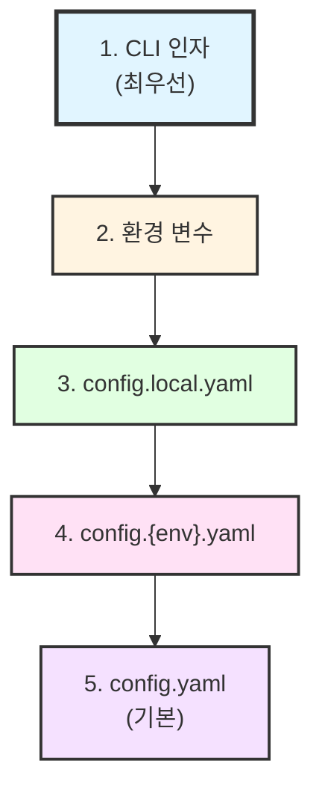

# 설정 관리 컨벤션

설정 파일 작성 및 관리 규칙을 제공한다.

## 목적

- 하드코딩 제거, 설정 중앙화
- OmegaConf + Pydantic 기반 관리
- 환경별 설정 분리 (dev, prod, test)
- 로컬 오버라이드 지원

## 사용법

```
/convention-config [섹션]
```

| 섹션 | 설명 |
|------|------|
| `structure` | 디렉토리 구조 |
| `schema` | Pydantic 스키마 정의 |
| `usage` | 코드에서 사용법 |
| `override` | 오버라이드 패턴 |
| `all` | 전체 규칙 (기본값) |

---

## 1. 핵심 원칙

| 원칙 | 설명 |
|------|------|
| 하드코딩 금지 | 모든 경로, 파라미터는 config.yaml에서 관리 |
| OmegaConf | YAML 파일 로딩 및 계층적 설정 관리 |
| Pydantic | 설정값 타입 검증 및 기본값 정의 |
| 환경 분리 | dev, prod, test 별도 설정 파일 |

---

## 2. 디렉토리 구조

```
config/
├── config.yaml              # 메인 설정 (git tracked)
├── config.local.yaml        # 로컬 오버라이드 (gitignored)
├── config.dev.yaml          # 개발 환경
├── config.prod.yaml         # 운영 환경
├── config.test.yaml         # 테스트 환경
└── schemas/
    └── config_schema.py     # Pydantic 스키마
```

### .gitignore 설정

```gitignore
# Config local overrides
config/config.local.yaml
config/*.local.yaml

# Secrets (절대 커밋하지 않음)
config/secrets.yaml
*.secret.yaml
```

---

## 3. Pydantic 스키마

### 스키마 정의

```python
# config/schemas/config_schema.py
from pydantic import BaseModel, Field
from pathlib import Path


class PathConfig(BaseModel):
    """경로 설정."""
    data_dir: Path = Field(
        default=Path("./data"),
        description="데이터 디렉토리"
    )
    output_dir: Path = Field(
        default=Path("./output"),
        description="출력 디렉토리"
    )
    model_dir: Path = Field(
        default=Path("./models"),
        description="모델 저장 디렉토리"
    )


class DataConfig(BaseModel):
    """데이터 처리 설정."""
    batch_size: int = Field(
        default=32,
        ge=1,
        description="배치 크기"
    )
    num_workers: int = Field(
        default=4,
        ge=0,
        description="데이터 로더 워커 수"
    )
    shuffle: bool = Field(
        default=True,
        description="데이터 셔플 여부"
    )


class ModelConfig(BaseModel):
    """모델 설정."""
    name: str = Field(
        default="default",
        description="모델 이름"
    )
    learning_rate: float = Field(
        default=1e-4,
        gt=0,
        description="학습률"
    )
    epochs: int = Field(
        default=100,
        ge=1,
        description="에폭 수"
    )


class Config(BaseModel):
    """전체 설정."""
    paths: PathConfig = Field(default_factory=PathConfig)
    data: DataConfig = Field(default_factory=DataConfig)
    model: ModelConfig = Field(default_factory=ModelConfig)
```

### Field 옵션

| 옵션 | 설명 | 예시 |
|------|------|------|
| `default` | 기본값 | `default=32` |
| `default_factory` | 동적 기본값 | `default_factory=list` |
| `ge`, `gt` | 최솟값 (이상, 초과) | `ge=0`, `gt=0` |
| `le`, `lt` | 최댓값 (이하, 미만) | `le=100` |
| `min_length`, `max_length` | 문자열 길이 | `min_length=1` |
| `regex` | 정규식 검증 | `regex=r"^[a-z]+$"` |

---

## 4. config.yaml 작성

```yaml
# config/config.yaml
paths:
  data_dir: ./data
  output_dir: ./output
  model_dir: ./models

data:
  batch_size: 64
  num_workers: 8
  shuffle: true

model:
  name: my_model
  learning_rate: 0.001
  epochs: 50
```

### 중첩 설정

```yaml
database:
  host: localhost
  port: 5432
  credentials:
    username: user
    password: ${DB_PASSWORD}  # 환경 변수 참조

logging:
  level: INFO
  handlers:
    - type: console
      format: "%(asctime)s - %(message)s"
    - type: file
      path: ./logs/app.log
```

---

## 5. 코드에서 사용

### 기본 로드

```python
from omegaconf import OmegaConf
from config.schemas.config_schema import Config

# YAML 로드
raw_config = OmegaConf.load("config/config.yaml")

# 로컬 오버라이드 병합 (있으면)
if Path("config/config.local.yaml").exists():
    local_config = OmegaConf.load("config/config.local.yaml")
    raw_config = OmegaConf.merge(raw_config, local_config)

# Pydantic으로 검증
config = Config(**OmegaConf.to_container(raw_config))

# 사용
print(config.paths.data_dir)
print(config.model.learning_rate)
```

### 유틸리티 함수

```python
# src/utils/config.py
from pathlib import Path
from omegaconf import OmegaConf
from config.schemas.config_schema import Config


def load_config(
    config_path: str = "config/config.yaml",
    local_path: str | None = "config/config.local.yaml",
    env: str | None = None
) -> Config:
    """설정 로드 및 검증.

    Args:
        config_path: 메인 설정 파일 경로.
        local_path: 로컬 오버라이드 파일 경로.
        env: 환경 (dev, prod, test).

    Returns:
        검증된 Config 객체.
    """
    # 메인 설정 로드
    config = OmegaConf.load(config_path)

    # 환경별 설정 병합
    if env:
        env_path = Path(f"config/config.{env}.yaml")
        if env_path.exists():
            env_config = OmegaConf.load(env_path)
            config = OmegaConf.merge(config, env_config)

    # 로컬 오버라이드 병합
    if local_path and Path(local_path).exists():
        local_config = OmegaConf.load(local_path)
        config = OmegaConf.merge(config, local_config)

    # Pydantic으로 검증
    return Config(**OmegaConf.to_container(config))
```

---

## 6. 오버라이드 패턴

### 우선순위



### CLI 오버라이드

```python
import argparse
from omegaconf import OmegaConf

def main():
    parser = argparse.ArgumentParser()
    parser.add_argument("--config", default="config/config.yaml")
    parser.add_argument("overrides", nargs="*")
    args = parser.parse_args()

    # 기본 설정 로드
    config = OmegaConf.load(args.config)

    # CLI 오버라이드 적용
    # python main.py model.learning_rate=0.01 data.batch_size=128
    if args.overrides:
        cli_config = OmegaConf.from_dotlist(args.overrides)
        config = OmegaConf.merge(config, cli_config)

    return Config(**OmegaConf.to_container(config))
```

### 환경 변수 오버라이드

```bash
# MYAPP_PATHS_DATA_DIR=./custom_data 형식
export MYAPP_MODEL_LEARNING_RATE=0.01
```

```python
config = OmegaConf.merge(config, OmegaConf.from_env(prefix="MYAPP"))
```

---

## 7. 환경별 설정

### 개발 환경

```yaml
# config/config.dev.yaml
database:
  url: localhost:5432
  debug: true

logging:
  level: DEBUG
```

### 운영 환경

```yaml
# config/config.prod.yaml
database:
  url: prod-db.example.com
  debug: false
  pool_size: 20

logging:
  level: WARNING
```

### 사용

```python
# 환경에 따라 로드
config = load_config(env="prod")
```

---

## 8. 금지 패턴 (Anti-patterns)

### 하드코딩된 경로

```python
# Bad
data_path = "/Users/myname/projects/data/train.csv"

# Good
data_path = config.paths.data_dir / "train.csv"
```

### 매직 넘버

```python
# Bad
model = Model(hidden_size=256, dropout=0.3)

# Good
model = Model(
    hidden_size=config.model.hidden_size,
    dropout=config.model.dropout
)
```

### 환경별 분기 하드코딩

```python
# Bad
if os.getenv("ENV") == "prod":
    db_url = "prod-db.example.com"
else:
    db_url = "localhost"

# Good
db_url = config.database.url  # config.{env}.yaml에서 관리
```

### 설정 없이 환경 변수 직접 사용

```python
# Bad
api_key = os.getenv("API_KEY")

# Good (config.yaml에서 관리)
# api_key: ${API_KEY}
api_key = config.api.key
```

---

## 관련 스킬

| 스킬 | 역할 |
|------|------|
| [@skills/check-config-validation/SKILL.md] | 설정 파일 검증 |
| [@skills/convention-python/SKILL.md] | Python 코딩 컨벤션 참조 |

---

## 참고 자료

- [OmegaConf 문서](https://omegaconf.readthedocs.io/)
- [Pydantic 문서](https://docs.pydantic.dev/)

---

## Changelog

| 날짜 | 버전 | 변경 내용 |
|------|------|----------|
| 2026-01-21 | 1.0.0 | 초기 생성 - OmegaConf + Pydantic 설정 관리 패턴 통합 |

## Gotchas (실패 포인트)

- .env 파일을 git commit에 포함하면 secrets 유출 — .gitignore 확인
- OmegaConf에서 `cfg.key` vs `cfg['key']` 혼용 금지 — attribute 방식 통일
- 환경별 config 병합 순서 실수 → dev 설정이 prod에 적용되는 사고
- pyproject.toml에 중복 설정 시 어느 것이 우선인지 불명확
