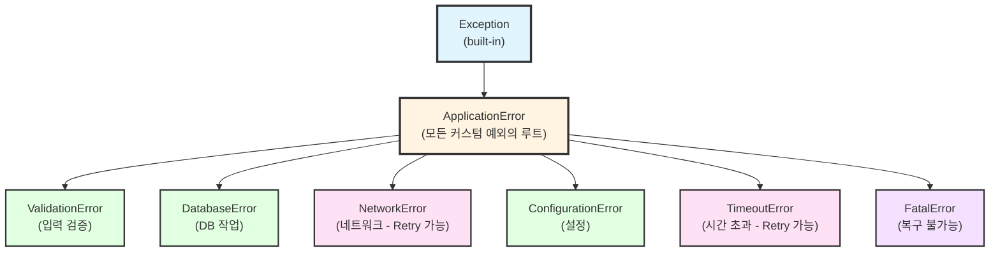

# 에러 처리(Error Handling) 컨벤션

예외 처리 및 장애 복구 전략을 통해 견고한 소프트웨어를 구축하기 위한 규칙.

## 목적

- **예외 계층화**: 예외 타입 정의 및 계층 구조
- **복구 전략**: Retry, fallback, graceful degradation
- **Retry 로직**: Exponential backoff로 cascading failure 방지
- **Circuit breaker**: 반복적 실패 시 빠른 실패(fail-fast)
- **구조화된 로깅**: 에러 추적 및 디버깅 용이

---

## 1. 예외 계층화

### 1.1 핵심 원칙

**규칙**: 예외를 계층화하여 특정 예외를 catch 및 처리한다.

**예외 클래스 정의**: [@templates/skill-examples/convention-error-handling/exception-hierarchy.py]

**예외 종류**:
- `ApplicationError`: 모든 커스텀 예외의 베이스 클래스
- `ValidationError`: 입력 검증 실패
- `DatabaseError`: DB 작업 실패
- `NetworkError`: 네트워크 작업 실패 (Retry 가능)
- `ConfigurationError`: 설정 오류
- `TimeoutError`: 작업 시간 초과 (Retry 가능)
- `FatalError`: 복구 불가능한 치명적 오류

### 1.2 예외 계층도



---

## 2. Try-Catch-Finally 구조화

### 2.1 기본 패턴

**규칙**: 예외별로 다른 처리를 수행하고, 정리 작업은 finally에서.

**Try-Catch-Finally 예시**: [@templates/skill-examples/convention-error-handling/try-catch-finally.py]

**핵심 처리 흐름**:
1. 입력 검증 (ValidationError 발생 가능)
2. DB 쿼리 시도
3. 예외별 처리:
   - `ValidationError`: 입력 유효성 재점검 후 반환
   - `DatabaseError`: 재시도 또는 대체 방법
   - `FatalError`: 로깅 후 프로그램 종료 신호
4. finally: DB 연결 정리 (필수 실행)

### 2.2 다층 예외 처리

**process_user_request()**: 다층 예외 처리 예시
- ValidationError → 로깅 + 에러 메시지 반환
- DatabaseError → 로깅 + 캐시 시도
- FatalError → 로깅 + 시스템 종료 신호
- Exception → 예상 미처 예외 로깅

---

## 3. Retry Logic 및 Exponential Backoff

### 3.1 기본 Retry 구현

**Retry 함수**: [@templates/skill-examples/convention-error-handling/retry-logic.py]

**retry_with_exponential_backoff()**:
- 최대 재시도 횟수 설정 (기본 3회)
- Exponential backoff 계산 (delay × backoff_factor^attempt)
- Jitter 추가 (랜덤값으로 thundering herd 방지)

### 3.2 Decorator를 사용한 Retry

**@retry_on_error**: 재시도 데코레이터
- 함수에 자동으로 재시도 로직 적용
- NetworkError, TimeoutError만 재시도
- 간단한 사용법

사용 예시:
```python
@retry_on_error(max_retries=3, initial_delay=1.0)
def fetch_data_from_api():
    # API 호출
    pass
```

---

## 4. Circuit Breaker 패턴

### 4.1 Circuit Breaker 상태 머신

**Circuit Breaker 클래스**: [@templates/skill-examples/convention-error-handling/circuit-breaker.py]

**상태 (States)**:
- `CLOSED`: 정상 상태, 모든 요청 통과
- `OPEN`: 차단 상태, 즉시 실패 반환 (cascading failure 방지)
- `HALF_OPEN`: 복구 중, 제한된 요청만 허용

**상태 전이**:
- CLOSED → OPEN: failure_count >= threshold
- OPEN → HALF_OPEN: recovery_timeout 초과
- HALF_OPEN → CLOSED: 성공 시
- HALF_OPEN → OPEN: 실패 시

사용 예시:
```python
breaker = CircuitBreaker(
    failure_threshold=5,
    recovery_timeout=60.0
)
result = breaker.call(fetch_from_service)
```

---

## 5. 구조화된 로깅

### 5.1 에러 로깅 패턴

**로깅 함수**: [@templates/skill-examples/convention-error-handling/structured-logging.py]

**setup_error_logging()**: 로거 설정
- 로그 레벨: DEBUG (개발) / ERROR (프로덕션)
- 포맷: timestamp, level, message, exception
- 핸들러: console (개발) + file (프로덕션)

**log_exception()**: 구조화된 예외 로깅
- 예외 타입, 메시지 추출
- 컨텍스트 정보 추가 (user_id, request_id 등)
- JSON 형식으로 로깅 (파싱 용이)
- 스택 트레이스 포함

---

## 6. 종합 예제: API 호출 with 복구 전략

**API 호출 예시**: [@templates/skill-examples/convention-error-handling/api-example.py]

**call_payment_api()**: 종합 복구 전략
1. 입력 검증 (ValidationError)
2. Circuit Breaker 상태 확인
3. Retry with exponential backoff (max 3회)
4. 최종 실패 시 캐시/기본값 반환
5. 모든 단계에서 구조화된 로깅

---

## 7. 에러 처리 체크리스트

구현 완료 후 다음을 확인하세요:

- [ ] 커스텀 예외 클래스 정의 (ApplicationError 상속)
- [ ] 예외별 catch 및 처리 로직 구현
- [ ] Try-catch-finally 구조화 (정리 작업 finally)
- [ ] Retry logic with exponential backoff 구현
- [ ] Circuit Breaker 패턴 적용 (외부 서비스 호출)
- [ ] 구조화된 에러 로깅 (timestamp, context, exception)
- [ ] Graceful degradation 전략 (캐시, 기본값 반환)
- [ ] 테스트: 각 예외 타입별 처리 검증
- [ ] 문서화: 예외별 발생 시나리오, 처리 방법 명시
- [ ] 모니터링: 에러율, 재시도율, Circuit Breaker 상태 추적

---

## 8. 외부 도구 통합

**외부 도구 가이드**: [@templates/skill-examples/convention-error-handling/external-tools.md]

지원 도구:
- **Tenacity**: Retry 라이브러리 (대안)
- **Python asyncio**: 비동기 timeout 처리

---

## 관련 스킬

| 스킬 | 역할 |
|------|------|
| [@skills/convention-logging/SKILL.md] | 구조화된 로깅 |
| [@skills/convention-python/SKILL.md] | Python 코딩 컨벤션 |
| [@skills/convention-testing/SKILL.md] | 테스트 작성 (예외 테스트) |
| [@skills/check-security/SKILL.md] | 보안 예외 처리 |

---

## 참고

- Python Exception Handling: https://docs.python.org/3/tutorial/errors.html
- Circuit Breaker Pattern: https://martinfowler.com/bliki/CircuitBreaker.html
- Tenacity (Retry Library): https://tenacity.readthedocs.io/
- OWASP Error Handling: https://owasp.org/www-community/Error_Handling

---

## Changelog

| 날짜 | 버전 | 변경 내용 |
|------|------|----------|
| 2026-01-28 | 1.1.0 | 보수적 리팩토링 - 880→264줄. Python 코드 예시를 템플릿으로 분리 |
| 2026-01-21 | 1.0.0 | 초기 생성 - 예외 계층화, Retry, Circuit breaker |

## Gotchas (실패 포인트)

- bare except 금지: `except:` → `except Exception as e:`
- 예외를 삼키면(swallow) 버그 추적 불가 — 반드시 log 또는 raise
- 커스텀 예외 상속 체계 없이 모두 ValueError 사용 → 호출자가 구분 불가
- Retry logic에서 무한루프 방지 — max_retries 반드시 설정
