# app-streamlit

Streamlit 앱을 빠르게 생성하는 스킬.

## 목적

- Streamlit 앱 구조 스캐폴딩
- 대시보드, 데이터 앱, LLM 채팅 인터페이스 생성
- 컴포넌트 추가 및 멀티페이지 구성
- 데이터 사이언스, ML/AI 프로젝트의 인터랙티브 대시보드 구축

## 사용법

```
/app-streamlit scaffold dashboard
/app-streamlit scaffold data-app
/app-streamlit scaffold chat
/app-streamlit component chart-line
/app-streamlit page analytics
/app-streamlit run
```

## 액션

| 액션 | 설명 | 예시 |
|------|------|------|
| `scaffold` | 앱 구조 생성 | `/app-streamlit scaffold dashboard` |
| `component` | 컴포넌트 추가 | `/app-streamlit component chart-line` |
| `page` | 멀티페이지 추가 | `/app-streamlit page analytics` |
| `run` | 앱 실행 | `/app-streamlit run` |

---

## AskUserQuestion 활용 지점

### 지점 1: 앱 타입 선택

**시점**: scaffold 액션 실행 시 앱 타입 미지정

```yaml
AskUserQuestion:
  questions:
    - question: "어떤 타입의 Streamlit 앱을 생성할까요?"
      header: "앱 타입"
      multiSelect: false
      options:
        - label: "dashboard - 데이터 대시보드 (권장)"
          description: "차트, 메트릭, KPI 표시 | 복잡도: 낮음 | 용도: 데이터 시각화"
        - label: "chat - LLM 채팅 인터페이스"
          description: "챗봇, 대화형 AI | 복잡도: 중간 | 용도: AI 인터랙션"
        - label: "data-app - 데이터 탐색기"
          description: "DataFrame 조작, 필터링 | 복잡도: 낮음 | 용도: 데이터 분석"
        - label: "form - 데이터 입력 폼"
          description: "사용자 입력 수집 | 복잡도: 낮음 | 용도: 데이터 수집"
```

### 지점 2: 컴포넌트 선택

**시점**: component 액션 실행 시 컴포넌트 타입 미지정

```yaml
AskUserQuestion:
  questions:
    - question: "추가할 컴포넌트 카테고리를 선택해주세요"
      header: "컴포넌트"
      multiSelect: false
      options:
        - label: "Chart - 차트 컴포넌트 (권장)"
          description: "line/bar/area/pie 차트 | plotly/altair 지원"
        - label: "Input - 입력 위젯"
          description: "slider/selectbox/checkbox 등"
        - label: "Data - 데이터 표시"
          description: "dataframe/table/metric/json"
        - label: "Layout - 레이아웃"
          description: "columns/tabs/expander/container"
```

### 지점 3: 초기 데이터 소스

**시점**: scaffold 완료 후 데이터 연결 설정

```yaml
AskUserQuestion:
  questions:
    - question: "앱이 사용할 데이터 소스를 설정할까요?"
      header: "데이터 소스"
      multiSelect: false
      options:
        - label: "샘플 데이터 (권장)"
          description: "빠른 프로토타입용 더미 데이터 생성"
        - label: "CSV/Excel 파일"
          description: "파일 업로더 컴포넌트 추가"
        - label: "Database 연결"
          description: "PostgreSQL/MongoDB 연결 설정"
        - label: "API 연결"
          description: "REST API 데이터 페칭"
```

## 앱 타입

### 1. dashboard

데이터 대시보드 앱. 차트, 메트릭, KPI 표시에 적합.

```
/app-streamlit scaffold dashboard
```

**포함 요소**:
- 사이드바 필터
- 메트릭 카드 (st.metric)
- 라인/바/파이 차트
- 데이터 테이블

### 2. data-app

데이터 탐색기 앱. DataFrame 조작, 필터링, 분석에 적합.

```
/app-streamlit scaffold data-app
```

**포함 요소**:
- 파일 업로더
- 데이터 미리보기 (st.dataframe)
- 필터/정렬 위젯
- 다운로드 버튼

### 3. chat

LLM 채팅 인터페이스. AI 챗봇, 대화형 분석에 적합.

```
/app-streamlit scaffold chat
```

**포함 요소**:
- st.chat_message
- st.chat_input
- 대화 히스토리 관리
- 스트리밍 응답

### 4. form

데이터 입력 폼. 사용자 입력 수집, 유효성 검사에 적합.

```
/app-streamlit scaffold form
```

**포함 요소**:
- st.form
- 다양한 입력 위젯
- 유효성 검사
- 제출 처리

### 5. multi-page

멀티페이지 앱. 복잡한 앱의 페이지 분리에 적합.

```
/app-streamlit scaffold multi-page
```

**포함 요소**:
- pages/ 디렉토리 구조
- 네비게이션
- 공유 상태 관리

## uv 환경 설정

> **참조**: `@.claude/docs/references/research/uv-best-practices.md`

### uv 기반 프로젝트 초기화

```bash
# 프로젝트 생성 (uv 권장)
uv init streamlit_app
cd streamlit_app

# Streamlit 및 의존성 추가
uv add streamlit pandas plotly altair
```

### uv로 앱 실행

```bash
# uv run으로 실행 (권장)
uv run streamlit run app.py

# 특정 포트 지정
uv run streamlit run app.py --server.port 8502

# 헤드리스 모드 (서버 배포용)
uv run streamlit run app.py --server.headless true
```

### pyproject.toml 설정

```toml
[project]
name = "streamlit-app"
version = "0.1.0"
requires-python = ">=3.11"
dependencies = [
    "streamlit>=1.32.0",
    "pandas>=2.0.0",
    "plotly>=5.18.0",
    "altair>=5.2.0",
]

[project.optional-dependencies]
dev = [
    "pytest>=8.0.0",
    "ruff>=0.3.0",
]
```

### uv 명령어 요약

| 명령어 | 설명 |
|--------|------|
| `uv init` | 프로젝트 초기화 |
| `uv add streamlit` | Streamlit 추가 |
| `uv run streamlit run app.py` | 앱 실행 |
| `uv sync` | 의존성 동기화 |
| `uv lock` | lockfile 생성 |

## 출력 구조

### 기본 구조 (uv 기반)

```
streamlit_app/
├── pyproject.toml      # uv 프로젝트 설정 (권장)
├── uv.lock             # 의존성 lock 파일
├── app.py              # 메인 앱
├── pages/              # 멀티페이지
│   ├── 1_Dashboard.py
│   └── 2_Analytics.py
├── components/         # 재사용 컴포넌트
│   ├── __init__.py
│   ├── charts.py
│   └── widgets.py
├── utils/              # 유틸리티
│   ├── __init__.py
│   ├── data_loader.py
│   └── cache.py
├── .streamlit/         # 설정
│   └── config.toml
└── .python-version     # Python 버전 고정
```

### config.toml 템플릿

```toml
[theme]
primaryColor = "#FF4B4B"
backgroundColor = "#FFFFFF"
secondaryBackgroundColor = "#F0F2F6"
textColor = "#262730"
font = "sans serif"

[server]
port = 8501
headless = true

[browser]
gatherUsageStats = false
```

## 컴포넌트 카탈로그

### Display 컴포넌트

| 컴포넌트 | 코드 | 용도 |
|----------|------|------|
| `text` | `st.text()` | 고정폭 텍스트 |
| `markdown` | `st.markdown()` | 마크다운 렌더링 |
| `title` | `st.title()` | 제목 |
| `header` | `st.header()` | 헤더 |
| `code` | `st.code()` | 코드 블록 |
| `latex` | `st.latex()` | LaTeX 수식 |

### Data 컴포넌트

| 컴포넌트 | 코드 | 용도 |
|----------|------|------|
| `dataframe` | `st.dataframe()` | 인터랙티브 테이블 |
| `table` | `st.table()` | 정적 테이블 |
| `metric` | `st.metric()` | KPI 메트릭 |
| `json` | `st.json()` | JSON 표시 |
| `editable` | `st.data_editor()` | 편집 가능 테이블 |

### Input 컴포넌트

| 컴포넌트 | 코드 | 용도 |
|----------|------|------|
| `button` | `st.button()` | 버튼 |
| `checkbox` | `st.checkbox()` | 체크박스 |
| `radio` | `st.radio()` | 라디오 버튼 |
| `selectbox` | `st.selectbox()` | 드롭다운 |
| `slider` | `st.slider()` | 슬라이더 |
| `text_input` | `st.text_input()` | 텍스트 입력 |
| `file_uploader` | `st.file_uploader()` | 파일 업로드 |

### Chart 컴포넌트

| 컴포넌트 | 코드 | 용도 |
|----------|------|------|
| `line_chart` | `st.line_chart()` | 라인 차트 |
| `area_chart` | `st.area_chart()` | 영역 차트 |
| `bar_chart` | `st.bar_chart()` | 바 차트 |
| `map` | `st.map()` | 지도 |
| `plotly` | `st.plotly_chart()` | Plotly 차트 |
| `altair` | `st.altair_chart()` | Altair 차트 |

### Layout 컴포넌트

| 컴포넌트 | 코드 | 용도 |
|----------|------|------|
| `columns` | `st.columns()` | 컬럼 레이아웃 |
| `tabs` | `st.tabs()` | 탭 |
| `expander` | `st.expander()` | 확장 패널 |
| `container` | `st.container()` | 컨테이너 |
| `sidebar` | `st.sidebar` | 사이드바 |

### Chat 컴포넌트

| 컴포넌트 | 코드 | 용도 |
|----------|------|------|
| `chat_message` | `st.chat_message()` | 채팅 메시지 |
| `chat_input` | `st.chat_input()` | 채팅 입력 |

## 앱 템플릿

### Dashboard 템플릿

```python
import streamlit as st
import pandas as pd
import plotly.express as px

st.set_page_config(
    page_title="Dashboard",
    page_icon="📊",
    layout="wide"
)

st.title("📊 Data Dashboard")

# Sidebar filters
with st.sidebar:
    st.header("Filters")
    date_range = st.date_input("Date Range", [])
    category = st.selectbox("Category", ["All", "A", "B", "C"])

# Metrics row
col1, col2, col3, col4 = st.columns(4)
with col1:
    st.metric("Total Users", "1,234", "+12%")
with col2:
    st.metric("Revenue", "$45,678", "+8%")
with col3:
    st.metric("Orders", "567", "-3%")
with col4:
    st.metric("Conversion", "3.2%", "+0.5%")

# Charts
col1, col2 = st.columns(2)

with col1:
    st.subheader("Trend")
    # Line chart here
    st.line_chart(pd.DataFrame({"data": [1, 2, 3, 4, 5]}))

with col2:
    st.subheader("Distribution")
    # Bar chart here
    st.bar_chart(pd.DataFrame({"data": [3, 1, 4, 1, 5]}))

# Data table
st.subheader("Raw Data")
st.dataframe(pd.DataFrame({"A": [1, 2, 3], "B": [4, 5, 6]}))
```

### Chat 템플릿

```python
import streamlit as st

st.set_page_config(
    page_title="Chat",
    page_icon="💬"
)

st.title("💬 AI Chat")

# Initialize chat history
if "messages" not in st.session_state:
    st.session_state.messages = []

# Display chat history
for message in st.session_state.messages:
    with st.chat_message(message["role"]):
        st.markdown(message["content"])

# Chat input
if prompt := st.chat_input("What's on your mind?"):
    # Add user message
    st.session_state.messages.append({"role": "user", "content": prompt})
    with st.chat_message("user"):
        st.markdown(prompt)

    # Generate response (placeholder)
    response = f"Echo: {prompt}"

    # Add assistant message
    st.session_state.messages.append({"role": "assistant", "content": response})
    with st.chat_message("assistant"):
        st.markdown(response)
```

### Data App 템플릿

```python
import streamlit as st
import pandas as pd

st.set_page_config(
    page_title="Data Explorer",
    page_icon="🔍"
)

st.title("🔍 Data Explorer")

# File upload
uploaded_file = st.file_uploader("Upload CSV", type=["csv"])

if uploaded_file:
    df = pd.read_csv(uploaded_file)

    # Data preview
    st.subheader("Data Preview")
    st.dataframe(df.head())

    # Column selection
    columns = st.multiselect("Select columns", df.columns.tolist())

    if columns:
        # Filtered data
        st.subheader("Filtered Data")
        st.dataframe(df[columns])

        # Download button
        csv = df[columns].to_csv(index=False)
        st.download_button(
            "Download CSV",
            csv,
            "filtered_data.csv",
            "text/csv"
        )
else:
    st.info("Please upload a CSV file to get started.")
```

### Form 템플릿

```python
import streamlit as st

st.set_page_config(
    page_title="Form",
    page_icon="📝"
)

st.title("📝 Data Entry Form")

with st.form("entry_form"):
    st.subheader("Personal Information")

    col1, col2 = st.columns(2)
    with col1:
        name = st.text_input("Name")
        email = st.text_input("Email")
    with col2:
        age = st.number_input("Age", min_value=0, max_value=120)
        gender = st.selectbox("Gender", ["", "Male", "Female", "Other"])

    st.subheader("Preferences")
    interests = st.multiselect(
        "Interests",
        ["Sports", "Music", "Technology", "Art", "Travel"]
    )
    newsletter = st.checkbox("Subscribe to newsletter")

    submitted = st.form_submit_button("Submit")

    if submitted:
        if name and email:
            st.success(f"Thank you, {name}! Your information has been submitted.")
        else:
            st.error("Please fill in all required fields.")
```

## 프로세스

```mermaid
flowchart TD
    Start["/app-streamlit [action] [options]"]

    Scaffold["scaffold 액션"]
    Scaffold1["앱 타입 결정"]
    Scaffold2["디렉토리 구조 생성"]
    Scaffold3["템플릿 파일 생성"]
    Scaffold4["config.toml 설정"]
    Scaffold5["requirements.txt 생성"]

    Component["component 액션"]
    Component1["컴포넌트 타입 확인"]
    Component2["components/ 디렉토리에 추가"]
    Component3["app.py에 import 추가"]

    Page["page 액션"]
    Page1["pages/ 디렉토리에 페이지 추가"]
    Page2["네비게이션 업데이트"]

    Run["run 액션"]
    Run1["streamlit run app.py 실행"]
    Run2["브라우저 자동 열기"]

    End([완료])

    Start --> Scaffold
    Scaffold --> Scaffold1
    Scaffold --> Scaffold2
    Scaffold --> Scaffold3
    Scaffold --> Scaffold4
    Scaffold --> Scaffold5

    Start --> Component
    Component --> Component1
    Component --> Component2
    Component --> Component3

    Start --> Page
    Page --> Page1
    Page --> Page2

    Start --> Run
    Run --> Run1
    Run --> Run2

    Scaffold --> End
    Component --> End
    Page --> End
    Run --> End

    style Start fill:#e1f5ff
    style Scaffold fill:#fff4e1
    style Component fill:#e1ffe1
    style Page fill:#ffe1f5
    style Run fill:#f5e1ff
    style End fill:#90EE90
```



## 예제

### Dashboard 스캐폴딩

```
User: /app-streamlit scaffold dashboard

Claude:
=== Streamlit Dashboard 생성 ===

[1/4] 디렉토리 구조 생성 중...
  ✓ streamlit_app/
  ✓ streamlit_app/pages/
  ✓ streamlit_app/components/
  ✓ streamlit_app/utils/
  ✓ streamlit_app/.streamlit/

[2/4] 템플릿 파일 생성 중...
  ✓ app.py (Dashboard 템플릿)
  ✓ pages/1_Dashboard.py
  ✓ pages/2_Analytics.py
  ✓ components/charts.py
  ✓ utils/data_loader.py

[3/4] 설정 파일 생성 중...
  ✓ .streamlit/config.toml
  ✓ requirements.txt

[4/4] 완료

=== 생성 완료 ===

실행 방법 (uv 권장):
  cd streamlit_app
  uv sync
  uv run streamlit run app.py

또는: /app-streamlit run
```

### 컴포넌트 추가

```
User: /app-streamlit component chart-line

Claude:
=== 컴포넌트 추가 ===

[1/2] Line Chart 컴포넌트 생성 중...

components/charts.py에 추가됨:

```python
def render_line_chart(data, x, y, title="Line Chart"):
    """Render a line chart with Plotly."""
    import plotly.express as px
    fig = px.line(data, x=x, y=y, title=title)
    st.plotly_chart(fig, use_container_width=True)
```

[2/2] 사용 예시:

```python
from components.charts import render_line_chart

render_line_chart(df, x="date", y="value", title="Daily Trend")
```

=== 완료 ===
```

### 멀티페이지 추가

```
User: /app-streamlit page analytics

Claude:
=== 페이지 추가 ===

[1/2] pages/3_Analytics.py 생성 중...

pages/3_Analytics.py:

```python
import streamlit as st

st.set_page_config(page_title="Analytics", page_icon="📈")

st.title("📈 Analytics")

# Add your analytics content here
```

[2/2] 완료

페이지가 네비게이션에 자동으로 추가되었습니다.

=== 완료 ===
```

## 베스트 프랙티스

### 성능 최적화

```python
# 캐싱 사용
@st.cache_data
def load_data():
    return pd.read_csv("data.csv")

# 세션 상태 관리
if "data" not in st.session_state:
    st.session_state.data = load_data()
```

### 레이아웃 팁

```python
# Wide layout
st.set_page_config(layout="wide")

# Columns with different widths
col1, col2, col3 = st.columns([2, 1, 1])

# Sidebar organization
with st.sidebar:
    st.header("Settings")
    # sidebar content
```

### 에러 핸들링

```python
try:
    df = pd.read_csv(uploaded_file)
except Exception as e:
    st.error(f"Error loading file: {e}")
```

## 관련 스킬

| 스킬명 | 관계 | 설명 |
|--------|------|------|
| [@skills/project-init/SKILL.md] | 관련 | 프로젝트 초기화 |
| [@skills/setup-uv-env/SKILL.md] | 관련 | uv 환경 설정 |
| [@skills/diagram-generator/SKILL.md] | 관련 | 다이어그램 생성 |
| `ds-ml` | 관련 | 데이터 사이언스 스킬 |

## 참조

- uv 베스트 프랙티스: `@.claude/docs/references/research/uv-best-practices.md`

## Changelog

| 날짜 | 변경 내용 |
|------|----------|
| 2026-01-21 | 초기 스킬 생성 |
| 2026-01-21 | 5개 앱 타입 템플릿 추가 (dashboard, data-app, chat, form, multi-page) |
| 2026-01-21 | 컴포넌트 카탈로그 추가 |
| 2026-01-21 | uv 환경 설정 섹션 추가 |
