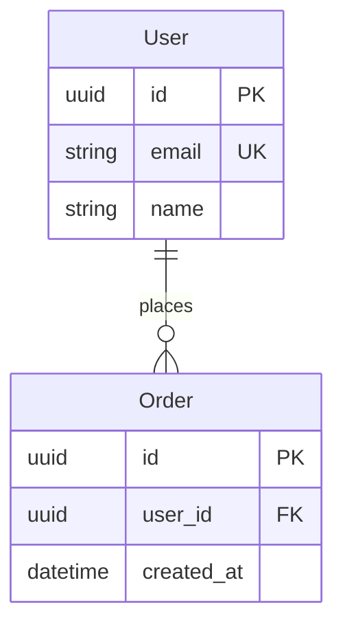
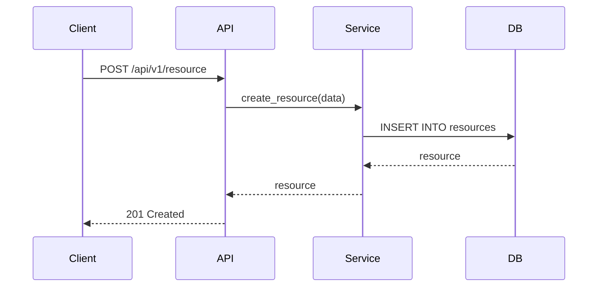

# doc-spec

기술 명세서(Technical Specification)를 생성하는 스킬.

## 목적

- PRD를 기술 명세로 변환
- API 스펙 정의
- 데이터 모델 설계
- 시퀀스 다이어그램 생성
- 에러 처리 명세

## 사용법

```
/doc-spec                                # 대화형으로 명세 생성
/doc-spec tasks/auth-prd.md           # PRD 기반 명세 생성
```

## 프로세스

```
/doc-spec [prd-file]
    |
    v
[Step 1] PRD 분석
    |-- PRD 파일 로드
    |-- 기능 요구사항 추출
    |-- 비기능 요구사항 추출
    |
    v
[Step 2] 기술 설계
    |-- API 엔드포인트 정의
    |-- 데이터 모델 설계
    |-- 시퀀스 다이어그램 생성
    |
    v
[Step 3] 문서 생성
    |-- 기술 명세서 템플릿 적용
    |-- docs/spec/ 저장
    |
    v
완료
```

## 기술 명세서 템플릿

```markdown
# {기능명} 기술 명세서

> **버전**: 1.0
> **작성일**: {날짜}
> **PRD 참조**: {prd-file}

---

## 1. Overview

### 1.1 목적
{기능 목적}

### 1.2 범위
{포함/제외 범위}

---

## 2. API Specification

### 2.1 Endpoints

| Method | Path | Description | Auth |
|--------|------|-------------|------|
| POST | /api/v1/{resource} | {설명} | JWT |

### 2.2 Request/Response

#### POST /api/v1/{resource}

**Request:**
```json
{
  "field1": "string",
  "field2": 0
}
```

**Response (200):**
```json
{
  "id": "uuid",
  "created_at": "datetime"
}
```

**Response (400):**
```json
{
  "error": {
    "code": "INVALID_INPUT",
    "message": "string"
  }
}
```

---

## 3. Data Models

### 3.1 {Entity}

| Field | Type | Required | Description | Constraints |
|-------|------|----------|-------------|-------------|
| id | UUID | Y | Primary key | auto-generated |
| email | string | Y | 이메일 | unique, max 255 |

### 3.2 ER Diagram



---

## 4. Sequence Diagrams

### 4.1 {Use Case}



---

## 5. Error Handling

### 5.1 Error Codes

| HTTP Code | Error Code | Message | Description |
|-----------|------------|---------|-------------|
| 400 | INVALID_INPUT | 잘못된 입력값 | 요청 데이터 검증 실패 |
| 401 | UNAUTHORIZED | 인증 필요 | 토큰 누락/만료 |
| 404 | NOT_FOUND | 리소스 없음 | 요청 리소스 미존재 |

### 5.2 Error Response Format

```json
{
  "error": {
    "code": "ERROR_CODE",
    "message": "Human readable message",
    "details": {}
  }
}
```

---

## 6. Security Considerations

- [ ] 인증: JWT Bearer Token
- [ ] 권한: Role-based access control
- [ ] 입력 검증: Pydantic 스키마
- [ ] 로깅: 민감 정보 마스킹

---

## 7. Performance Requirements

| Metric | Target | Measurement |
|--------|--------|-------------|
| Response Time | < 200ms (p95) | API Gateway |
| Throughput | 100 req/s | Load test |

---

## Traceability

- **Upstream**: {prd-file}
- **Downstream**: tasks/{feature}-tasks.md
```

## 예제

### PRD 기반 명세 생성

```
User: /doc-spec tasks/user-auth-prd.md

Claude:
=== 기술 명세서 생성 ===

[1/3] PRD 분석 중...
  - 기능 요구사항: 5개
  - 비기능 요구사항: 3개

[2/3] 기술 설계 중...
  - API 엔드포인트: 4개
    - POST /api/v1/auth/register
    - POST /api/v1/auth/login
    - POST /api/v1/auth/refresh
    - POST /api/v1/auth/logout
  - 데이터 모델: 2개
    - User
    - RefreshToken

[3/3] 문서 생성 중...
  - 시퀀스 다이어그램: 3개 (로그인, 토큰 갱신, 로그아웃)

=== 완료 ===

파일: docs/spec/user-auth-spec.md

다음 단계: /doc-tasks로 작업 분해
```

## 관련 스킬

| 스킬명 | 관계 | 설명 |
|--------|------|------|
| [@skills/doc-prd/SKILL.md] | 선행 | PRD 기반으로 명세 작성 |
| [@skills/doc-tasks/SKILL.md] | 후행 | 명세 기반 태스크 분해 |
| [@skills/diagram-generator/SKILL.md] | 활용 | Mermaid 다이어그램 생성 |

## Changelog

| 날짜 | 변경 내용 |
|------|----------|
| 2026-02-12 | 저장 경로 통일: docs/prd/ → tasks/ |
| 2026-01-21 | 초기 스킬 생성 |
