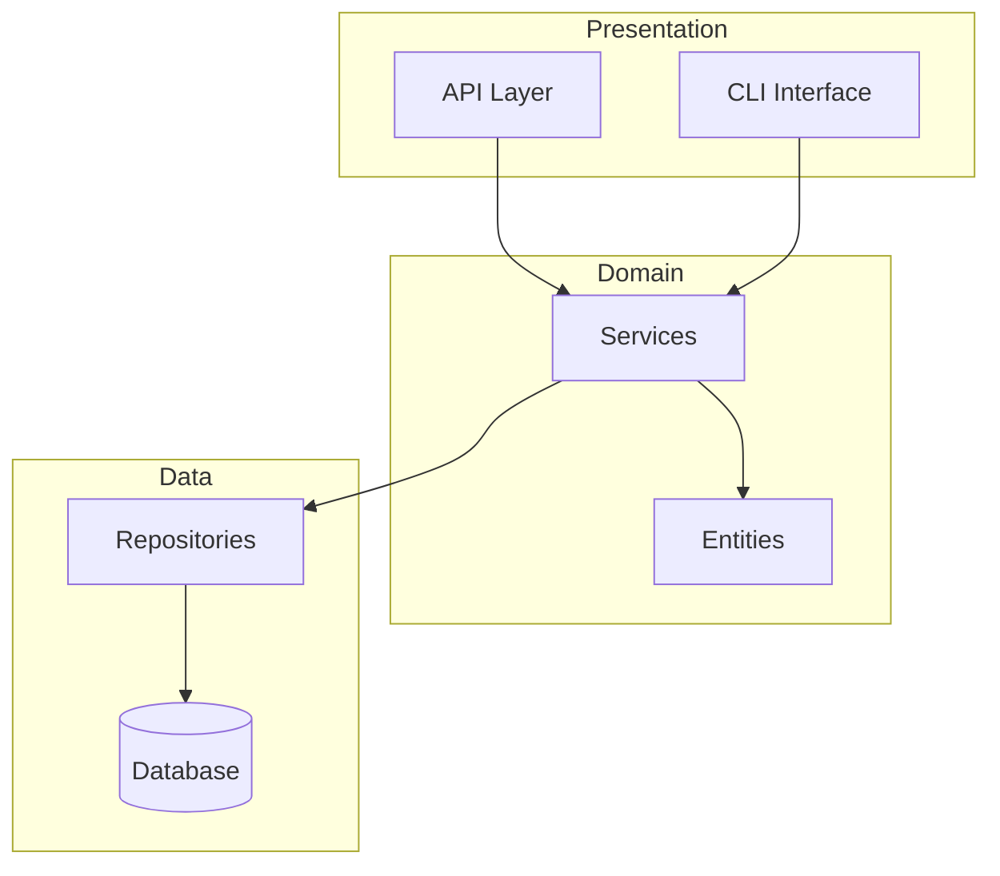

# doc-sys

시스템 아키텍처 문서를 생성하는 스킬.

## 목적

- 프로젝트 코드베이스 자동 분석
- 컴포넌트 간 관계를 Mermaid로 시각화
- 레이어별 책임과 규칙 문서화
- 기술 스택 및 디렉토리 구조 설명

## 사용법

```
/doc-sys                                  # 기본 경로에 문서 생성
/doc-sys docs/architecture/system.md      # 지정 경로에 생성
/doc-sys --focus api                      # API 레이어 집중 분석
```

## 프로세스

```
[Step 1] 프로젝트 분석
    |-- 디렉토리 구조 스캔 (Glob)
    |-- pyproject.toml/requirements.txt 분석
    |-- import 관계 추출 (Grep)
    v
[Step 2] 컴포넌트 식별
    |-- 주요 모듈/패키지 식별
    |-- 레이어 분류 (Presentation/Domain/Data)
    |-- 의존성 그래프 생성
    v
[Step 3] 다이어그램 생성
    |-- 컴포넌트 다이어그램 (Mermaid)
    |-- 시퀀스 다이어그램 (주요 유스케이스)
    |-- (선택) ER 다이어그램
    v
[Step 4] 문서 작성
    |-- 개요 섹션
    |-- 아키텍처 개요
    |-- 컴포넌트 상세
    |-- 기술 스택
    |-- 디렉토리 구조
    v
[Step 5] 파일 저장
    |-- docs/architecture/system.md 저장
    |-- 다음 단계 안내
```

## 출력

**시스템 아키텍처 문서**: `docs/architecture/system.md`

### 문서 구조

```markdown
# 시스템 아키텍처 문서

> **프로젝트**: {project_name}
> **버전**: {version}
> **최종 수정일**: {date}

---

## 1. 개요
### 1.1 목적
### 1.2 범위
### 1.3 용어 정의

## 2. 아키텍처 개요
### 2.1 아키텍처 스타일
### 2.2 컴포넌트 다이어그램
### 2.3 주요 설계 결정

## 3. 레이어 상세
### 3.1 Presentation Layer
### 3.2 Domain Layer
### 3.3 Data Layer

## 4. 데이터 흐름
### 4.1 주요 시퀀스
### 4.2 에러 처리

## 5. 기술 스택

## 6. 디렉토리 구조

## 7. 참고 자료
```

## 분석 항목

### 레이어 분류 기준

| 디렉토리 패턴 | 레이어 | 역할 |
|--------------|--------|------|
| `api/`, `routes/`, `views/` | Presentation | HTTP 요청/응답 처리 |
| `core/`, `domain/`, `entities/` | Domain | 비즈니스 로직 |
| `services/` | Application | 유스케이스 조율 |
| `repositories/`, `db/`, `data/` | Data | 데이터 접근 |
| `utils/`, `helpers/` | Infrastructure | 공통 유틸리티 |

### 기술 스택 분석

```
pyproject.toml 또는 requirements.txt에서 추출:
- 프레임워크 (FastAPI, Django, Flask)
- ORM (SQLAlchemy, Tortoise)
- 데이터베이스 (PostgreSQL, MySQL, SQLite)
- 설정 관리 (Pydantic, OmegaConf)
- 테스트 (pytest, hypothesis)
```

## 예제

### 기본 사용

```
User: /doc-sys

Claude:
=== 시스템 아키텍처 문서 생성 ===

[1/5] 프로젝트 분석 중...
  - 디렉토리: 15개 발견
  - Python 파일: 42개 발견
  - 의존성: 23개 패키지

[2/5] 컴포넌트 식별 중...
  - Presentation Layer: api/ (5 모듈)
  - Domain Layer: services/ (8 모듈)
  - Data Layer: repositories/ (4 모듈)

[3/5] 다이어그램 생성 중...
  ✓ 컴포넌트 다이어그램
  ✓ 시퀀스 다이어그램 (2개)

[4/5] 문서 작성 중...
  - 개요 섹션
  - 아키텍처 개요
  - 레이어 상세
  - 기술 스택
  - 디렉토리 구조

[5/5] 파일 저장...
  ✓ docs/architecture/system.md 생성 완료

=== 완료 ===
다음 단계: /doc-adr 로 설계 결정 기록
```

### 생성된 문서 예시

```markdown
# 시스템 아키텍처 문서

> **프로젝트**: my-api
> **버전**: 1.0.0
> **최종 수정일**: 2026-01-21

---

## 2. 아키텍처 개요

### 2.1 아키텍처 스타일

클린 아키텍처 기반의 레이어드 아키텍처를 따른다.

### 2.2 컴포넌트 다이어그램



---

## 5. 기술 스택

| 카테고리 | 기술 | 버전 | 용도 |
|----------|------|------|------|
| Language | Python | 3.11+ | 메인 언어 |
| Framework | FastAPI | 0.100+ | 웹 프레임워크 |
| ORM | SQLAlchemy | 2.0+ | 데이터베이스 |
| Config | Pydantic | 2.0+ | 설정 관리 |
```

## 관련 스킬

| 스킬명 | 관계 | 설명 |
|--------|------|------|
| [@skills/scaffold-structure/SKILL.md] | 선행 | 디렉토리 구조 생성 후 문서화 |
| [@skills/project-init/SKILL.md] | 부모 (Composite) | 초기화 과정에서 doc-sys 호출 |
| [@skills/doc-adr/SKILL.md] | 후행 | 설계 결정은 ADR로 상세 기록 |
| [@skills/diagram-generator/SKILL.md] | 활용 | Mermaid 다이어그램 생성 기능 재사용 |

## Changelog

| 날짜 | 변경 내용 |
|------|----------|
| 2026-01-21 | 초기 스킬 생성 |
