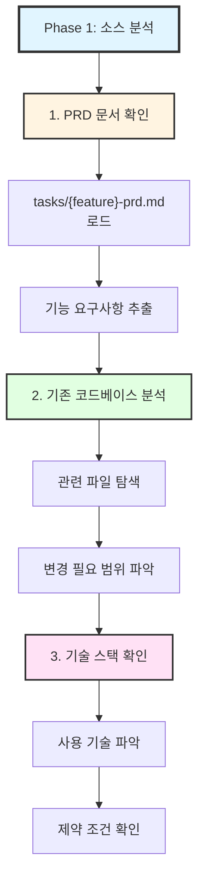
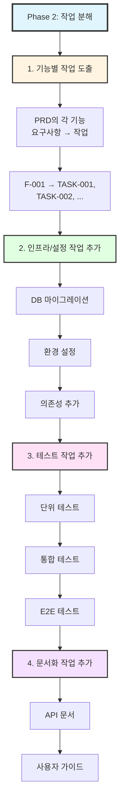
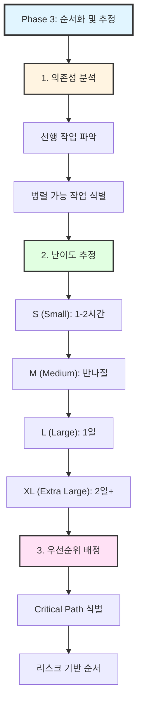
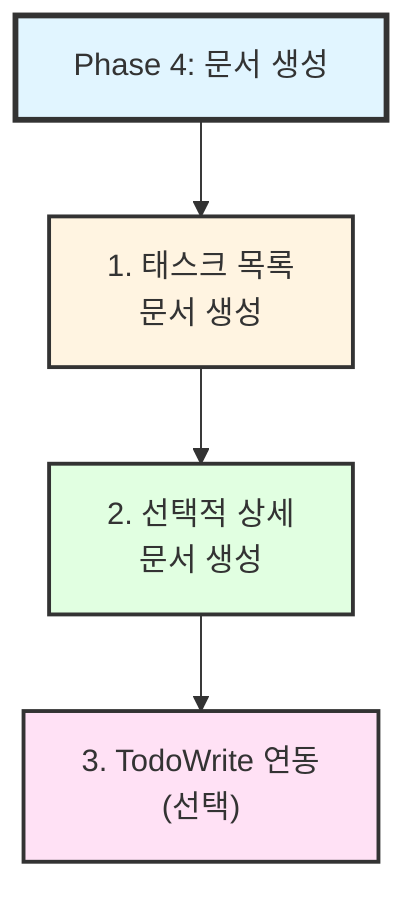
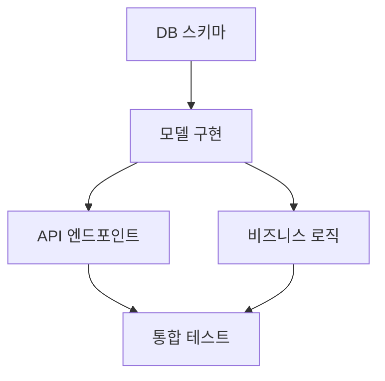
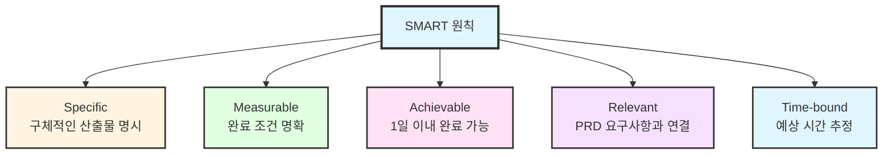
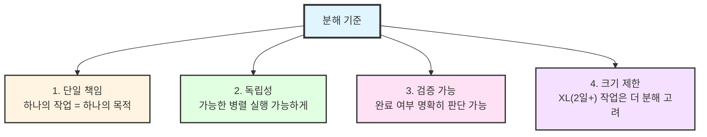
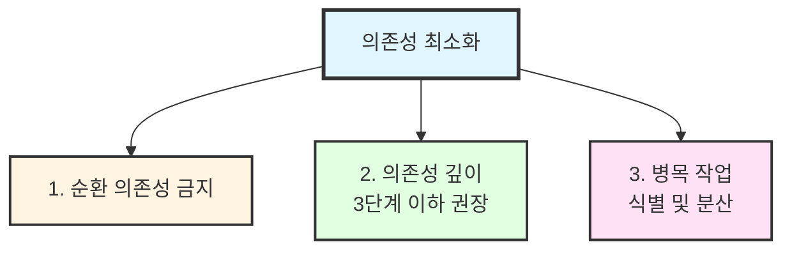

# doc-tasks

> 요구사항을 실행 가능한 작업으로 분해

---

## 목적

1. **작업 분해**: 큰 요구사항을 작은 단위로 분할
2. **의존성 관리**: 작업 간 선후 관계 명확화
3. **추정 지원**: 난이도와 복잡도 평가
4. **추적 가능성**: PRD ↔ 작업 간 연결고리 유지

---

## 태스크 문서 구조

```
tasks/
├── {feature}-tasks.md        # 태스크 목록
└── {feature}-tasks-detail/   # 상세 태스크 (선택)
    ├── TASK-001.md
    └── TASK-002.md
```

---

## 실행 프로세스

### Phase 1: 소스 분석



### Phase 2: 작업 분해



### Phase 3: 순서화 및 추정



### Phase 4: 문서 생성



---

## 태스크 목록 템플릿

```markdown
# Tasks: {기능명}

> PRD: tasks/{feature}-prd.md
> 생성일: {날짜}
> 총 작업 수: {N}개

---

## 요약

| 항목 | 수량 |
|------|------|
| 총 작업 | {N} |
| 구현 작업 | {X} |
| 테스트 작업 | {Y} |
| 문서 작업 | {Z} |

### 난이도 분포
| 난이도 | 수량 | 예상 시간 |
|--------|------|----------|
| S | {n} | {n*2}h |
| M | {n} | {n*4}h |
| L | {n} | {n*8}h |
| XL | {n} | {n*16}h+ |

---

## 의존성 그래프



---

## 작업 목록

### Phase 1: 기반 작업

#### TASK-001: [작업명]
| 항목 | 내용 |
|------|------|
| **설명** | [상세 설명] |
| **PRD 참조** | F-001 |
| **난이도** | M |
| **의존성** | - |
| **산출물** | [파일/결과물] |
| **완료 조건** | [검증 기준] |
| **상태** | [ ] 대기 |

#### TASK-002: [작업명]
| 항목 | 내용 |
|------|------|
| **설명** | [상세 설명] |
| **PRD 참조** | F-001 |
| **난이도** | L |
| **의존성** | TASK-001 |
| **산출물** | [파일/결과물] |
| **완료 조건** | [검증 기준] |
| **상태** | [ ] 대기 |

### Phase 2: 핵심 구현

#### TASK-003: [작업명]
...

### Phase 3: 테스트 및 검증

#### TASK-T001: [테스트 작업명]
| 항목 | 내용 |
|------|------|
| **유형** | 단위 테스트 |
| **대상** | TASK-002, TASK-003 |
| **난이도** | S |
| **완료 조건** | 커버리지 80% 이상 |

### Phase 4: 문서화

#### TASK-D001: [문서 작업명]
...

---

## 실행 순서 (권장)

```
Week 1:
├── Day 1-2: TASK-001 (기반)
├── Day 3-4: TASK-002 (모델)
└── Day 5: TASK-003 (API 시작)

Week 2:
├── Day 1-2: TASK-003 완료, TASK-004
├── Day 3: TASK-T001 (테스트)
└── Day 4-5: TASK-005, TASK-D001
```

---

## 변경 이력

| 버전 | 날짜 | 변경 내용 |
|------|------|-----------|
| 1.0 | {날짜} | 초기 작성 |
```

---

## 사용 예시

### 예시 1: PRD에서 태스크 생성

```
User: /doc-tasks tasks/user-dashboard-prd.md

Claude: PRD 문서를 분석합니다.

### 발견된 기능 요구사항
- F-001: 데이터 위젯 표시
- F-002: 필터링 기능
- F-003: 데이터 내보내기
- F-004: 실시간 업데이트

### 작업 분해 시작

[AskUserQuestion 호출]
question: "위젯 구현 방식을 선택해주세요"
header: "위젯"
options:
  - "기존 컴포넌트 활용 (Recommended)" - 재사용 가능
  - "새 컴포넌트 개발" - 맞춤 구현 필요

User: 기존 컴포넌트 활용

Claude: 작업 목록을 생성합니다.

총 12개 작업 도출:
- 구현: 8개
- 테스트: 3개
- 문서: 1개

파일: tasks/user-dashboard-tasks.md

검토 후 조정할 사항을 알려주세요.
```

### 예시 2: 기능명으로 태스크 생성

```
User: /doc-tasks 결제 시스템

Claude: 관련 PRD를 찾습니다...

발견: tasks/payment-system-prd.md

이 PRD를 기반으로 태스크를 생성할까요?

User: 네

Claude: (PRD 분석 후 작업 분해)
```

### 예시 3: 태스크를 TodoWrite로 연동

```
User: /doc-tasks 인증 모듈 --todo

Claude: 태스크 목록을 생성하고 TodoWrite에 등록합니다.

### 생성된 작업
1. TASK-001: JWT 유틸리티 함수 (M)
2. TASK-002: 인증 미들웨어 (L)
3. TASK-003: 로그인 API (M)
4. TASK-T001: 인증 단위 테스트 (S)

[TodoWrite 호출]
- [ ] JWT 유틸리티 함수
- [ ] 인증 미들웨어
- [ ] 로그인 API
- [ ] 인증 단위 테스트

Todo 목록에 등록되었습니다.
실행을 시작할까요? (/3-step-workflow 연계)
```

---

## 작업 분해 원칙

### 1. SMART 원칙



### 2. 분해 기준



### 3. 의존성 최소화



---

## 난이도 가이드

| 난이도 | 시간 | 특징 | 예시 |
|--------|------|------|------|
| S | 1-2h | 단순 변경 | 설정 수정, 작은 함수 |
| M | 3-4h | 새 기능 추가 | API 엔드포인트 1개 |
| L | 1일 | 복잡한 로직 | 비즈니스 로직 모듈 |
| XL | 2일+ | 대규모 변경 | 아키텍처 변경, 분해 권장 |

---

## 관련 스킬

| 스킬 | 관계 | 설명 |
|------|------|------|
| [@skills/prd-workflow/SKILL.md] | 호출처 | PRD 워크플로우에서 호출 |
| [@skills/doc-prd/SKILL.md] | 입력 | PRD에서 요구사항 추출 |
| [@skills/3-step-workflow/SKILL.md] | 연계 | Plan 단계에서 사용 |
| [@skills/subagent-driven-dev/SKILL.md] | 실행 | 태스크별 서브에이전트 할당 |
| [@skills/done/SKILL.md] | 후속 | 작업 완료 처리 |

---

## 옵션

| 옵션 | 설명 |
|------|------|
| `--todo` | TodoWrite에 작업 자동 등록 |
| `--detail` | 각 작업별 상세 문서 생성 |
| `--mermaid` | 의존성 다이어그램 포함 |
| `--estimate` | 상세 시간 추정 포함 |

---

## 주의사항

1. **PRD 없이 사용 주의**: 요구사항 불명확 시 잘못된 분해 위험
2. **과도한 분해 지양**: 너무 작은 작업은 관리 오버헤드 증가
3. **추정은 참고용**: 난이도/시간 추정은 상황에 따라 달라질 수 있음
4. **지속적 업데이트**: 실행 중 발견된 작업 추가 반영

---

## Changelog

| 버전 | 날짜 | 변경 내용 |
|------|------|-----------|
| 1.1.0 | 2026-02-12 | 저장 경로 통일: docs/tasks/ → tasks/ |
| 1.0.0 | 2026-01-21 | 초기 생성 - 태스크 분해 워크플로우 |
