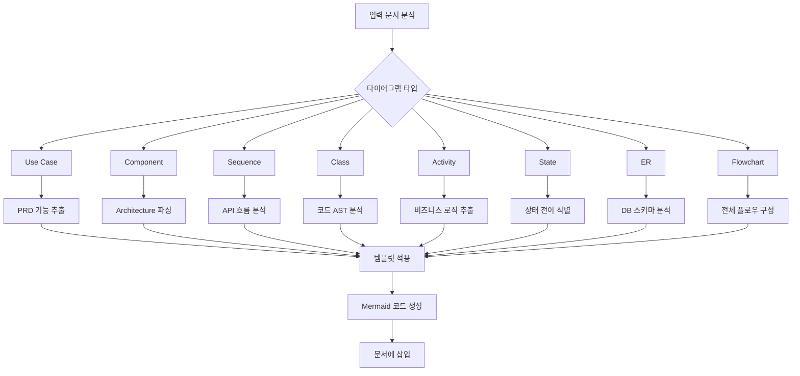
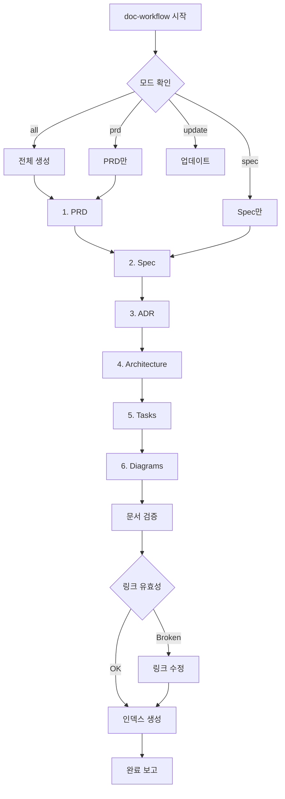

# doc-workflow

> 프로젝트 문서를 체계적으로 생성하고 관리하는 Composite 워크플로우

---

## 목적

1. **완전한 문서 세트 생성**: PRD부터 구현 문서까지 일관된 문서화
2. **추적성 확보**: 요구사항 → 설계 → 구현 → 테스트 연결
3. **자동화**: 3-step-workflow와 통합하여 각 단계별 자동 문서 생성
4. **유지보수**: 코드 변경 시 문서 자동 업데이트

---

## 사용법

```bash
# 전체 문서 생성
/doc-workflow all

# 특정 문서만 생성
/doc-workflow prd        # PRD만 생성
/doc-workflow brd        # BRD만 생성
/doc-workflow adr        # ADR만 생성
/doc-workflow spec       # Spec만 생성
/doc-workflow sys        # 시스템 아키텍처만
/doc-workflow tasks      # Tasks만 생성

# 문서 업데이트 (구현 후)
/doc-workflow update

# 시나리오 기반 문서 동기화 (NEW)
/doc-workflow sync <scenario-file> [--auto-adr] [--threshold=N] [--yes]
```

---

## AskUserQuestion 활용 지점

### 지점 1: 문서 생성 범위 선택

**시점**: 인자 없이 /doc-workflow 호출 시

```yaml
AskUserQuestion:
  questions:
    - question: "어떤 문서를 생성할까요?"
      header: "문서 범위"
      multiSelect: true
      options:
        - label: "전체 (PRD → BRD → ADR → Spec → Sys → Tasks) (권장)"
          description: "모든 문서를 순서대로 생성"
        - label: "PRD - 제품 요구사항"
          description: "기능 요구사항, 비기능 요구사항, 성공 기준"
        - label: "BRD - 비즈니스 요구사항"
          description: "비즈니스 목표, ROI, 이해관계자"
        - label: "ADR - 아키텍처 결정 기록"
          description: "기술 결정 사항 및 근거 (Y-statement)"
        - label: "Spec - 기술 명세서"
          description: "API, 데이터 모델, 함수 시그니처"
        - label: "Sys - 시스템 아키텍처"
          description: "컴포넌트 구조, 함수/클래스 목록"
        - label: "Tasks - 작업 분해"
          description: "구현 작업 목록, 의존성, 우선순위"
```

### 지점 2: 다이어그램 타입 선택

**시점**: 다이어그램 생성 요청 시

```yaml
AskUserQuestion:
  questions:
    - question: "생성할 다이어그램 타입을 선택해주세요"
      header: "다이어그램"
      multiSelect: true
      options:
        - label: "Use Case - 유스케이스 (권장)"
          description: "액터와 기능 간 상호작용 | 용도: 요구사항 시각화"
        - label: "Sequence - 시퀀스"
          description: "API 호출 시퀀스 | 용도: 플로우 설계"
        - label: "Component - 컴포넌트"
          description: "시스템 구조 | 용도: 아키텍처 개요"
        - label: "Class - 클래스"
          description: "클래스 관계도 | 용도: 코드 구조"
```

### 지점 3: 문서 업데이트 전략

**시점**: update 모드 실행 시

```yaml
AskUserQuestion:
  questions:
    - question: "문서 업데이트 전략을 선택해주세요"
      header: "업데이트 전략"
      multiSelect: false
      options:
        - label: "자동 업데이트 (권장)"
          description: "코드 분석 후 자동으로 문서 동기화 | 빠름"
        - label: "수동 검토 후 업데이트"
          description: "변경사항 확인 후 사용자 승인 | 안전"
        - label: "새 버전 생성"
          description: "기존 문서 보존, 새 파일 생성 | 이력 관리"
```

---

## 모드별 설명

**상세 템플릿**: [@templates/skill-examples/doc-workflow/mode-implementations.md]

**핵심 내용**:
- **all 모드**: PRD → BRD → ADR → Spec → Sys → Tasks → Diagrams 순차 실행
- **개별 모드**: prd, spec, adr, architecture, tasks, update 각각 독립 실행
- **Skill tool 호출**: 각 모드별 조합 스킬 순서 및 인자 전달 방법

---

### Mode 8: sync (시나리오 기반 문서 동기화)

**상세 템플릿**: [@templates/skill-examples/doc-workflow/sync-mode-guide.md]

**핵심 내용**:
- **Traceability 기반 동기화**: 시나리오 → Upstream/Downstream 문서 자동 식별 및 업데이트
- **--auto-adr 모드**: 휴리스틱 패턴 매칭으로 ADR 후보 탐지 (신뢰도 85% 이상)
- **6단계 프로세스**: 분석 → 식별 → 업데이트 → ADR 탐지 → 사용자 확인 → 결과 요약

---

## 다이어그램 생성

### 자동 생성 다이어그램

| 다이어그램 | 입력 | 템플릿 | 설명 |
|-----------|------|--------|------|
| **Use Case** | PRD 기능 목록 | `templates/diagrams/use-case.md` | 액터와 기능 간 상호작용 |
| **Component** | Architecture 문서 | `templates/diagrams/component.md` | 시스템 컴포넌트 구조 |
| **Sequence** | Spec API 흐름 | `templates/diagrams/sequence.md` | API 호출 시퀀스 |
| **Class** | 코드 분석 | `templates/diagrams/class.md` | 클래스 구조 및 관계 |
| **Activity** | 비즈니스 로직 | `templates/diagrams/activity.md` | 프로세스 흐름 |
| **State** | 엔티티 상태 | `templates/diagrams/state.md` | 객체 상태 변화 |
| **ER** | 데이터 모델 | `templates/diagrams/er.md` | 데이터베이스 스키마 |
| **Flowchart** | 알고리즘 | `templates/diagrams/flowchart.md` | 시스템 전체 플로우 |

### 다이어그램 생성 프로세스



---

## 3-step-workflow 통합

### Phase 1: DISCUSS 완료 후

```
/doc-workflow prd
→ PRD 생성
→ 초기 Use Case 다이어그램
```

### Phase 2: PLAN 완료 후

```
/doc-workflow --spec --adr --architecture
→ Technical Spec 생성
→ ADR 작성
→ 시스템 아키텍처 문서
→ Component, Sequence 다이어그램
```

### Phase 4: VERIFY 완료 후

```
/doc-workflow update
→ 실제 구현 기반 문서 업데이트
→ Class, State, ER 다이어그램 생성
→ 함수/클래스 목록 동기화
```

---

## 실행 프로세스

### Step 1: 컨텍스트 수집

```
1. 프로젝트 루트 확인
2. 기존 문서 스캔
3. 코드베이스 분석 (필요 시)
4. Phase 정보 확인 (3-step-workflow에서 호출된 경우)
```

### Step 2: 문서 생성 순서



### Step 3: 문서 링크 검증

모든 문서는 서로 참조 가능해야 한다:

```markdown
<!-- PRD → Spec -->
상세 기술 명세: @docs/spec/{feature}-spec.md

<!-- Spec → Architecture -->
아키텍처 설계: @docs/architecture/system-architecture.md

<!-- Architecture → Tasks -->
구현 작업: @docs/tasks/{feature}-tasks.md

<!-- 다이어그램 참조 -->
시스템 구조: @docs/diagrams/component.md
```

### Step 4: 문서 인덱스 생성

```markdown
# 문서 인덱스

## {Feature} 문서 목록

| 문서 | 경로 | 상태 | 최종 수정 |
|------|------|------|----------|
| PRD | tasks/{feature}-prd.md | ✅ | 2026-01-27 |
| Spec | docs/spec/{feature}-spec.md | ✅ | 2026-01-27 |
| ADR | docs/adr/ADR-001-*.md | ✅ | 2026-01-27 |
| Architecture | docs/architecture/ | ✅ | 2026-01-27 |
| Tasks | docs/tasks/{feature}-tasks.md | ✅ | 2026-01-27 |

## 다이어그램

- [Use Case](docs/diagrams/use-case.md)
- [Component](docs/diagrams/component.md)
- [Sequence](docs/diagrams/sequence.md)
- [Class](docs/diagrams/class.md)
- [Activity](docs/diagrams/activity.md)
- [State](docs/diagrams/state.md)
- [ER](docs/diagrams/er.md)
- [Flowchart](docs/diagrams/flowchart.md)
```

---

## 사용 예시

### 예시 1: 프로젝트 초기 (전체 문서 생성)

```
User: /doc-workflow all user-authentication

Claude:
╔═══════════════════════════════════════════════╗
║          DOCUMENTATION WORKFLOW               ║
║       Feature: user-authentication            ║
╚═══════════════════════════════════════════════╝

[1/6] PRD 생성
━━━━━━━━━━━━━━━━━━━━━━━━━━━━━━━━━━━━━━━━━━━━━
/doc-prd 호출...
✅ tasks/user-authentication-prd.md 생성 완료

[2/6] Technical Spec 생성
━━━━━━━━━━━━━━━━━━━━━━━━━━━━━━━━━━━━━━━━━━━━━
/doc-spec 호출...
✅ docs/spec/user-authentication-spec.md 생성 완료

[3/6] ADR 작성
━━━━━━━━━━━━━━━━━━━━━━━━━━━━━━━━━━━━━━━━━━━━━
/doc-adr 호출...
✅ docs/adr/ADR-001-jwt-authentication.md 생성 완료

[4/6] 시스템 아키텍처 문서
━━━━━━━━━━━━━━━━━━━━━━━━━━━━━━━━━━━━━━━━━━━━━
/doc-sys 호출...
✅ docs/architecture/ 생성 완료
  - system-architecture.md
  - components.md
  - functions.md
  - classes.md

[5/6] 작업 분해
━━━━━━━━━━━━━━━━━━━━━━━━━━━━━━━━━━━━━━━━━━━━━
/doc-tasks 호출...
✅ docs/tasks/user-authentication-tasks.md 생성 완료

[6/6] 다이어그램 생성
━━━━━━━━━━━━━━━━━━━━━━━━━━━━━━━━━━━━━━━━━━━━━
✅ Use Case Diagram
✅ Component Diagram
✅ Sequence Diagram
✅ Class Diagram
✅ Activity Diagram
✅ State Diagram
✅ ER Diagram
✅ Flowchart

━━━━━━━━━━━━━━━━━━━━━━━━━━━━━━━━━━━━━━━━━━━━━
📊 문서 인덱스: docs/INDEX.md
📁 총 생성 파일: 15개
✅ 문서 링크 검증: 통과

다음 단계:
1. tasks/user-authentication-prd.md 검토
2. docs/INDEX.md에서 전체 문서 확인
3. /3-step-workflow로 구현 시작
```

### 예시 2: Phase 2 완료 후 (설계 문서)

```
User: /doc-workflow --spec --adr --architecture

Claude:
[Spec + ADR + Architecture 생성]
...
```

### 예시 3: Phase 4 완료 후 (문서 업데이트)

```
User: /doc-workflow update

Claude:
[코드 분석]
━━━━━━━━━━━━━━━━━━━━━━━━━━━━━━━━━━━━━━━━━━━━━
코드베이스 스캔 중...
- src/ 디렉토리 분석
- 함수 23개 발견
- 클래스 8개 발견

[변경 사항 탐지]
━━━━━━━━━━━━━━━━━━━━━━━━━━━━━━━━━━━━━━━━━━━━━
- authenticate() 함수 추가됨 → Spec 업데이트
- User 클래스 필드 변경 → Class Diagram 업데이트
- JWT토큰 생성 로직 변경 → Sequence Diagram 업데이트

[문서 업데이트]
━━━━━━━━━━━━━━━━━━━━━━━━━━━━━━━━━━━━━━━━━━━━━
✅ docs/spec/user-authentication-spec.md 업데이트
✅ docs/architecture/functions.md 업데이트
✅ docs/diagrams/class.md 업데이트
✅ docs/diagrams/sequence.md 업데이트

변경 내역: docs/CHANGELOG.md
```

---

## 관련 스킬

| 스킬 | 관계 | 설명 |
|------|------|------|
| [@skills/doc-prd/SKILL.md] | 의존 | PRD 생성 |
| [@skills/doc-spec/SKILL.md] | 의존 | Technical Spec 생성 |
| [@skills/doc-adr/SKILL.md] | 의존 | ADR 생성 |
| [@skills/doc-sys/SKILL.md] | 의존 | 시스템 아키텍처 문서 |
| [@skills/doc-tasks/SKILL.md] | 의존 | 작업 분해 |
| [@skills/diagram-generator/SKILL.md] | 의존 | 다이어그램 생성 |
| [@skills/3-step-workflow/SKILL.md] | 통합 | 각 Phase별 호출 |
| [@skills/prd-workflow/SKILL.md] | 대체 | doc-workflow가 prd-workflow 기능 포함 |

---

## 옵션

| 옵션 | 설명 |
|------|------|
| `--prd` | PRD만 생성 |
| `--spec` | Technical Spec만 생성 |
| `--adr` | ADR만 생성 |
| `--architecture` | 아키텍처 문서만 생성 |
| `--tasks` | Tasks만 생성 |
| `--diagrams` | 모든 다이어그램 생성 |
| `--update` | 기존 문서 업데이트 |
| `--force` | 기존 파일 덮어쓰기 |
| `--verbose` | 상세 로그 출력 |

---

## Changelog

| 버전 | 날짜 | 변경 내용 |
|------|------|----------|
| 2.1.0 | 2026-02-12 | 저장 경로 통일: docs/prd/ → tasks/ (PRD 파일 경로 변경) |
| 2.0.0 | 2026-01-28 | sync 모드 추가 (sync-docs 통합), test-generator 참조 추가 |
| 1.0.0 | 2026-01-27 | 초기 생성 - 완전한 문서 생성 워크플로우 |
