# 다이어그램 생성 스킬

코드베이스를 분석하여 **구문 오류 없는** Mermaid 다이어그램을 생성한다.

## 핵심 원칙

**다이어그램은 이해를 돕기 위한 것이다.** 10-15개 노드 이하로 유지하고, 복잡하면 분할한다.

## 사용법

```
/diagram <type> [target] [--format mermaid|drawio]
```

| 파라미터 | 설명 | 예시 |
|---------|------|------|
| `type` | 다이어그램 유형 | class, sequence, er, flow, state, arch, activity, timeline, usecase, wbs, pert, raci, bpmn, swimlane, network, cloud |
| `target` | 분석 대상 (선택) | src/models/, api/routes/ |
| `--format` | 출력 형식 | mermaid (기본), drawio |

### AskUserQuestion 활용 지점

**지점 1: 다이어그램 타입 선택**

타입이 지정되지 않았을 때:

```yaml
AskUserQuestion:
  questions:
    - question: "어떤 다이어그램을 생성할까요?"
      header: "다이어그램 타입"
      multiSelect: false
      options:
        - label: "flowchart - 프로세스 흐름"
          description: "데이터 파이프라인, ETL, 워크플로우"
        - label: "sequence - 상호작용 순서"
          description: "API 호출, 서비스 간 통신"
        - label: "class - 클래스 구조"
          description: "상속/구현 관계, 데이터 모델"
        - label: "er - 데이터베이스 스키마"
          description: "테이블 관계, 외래키"
        - label: "architecture - 시스템 구조"
          description: "컴포넌트, 배포 구조"
        - label: "usecase - 사용자 시나리오"
          description: "사용자-시스템 상호작용"
```

**지점 2: 상세 수준 선택**

```yaml
AskUserQuestion:
  questions:
    - question: "다이어그램 상세도를 선택해주세요"
      header: "상세 수준"
      multiSelect: false
      options:
        - label: "Simple - 핵심만 (권장)"
          description: "5-10개 노드 | 주요 관계만 표시"
        - label: "Detailed - 상세"
          description: "10-15개 노드 | 대부분의 관계 포함"
        - label: "Full - 전체"
          description: "15개+ 노드 | 모든 상세 정보"
```

---

## 다이어그램 유형 선택 가이드

**"무엇을 시각화할 것인가"에 따라 다이어그램을 선택한다.**

### 소프트웨어 다이어그램

| 시각화 대상 | 권장 다이어그램 | type 파라미터 |
|------------|----------------|---------------|
| 데이터 파이프라인, 프로세스 흐름, ETL | **Flowchart** | `flow` |
| API 호출, 서비스 간 통신, 함수 호출 순서 | **Sequence Diagram** | `sequence` |
| 클래스 구조, 상속/구현 관계, 데이터 모델 | **Class Diagram** | `class` |
| DB 테이블 관계, 스키마 설계 | **ER Diagram** | `er` |
| 객체 상태 전이 (Job, Order, Ticket 등) | **State Diagram** | `state` |
| 시스템 컴포넌트, 배포 구조, C4 모델 | **Architecture** | `arch` |
| 병렬 처리, 워크플로우, 분기/병합 | **Activity Diagram** | `activity` |
| 프로젝트 일정, 마일스톤, 로드맵 | **Timeline** | `timeline` |
| 사용자-시스템 상호작용, 요구사항 | **Use Case** | `usecase` |

### PMP/PMBOK 다이어그램 (신규)

| 시각화 대상 | 권장 다이어그램 | type 파라미터 |
|------------|----------------|---------------|
| 프로젝트 분해, 작업 구조 | **WBS** | `wbs` |
| 일정 네트워크, 크리티컬 패스 | **PERT/CPM** | `pert` |
| 책임 할당 매트릭스 | **RACI Matrix** | `raci` |

### 비즈니스 다이어그램 (신규)

| 시각화 대상 | 권장 다이어그램 | type 파라미터 |
|------------|----------------|---------------|
| 비즈니스 프로세스 모델 | **BPMN** | `bpmn` |
| 부서간 프로세스, 크로스펑셔널 | **Swimlane** | `swimlane` |

### 인프라 다이어그램 (신규)

| 시각화 대상 | 권장 다이어그램 | type 파라미터 |
|------------|----------------|---------------|
| 네트워크 토폴로지, 서버 구성 | **Network Diagram** | `network` |
| AWS/Azure/GCP 아키텍처 | **Cloud Architecture** | `cloud` |

### 결정 플로우

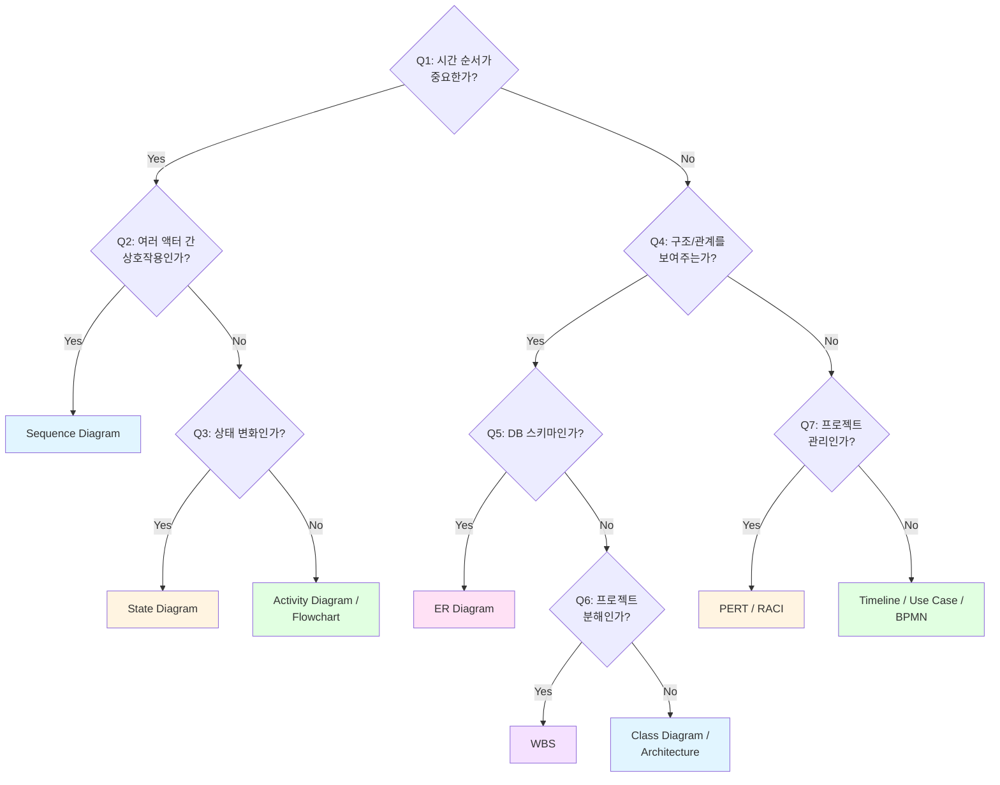

---

## 5단계 생성 워크플로우

### 1단계: 요구사항 파악

- 다이어그램 유형 결정
- 포함할 노드/엔티티 식별
- 범위 제한 (10-15개 노드 권장)

### 2단계: 노드 구조 계획

- 의미 있는 ID 부여: `A`, `B` 대신 `dataLoader`, `validator`
- 표시 라벨과 ID 분리 계획

### 3단계: 구문 규칙 적용 (중요)

**금지 사항:**
- 노드 라벨 내 중첩 따옴표
- 엣지 라벨의 불필요한 따옴표
- 특수문자가 있는 서브그래프 ID를 스타일 참조에 직접 사용

**올바른 패턴:**
```mermaid
%% GOOD: ID와 라벨 분리
NodeID[Display Label]

%% GOOD: 특수문자 포함 서브그래프
subgraph ID["Name with spaces"]

%% GOOD: 멀티라인 라벨
Node["Line 1<br/>Line 2"]

%% BAD: 중첩 따옴표
Node["Label with "nested" quotes"]
```

### 4단계: 템플릿으로 빌드

적절한 템플릿 선택 후 코드 작성.

### 5단계: 검증 및 테스트

- Mermaid Live Editor에서 렌더링 확인
- GitHub Markdown에서 미리보기

---

## 다이어그램 템플릿

**상세 템플릿**: [@templates/skill-examples/diagram-generator/diagram-templates.md]

**핵심 내용**:
- **소프트웨어 다이어그램**: Flowchart, Sequence, Class, ER, State, Architecture, Activity, Timeline, Use Case
- **PMP/PMBOK**: WBS, PERT/CPM, RACI Matrix
- **비즈니스**: BPMN, Swimlane
- **인프라**: Network, Cloud Architecture

---

## 다이어그램 유형 빠른 참조

### 1. Flowchart

**용도**: 데이터 파이프라인, 의사결정 분기, 프로세스 흐름

**분석 대상**: ETL 코드, 비즈니스 로직

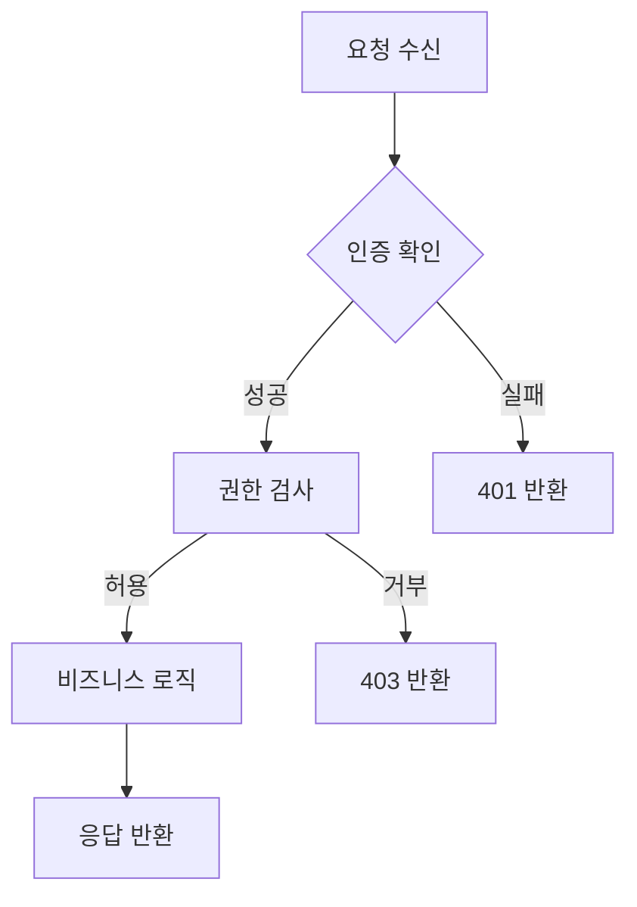

**방향 옵션**: TD/TB (위→아래), BT (아래→위), LR (좌→우), RL (우→좌)

### 2. Sequence Diagram

**용도**: API 호출 흐름, 함수 호출 순서, 서비스 간 통신

**분석 대상**: API 엔드포인트, 서비스 레이어

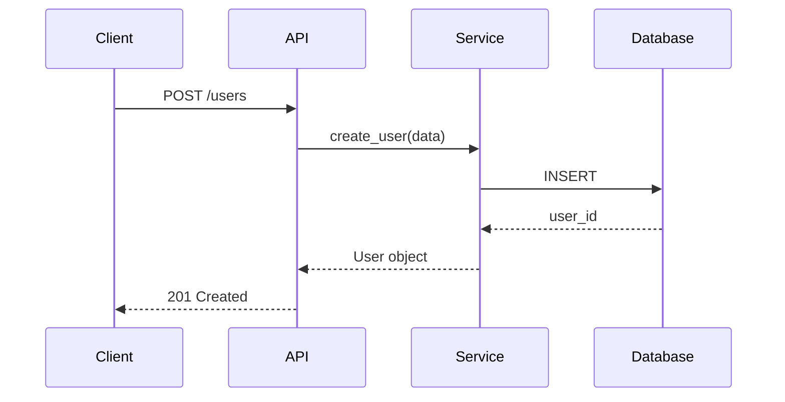

**화살표 유형**:
- `->>`: 실선 (동기 요청)
- `-->>`: 점선 (응답)
- `->>+` / `-->>-`: 활성화 시작/종료

### 3. Class Diagram

**용도**: 클래스 구조, 상속 관계, 데이터 모델

**분석 대상**: Python 클래스, TypeScript 인터페이스

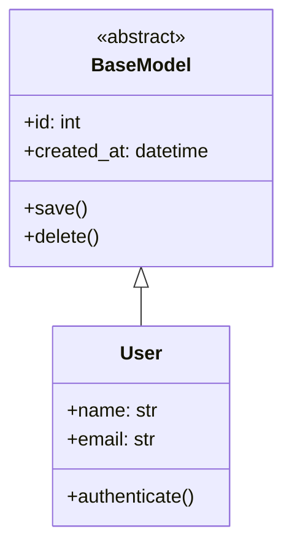

**관계 유형**:
- `<|--`: 상속
- `*--`: 합성 (강한 소유)
- `o--`: 집합 (약한 소유)
- `-->`: 연관
- `..>`: 의존
- `..|>`: 구현

### 4. ER Diagram

**용도**: DB 스키마, 테이블 관계

**분석 대상**: SQLAlchemy 모델, Django 모델

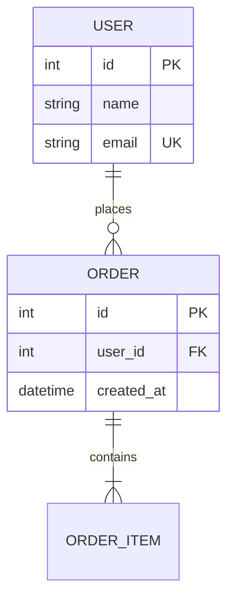

**관계 표기**:
- `||`: 정확히 하나
- `o|`: 0 또는 하나
- `}o`: 0 이상
- `}|`: 하나 이상

### 5. State Diagram

**용도**: 상태 전이, 라이프사이클

**분석 대상**: 상태 머신, 워크플로우

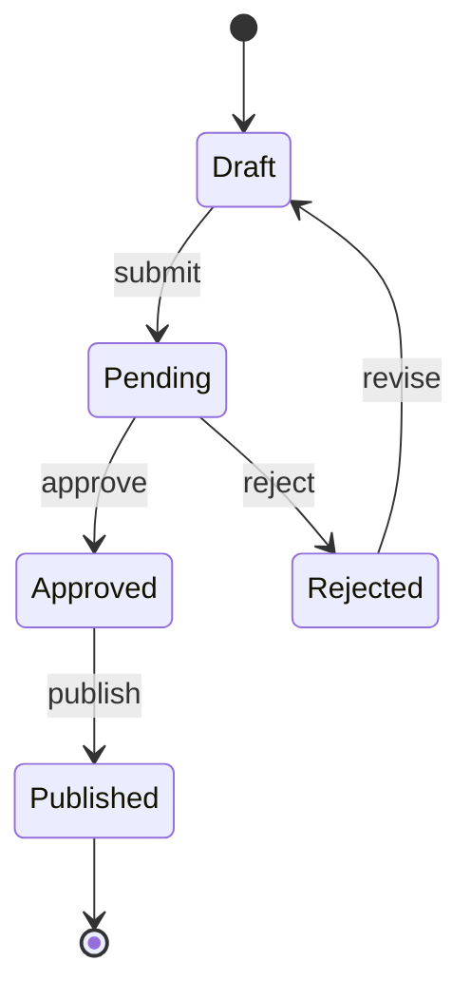

### 6. Architecture Diagram

**용도**: 시스템 컴포넌트, 배포 구조

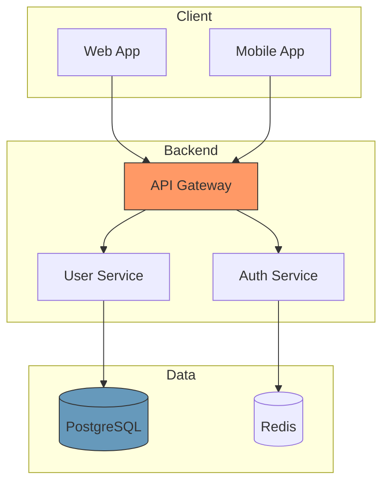

### 7. Activity Diagram

**용도**: 병렬 처리, 워크플로우, 분기/병합

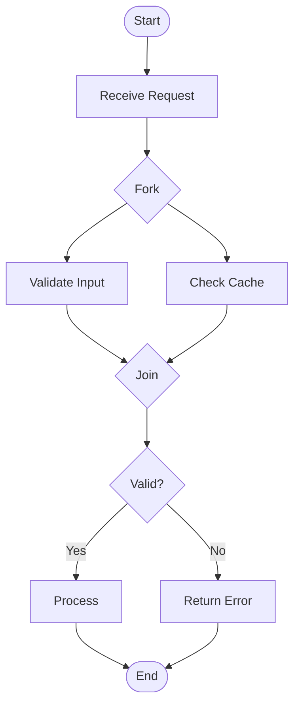

### 8. Timeline

**용도**: 프로젝트 일정, 마일스톤

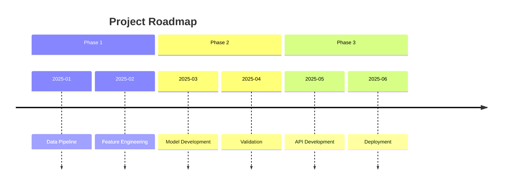

### 9. Use Case Diagram

**용도**: 사용자-시스템 상호작용, 요구사항

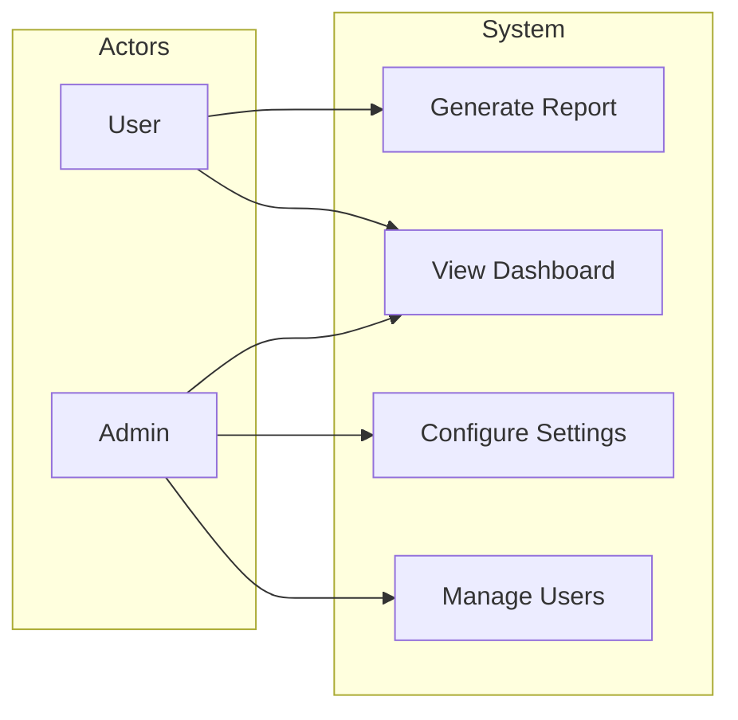

---

## PMP/PMBOK 다이어그램 (신규)

### 10. WBS (Work Breakdown Structure)

**용도**: 프로젝트 작업 분해, 딜리버러블 구조화

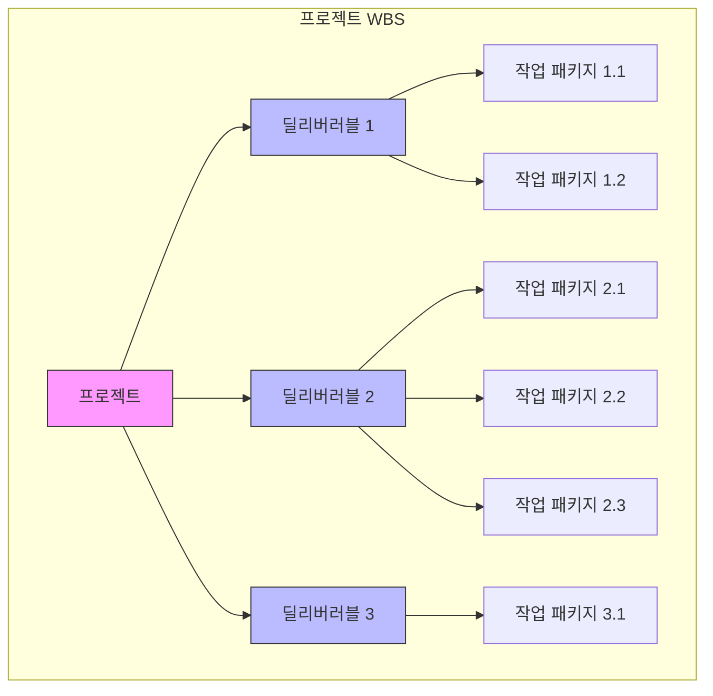

**WBS 작성 원칙**:
- 100% 규칙: 모든 작업은 상위 항목의 100%를 포함
- MECE: 상호 배타적이고 완전히 포괄적
- 3-5단계 깊이 권장

### 11. PERT/CPM (네트워크 다이어그램)

**용도**: 일정 네트워크, 크리티컬 패스 분석

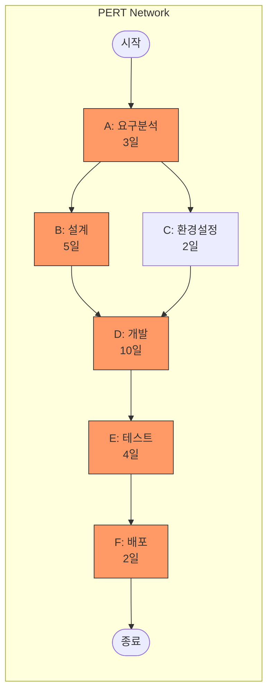

**PERT 요소**:
- 노드: 작업명 + 소요시간
- 크리티컬 패스: 가장 긴 경로 (빨간색 표시)
- 슬랙: 여유 시간

### 12. RACI Matrix

**용도**: 책임 할당 매트릭스

**출력 형식**: Markdown 테이블 (Mermaid 대신)

```markdown
## RACI Matrix

| 작업 | PM | 개발팀 | QA | DevOps | 고객 |
|------|:--:|:------:|:--:|:------:|:----:|
| 요구사항 정의 | A | C | I | I | R |
| 아키텍처 설계 | A | R | C | C | I |
| 개발 | I | R | I | C | I |
| 테스트 | I | C | R | I | I |
| 배포 | A | C | I | R | I |
| 운영 | I | C | I | R | I |

> **R**: Responsible (실행), **A**: Accountable (최종책임), **C**: Consulted (협의), **I**: Informed (통보)
```

---

## 비즈니스 다이어그램 (신규)

### 13. BPMN (Business Process Model)

**용도**: 비즈니스 프로세스 모델링

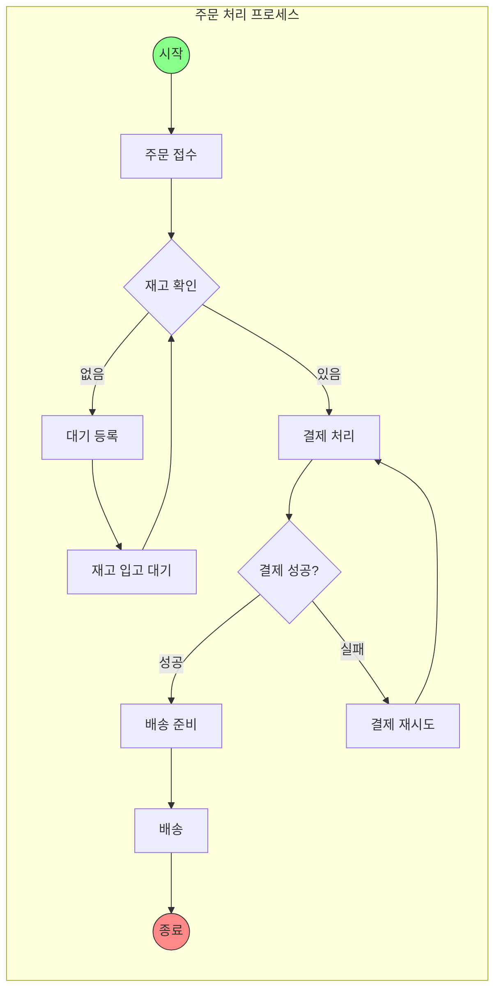

**BPMN 요소**:
- 이벤트: 원형 (시작/종료)
- 작업: 사각형
- 게이트웨이: 다이아몬드 (분기/병합)
- 플로우: 화살표

### 14. Swimlane (Cross-functional)

**용도**: 부서간 프로세스, 역할별 책임

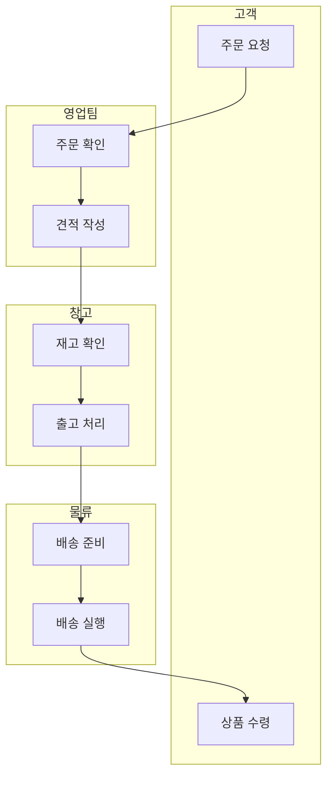

---

## 인프라 다이어그램 (신규)

### 15. Network Diagram

**용도**: 네트워크 토폴로지, 서버 구성

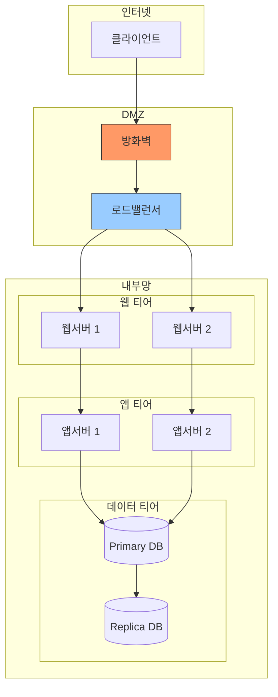

### 16. Cloud Architecture (AWS/Azure/GCP)

**용도**: 클라우드 인프라 구성

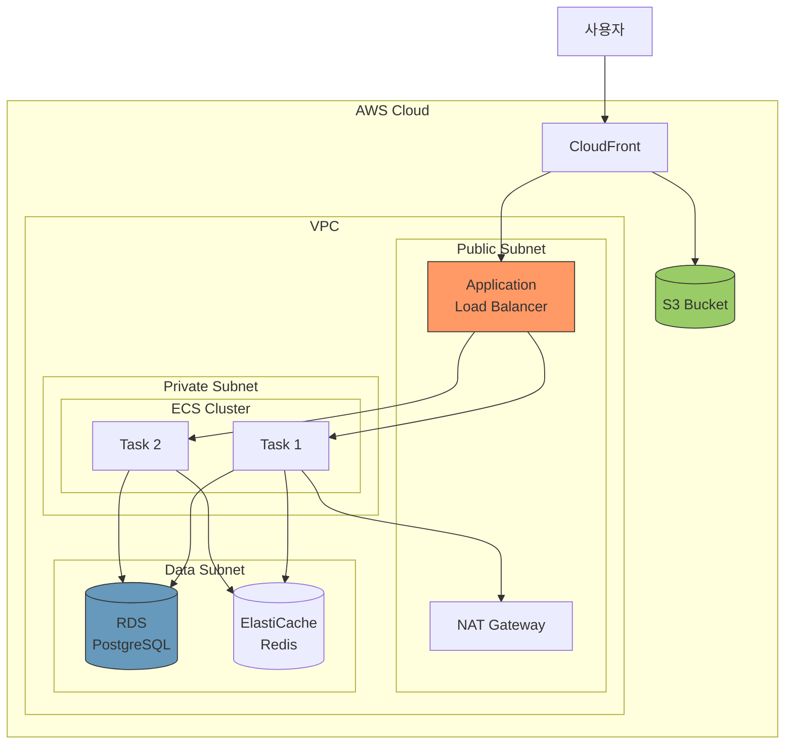

**클라우드 서비스 아이콘 컨벤션**:
- 컴퓨팅: 주황색 (`#f96`)
- 데이터베이스: 파란색 (`#69b`)
- 스토리지: 녹색 (`#9c6`)
- 네트워크: 보라색 (`#96f`)

---

## Draw.io XML 출력 (신규)

### 사용법

```
/diagram wbs my-project --format drawio
```

### 출력 형식

Draw.io (diagrams.net) 호환 XML 파일을 생성한다.

**출력 파일**: `docs/diagrams/{type}-{name}.drawio`

### Draw.io 템플릿 구조

```xml
<mxfile host="app.diagrams.net" modified="2026-01-21T00:00:00.000Z" agent="Claude">
  <diagram name="Page-1" id="page1">
    <mxGraphModel dx="1434" dy="780" grid="1" gridSize="10" guides="1" tooltips="1" connect="1" arrows="1" fold="1" page="1" pageScale="1" pageWidth="827" pageHeight="1169">
      <root>
        <mxCell id="0"/>
        <mxCell id="1" parent="0"/>
        <!-- 노드들 -->
        <mxCell id="node1" value="프로젝트" style="rounded=1;whiteSpace=wrap;html=1;fillColor=#f9f;strokeColor=#333;" vertex="1" parent="1">
          <mxGeometry x="100" y="50" width="120" height="60" as="geometry"/>
        </mxCell>
        <!-- 엣지들 -->
        <mxCell id="edge1" style="edgeStyle=orthogonalEdgeStyle;rounded=0;html=1;" edge="1" parent="1" source="node1" target="node2">
          <mxGeometry relative="1" as="geometry"/>
        </mxCell>
      </root>
    </mxGraphModel>
  </diagram>
</mxfile>
```

### Draw.io 변환 프로세스

```
1. Mermaid 다이어그램 생성
    |
    v
2. 노드 좌표 계산
    |-- 레이아웃 알고리즘 적용
    |-- 겹침 방지
    |
    v
3. Draw.io XML 생성
    |-- 노드 → mxCell (vertex)
    |-- 엣지 → mxCell (edge)
    |-- 스타일 변환
    |
    v
4. .drawio 파일 저장
```

---

## 구문 오류 방지 규칙

### 따옴표 처리

```mermaid
%% GOOD
Node[Label without quotes]
Node["Label with special chars: ()[]"]

%% BAD - 중첩 따옴표
Node["Label with "nested" quotes"]

%% SOLUTION - 중첩 따옴표 대신 작은따옴표
Node["Label with 'nested' quotes"]
```

### 멀티라인 라벨

```mermaid
%% GOOD - br 태그 사용
Node["First Line<br/>Second Line"]

%% BAD - 실제 줄바꿈
Node["First Line
Second Line"]
```

### 특수문자 포함 ID

```mermaid
%% GOOD - 따옴표로 감싸기
subgraph DB["Database Layer"]

%% BAD - 공백 포함 ID
subgraph Database Layer
```

### 스타일 정의 순서

```mermaid
flowchart LR
    %% 1. 먼저 모든 노드 정의
    A[Node A] --> B[Node B]

    %% 2. 그 다음 스타일 적용
    style A fill:#f96
    style B fill:#69b
```

---

## 품질 체크리스트

생성된 다이어그램은 다음 체크리스트를 통과해야 한다:

```
[ ] 적절한 다이어그램 유형 선택
[ ] 노드 수 10-15개 이하
[ ] 의미 있는 노드 ID 사용 (A, B 대신 의미 있는 이름)
[ ] 중첩 따옴표 없음
[ ] 멀티라인 구문 올바름 (<br/> 사용)
[ ] 서브그래프 ID 유효성 확인
[ ] 모든 노드 ID 고유
[ ] Mermaid Live Editor에서 렌더링 성공
[ ] 모든 관계가 해결됨 (dangling reference 없음)
[ ] 복잡하면 분할됨
```

---

## 사용하지 말 것

| 상황 | 대안 |
|------|------|
| 데이터 시각화 (막대/원/선 차트) | matplotlib, plotly 등 차트 라이브러리 |
| 복잡한 조직도 (50+ 노드) | 전용 조직도 도구 |
| 정밀한 Gantt 차트 | MS Project, Jira 등 |
| Git 브랜치 히스토리 | `git log --graph` 또는 GitKraken |

---

## 출력 형식

생성된 다이어그램은 다음 위치에 저장한다:

```
docs/diagrams/
├── class-{module}.md
├── sequence-{endpoint}.md
├── er-{schema}.md
├── flow-{process}.md
├── state-{entity}.md
├── architecture.md
├── timeline-{project}.md
├── usecase-{feature}.md
├── wbs-{project}.md
├── pert-{project}.md
├── raci-{project}.md
├── bpmn-{process}.md
├── swimlane-{process}.md
├── network-{system}.md
├── cloud-{system}.md
└── {name}.drawio
```

---

## 관련 스킬

| 스킬명 | 관계 | 설명 |
|--------|------|------|
| [@skills/doc-sys/SKILL.md] | 관련 | 시스템 아키텍처 문서 생성 |
| [@skills/doc-prd/SKILL.md] | 관련 | PRD 문서 생성 |
| [@skills/prd-workflow/SKILL.md] | 부모 | PRD 워크플로우에서 시각화 단계 |
| [@skills/workflow-builder/SKILL.md] | 관련 | 워크플로우 다이어그램 생성 |

---

## 참고

다이어그램 생성 상세 가이드:
- `references/mermaid-syntax.md` - 문법 레퍼런스
- `references/diagram-selection-guide.md` - 상황별 선택 가이드

## Changelog

| 날짜 | 변경 내용 |
|------|----------|
| 2026-01-21 | PMP/PMBOK 다이어그램 추가 (WBS, PERT, RACI) |
| 2026-01-21 | 비즈니스 다이어그램 추가 (BPMN, Swimlane) |
| 2026-01-21 | 인프라 다이어그램 추가 (Network, Cloud) |
| 2026-01-21 | Draw.io XML 출력 지원 추가 (--format drawio) |
| 2026-01-21 | 초기 스킬 생성 |

## Gotchas (실패 포인트)

- Mermaid 구문 오류 시 다이어그램 렌더링 안 됨 — 특수문자 escape 필요
- 너무 많은 노드(30개 이상)는 가독성 저하 — 계층적 분리 필요
- sequence diagram에서 activation bar 미사용 시 흐름 불명확
- Draw.io XML 복사 후 특수문자로 인한 XML 파싱 오류 가능
