# Mermaid Syntax Reference

## 구문 오류 방지 핵심 규칙

### 1. 따옴표 처리

```mermaid
%% GOOD - 따옴표 없이
Node[Simple Label]

%% GOOD - 특수문자 포함 시 따옴표
Node["Label with (parentheses) or [brackets]"]

%% BAD - 중첩 따옴표
Node["Label with "nested" quotes"]

%% SOLUTION - 작은따옴표 사용
Node["Label with 'nested' quotes"]
```

### 2. 멀티라인 라벨

```mermaid
%% GOOD - br 태그
Node["First Line<br/>Second Line"]

%% GOOD - 여러 줄
Node["Line 1<br/>Line 2<br/>Line 3"]

%% BAD - 실제 줄바꿈 사용
Node["First Line
Second Line"]
```

### 3. 엣지 라벨

```mermaid
%% GOOD - 간단한 라벨
A -->|Yes| B
A -->|No| C

%% BAD - 엣지 라벨에 따옴표
A -->|"Yes"| B
```

### 4. 서브그래프 ID

```mermaid
%% GOOD - 공백 없는 ID + 따옴표 라벨
subgraph DBLayer["Database Layer"]

%% BAD - 공백 포함 ID
subgraph Database Layer

%% BAD - 특수문자 ID 직접 사용
subgraph DB-Layer
```

### 5. 스타일 정의 순서

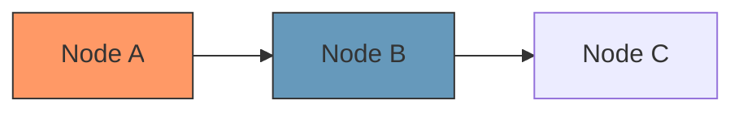

---

## Flowchart

### 기본 구조

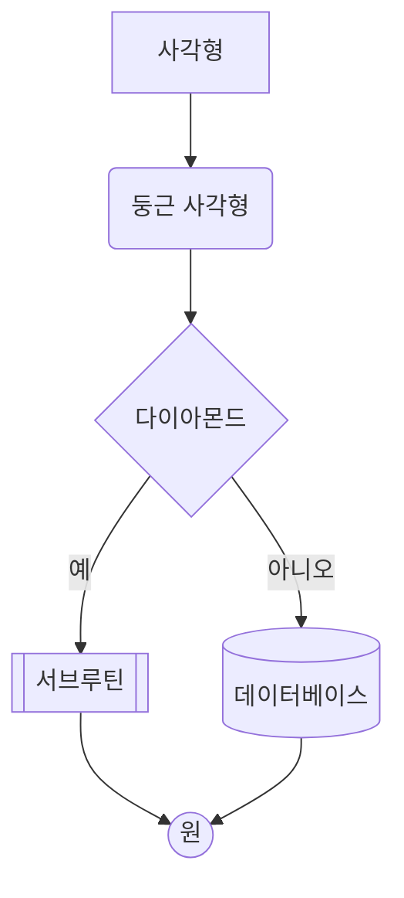

### 노드 형태

| 구문 | 형태 | 용도 |
|------|------|------|
| `[text]` | 사각형 | 일반 프로세스 |
| `(text)` | 둥근 사각형 | 시작/종료 |
| `{text}` | 다이아몬드 | 조건/분기 |
| `[(text)]` | 원통형 | 데이터베이스 |
| `[[text]]` | 서브루틴 | 서브프로세스 |
| `((text))` | 원 | 연결점 |
| `([text])` | 스타디움 | 시작/종료 |
| `>text]` | 비대칭 | 특수 용도 |
| `{{text}}` | 육각형 | 준비 단계 |

### 연결선

```mermaid
flowchart LR
    A --> B   %% 화살표
    B --- C   %% 선
    C -.-> D  %% 점선 화살표
    D ==> E   %% 굵은 화살표
    E --o F   %% 원 끝
    F --x G   %% X 끝
    G <--> H  %% 양방향
```

### 서브그래프

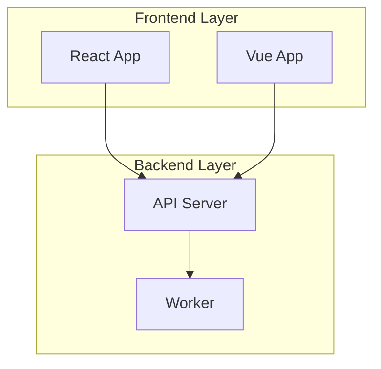

### 데이터 파이프라인 템플릿

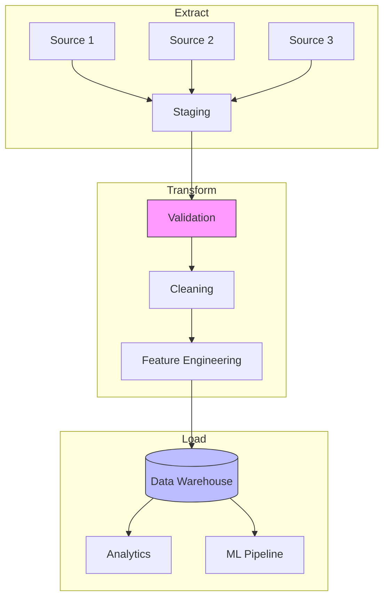

---

## Sequence Diagram

### 기본 구조

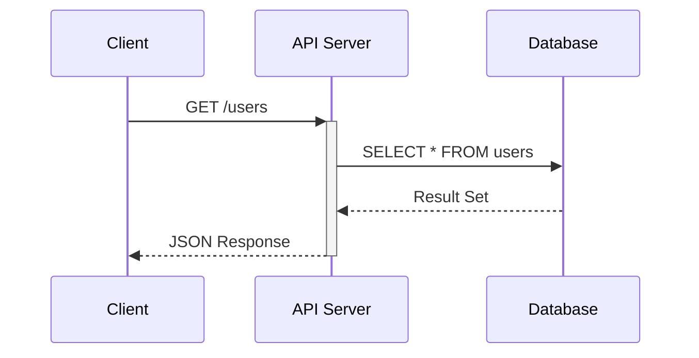

### 참가자 유형

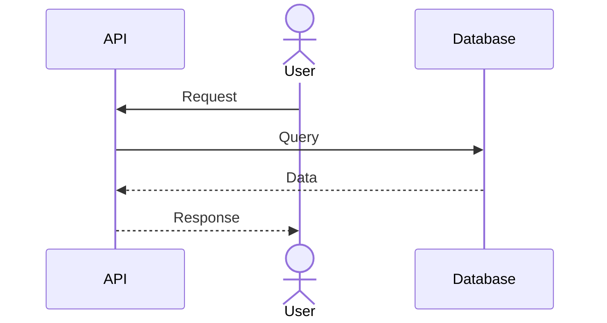

### 메시지 유형

| 구문 | 의미 |
|------|------|
| `->>` | 동기 메시지 (실선) |
| `-->>` | 응답 (점선) |
| `->>+` | 활성화 시작 |
| `-->>-` | 활성화 종료 |
| `-x` | 비동기 (즉시 반환) |
| `-)` | 비동기 응답 |

### 조건/반복

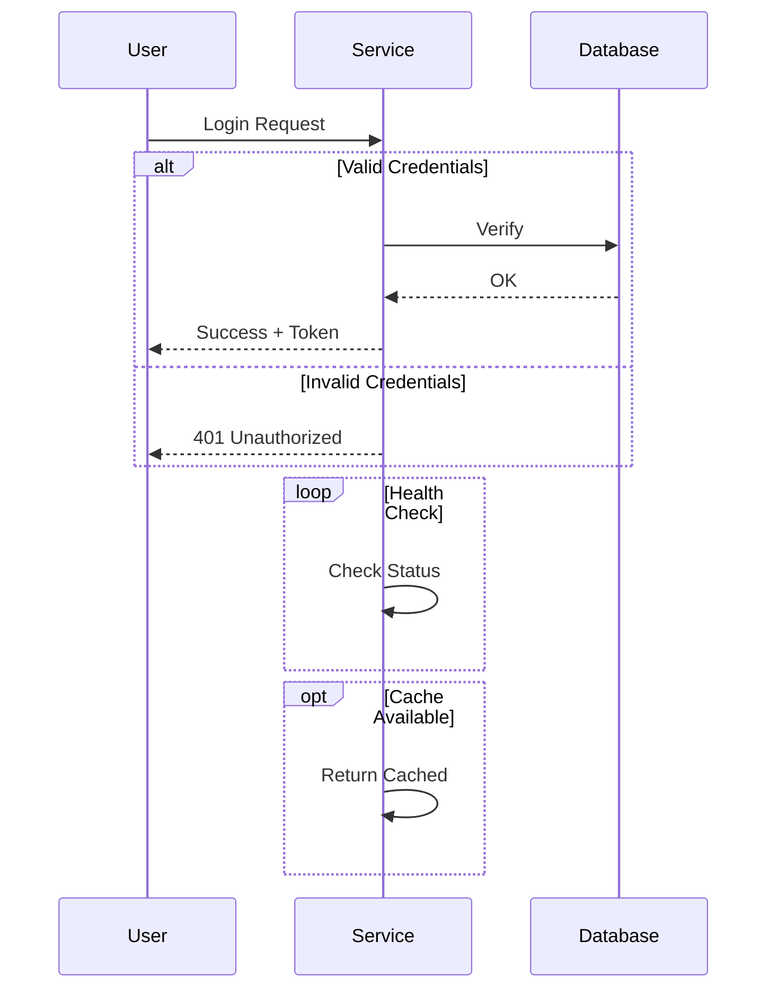

### API 호출 템플릿

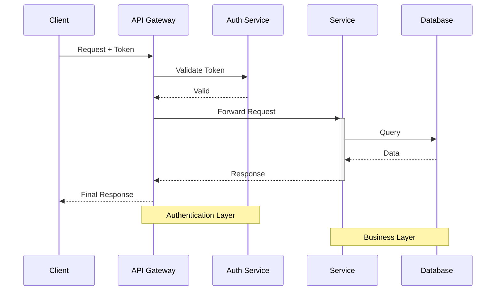

---

## Class Diagram

### 기본 구조

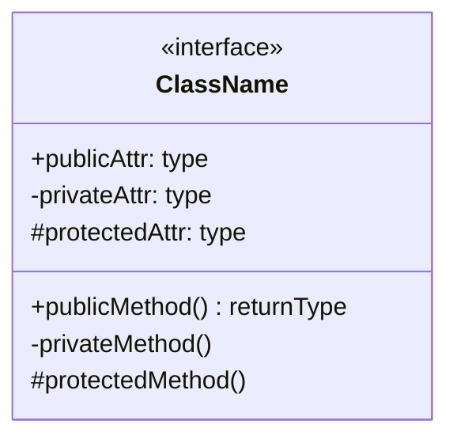

### 접근 제어자

| 기호 | 의미 |
|------|------|
| `+` | public |
| `-` | private |
| `#` | protected |
| `~` | package/internal |

### 관계 유형

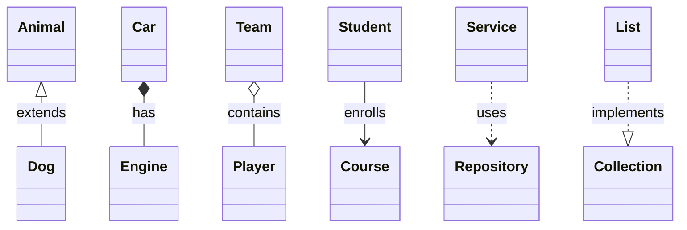

### 스테레오타입

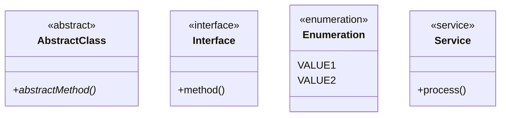

### 데이터 모델 템플릿

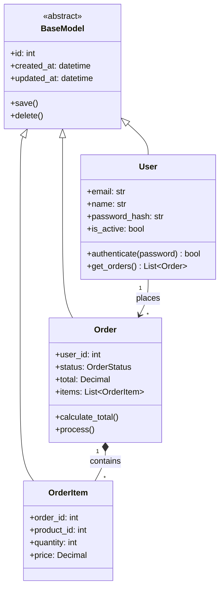

---

## ER Diagram

### 기본 구조

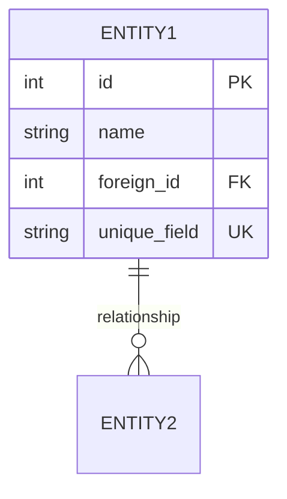

### 관계 표기

| 왼쪽 | 오른쪽 | 의미 |
|------|--------|------|
| `\|\|` | `\|\|` | 1:1 |
| `\|\|` | `o{` | 1:N (0 이상) |
| `\|\|` | `\|{` | 1:N (1 이상) |
| `o\|` | `o{` | 0..1:N |

### 데이터베이스 스키마 템플릿

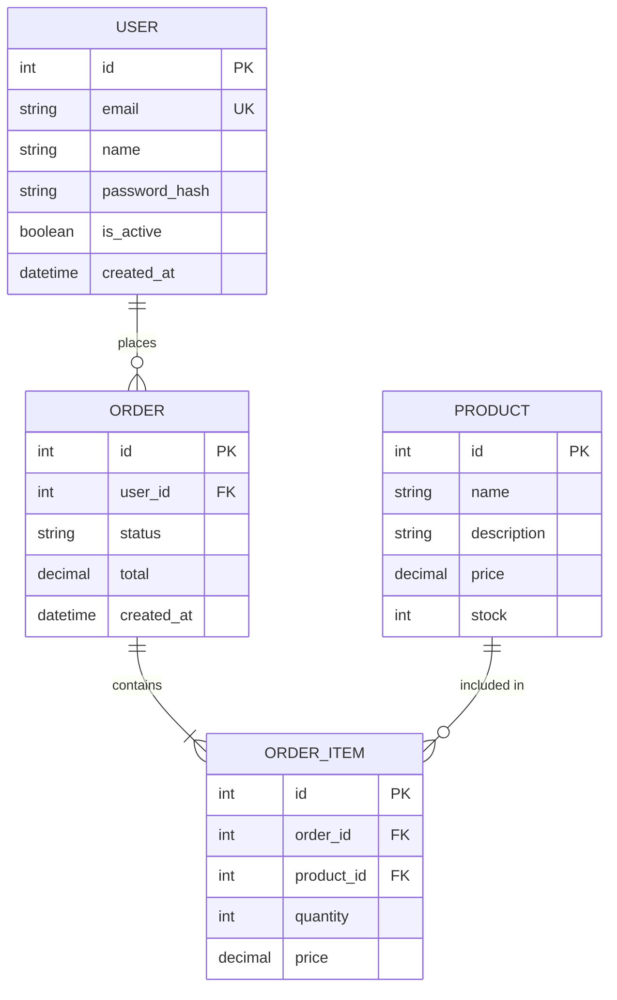

---

## State Diagram

### 기본 구조

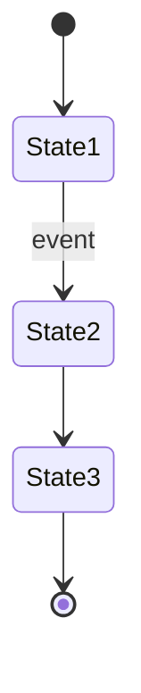

### 복합 상태

```mermaid
stateDiagram-v2
    [*] --> Active

    state Active {
        [*] --> Idle
        Idle --> Processing: start
        Processing --> Idle: complete
        Processing --> Error: fail
        Error --> Idle: retry
    }

    Active --> Inactive: deactivate
    Inactive --> Active: activate
    Inactive --> [*]: terminate
```

### Fork/Join

```mermaid
stateDiagram-v2
    [*] --> Ready

    state fork_state <<fork>>
    Ready --> fork_state

    fork_state --> Task1
    fork_state --> Task2
    fork_state --> Task3

    state join_state <<join>>
    Task1 --> join_state
    Task2 --> join_state
    Task3 --> join_state

    join_state --> Complete
    Complete --> [*]
```

### 주문 상태 템플릿

```mermaid
stateDiagram-v2
    [*] --> Created

    Created --> Pending: submit
    Pending --> Confirmed: confirm
    Pending --> Cancelled: cancel

    Confirmed --> Processing: start_processing
    Processing --> Shipped: ship

    Shipped --> Delivered: deliver
    Shipped --> Returned: return

    Delivered --> [*]
    Cancelled --> [*]
    Returned --> Refunded: process_refund
    Refunded --> [*]

    note right of Processing
        Inventory deducted
        at this stage
    end note
```

---

## Timeline

### 기본 구조

```mermaid
timeline
    title Project Timeline
    section Phase 1
        2025-01 : Task 1
        2025-02 : Task 2
    section Phase 2
        2025-03 : Task 3
        2025-04 : Task 4
```

### 프로젝트 로드맵 템플릿

```mermaid
timeline
    title 2025 Product Roadmap

    section Q1
        Jan : MVP Development
            : Core Features
        Feb : Alpha Testing
            : Bug Fixes
        Mar : Beta Release

    section Q2
        Apr : User Feedback
            : Performance Tuning
        May : Feature Expansion
        Jun : Public Launch

    section Q3
        Jul : Scale Infrastructure
        Aug : International Launch
        Sep : Enterprise Features
```

---

## 스타일링

### 개별 스타일

```mermaid
flowchart LR
    A[Critical] --> B[Warning] --> C[Success] --> D[Info]

    style A fill:#f66,stroke:#333,stroke-width:2px
    style B fill:#f96,stroke:#333
    style C fill:#9f9,stroke:#333
    style D fill:#69b,stroke:#333
```

### 클래스 정의

```mermaid
flowchart LR
    A[Node 1]:::critical --> B[Node 2]:::warning
    B --> C[Node 3]:::success

    classDef critical fill:#f66,stroke:#333,stroke-width:2px
    classDef warning fill:#f96,stroke:#333
    classDef success fill:#9f9,stroke:#333
```

### 색상 팔레트

| 용도 | 색상 코드 | 예시 |
|------|----------|------|
| Critical/Error | `#f66` | 오류, 경고 |
| Warning | `#f96` | 주의 |
| Success | `#9f9` | 성공, 완료 |
| Info/Primary | `#69b` | 정보, 주요 |
| Database | `#bbf` | 데이터 저장소 |
| External | `#ddd` | 외부 시스템 |

---

## 주석

```mermaid
flowchart TD
    %% 이것은 주석입니다
    %% 렌더링되지 않습니다

    A[Start] --> B[Process]

    %% 섹션 구분
    B --> C[End]
```

---

## 검증 체크리스트

생성된 Mermaid 코드 검증:

```
[ ] 중첩 따옴표 없음
[ ] 멀티라인에 <br/> 사용
[ ] 엣지 라벨 따옴표 불필요
[ ] 서브그래프 ID 유효 (공백/특수문자 없음)
[ ] 스타일 정의가 노드 정의 후에 위치
[ ] 모든 노드 ID 고유
[ ] 모든 참조된 노드 정의됨
[ ] Mermaid Live Editor에서 렌더링 성공
```

## 참고 자료

- Mermaid Live Editor: https://mermaid.live
- Mermaid 공식 문서: https://mermaid.js.org/
