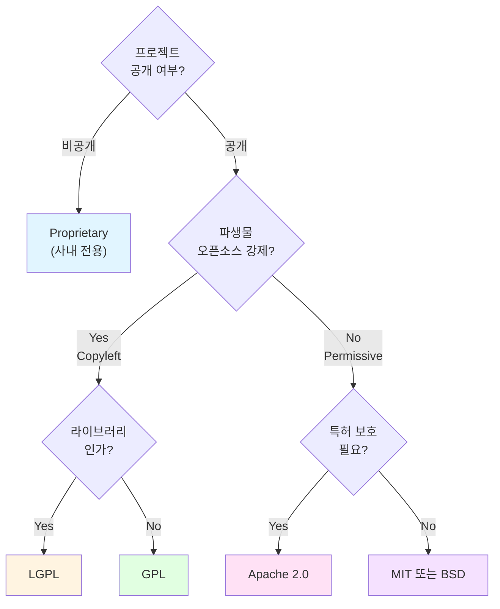

# 라이센스 선택 가이드

프로젝트에 적합한 라이센스를 선택하기 위한 가이드를 제공한다.

## 목적

- 프로젝트 상황에 맞는 라이센스 선택
- 라이센스별 법적 의미 이해
- 오픈소스 전환 시 고려사항 파악
- 라이센스 호환성 검토

## 사용법

```
/license-guide [옵션]
```

| 옵션 | 설명 |
|------|------|
| `proprietary` | 사내 전용 라이센스 |
| `mit` | MIT 라이센스 |
| `apache` | Apache 2.0 라이센스 |
| `gpl` | GPL v3 라이센스 |
| `lgpl` | LGPL v3 라이센스 |
| `bsd` | BSD 라이센스 (2-Clause, 3-Clause) |
| `compare` | 라이센스 비교표 |
| `all` | 전체 가이드 (기본값) |

### AskUserQuestion 활용 지점

**지점 1: 라이센스 타입 확인**

프로젝트에 적합한 라이센스를 선택한다:

```yaml
AskUserQuestion:
  questions:
    - question: "라이센스 타입을 선택해주세요"
      header: "라이센스"
      multiSelect: false
      options:
        - label: "proprietary - 비공개 (권장)"
          description: "상업적 사용 제한 | 소스 공개 불필요 | 사내/클라이언트 전용"
        - label: "MIT - 허용적 오픈소스"
          description: "매우 관대 | 상업적 사용 가능 | 파생물 라이센스 자유"
        - label: "Apache-2.0 - 특허 보호"
          description: "허용적 + 특허 보호 | 기업 친화적 | 변경 사항 명시 필요"
        - label: "GPL-3.0 - Copyleft"
          description: "오픈소스 | 파생물도 GPL | 소스 공개 의무"
        - label: "BSD - 간결한 허용적"
          description: "MIT와 유사 | 광고 조항 옵션"
        - label: "Custom - 커스텀 라이센스"
          description: "직접 작성 또는 법무팀 검토"
```

---

## 1. 라이센스 비교표

### 허용적 라이센스 (Permissive)

| 특성 | MIT | Apache 2.0 | BSD-2 | BSD-3 |
|------|-----|------------|-------|-------|
| 상업적 사용 | O | O | O | O |
| 수정/배포 | O | O | O | O |
| 특허 보호 | X | O | X | X |
| 저작권 표시 | 필수 | 필수 | 필수 | 필수 |
| 변경 사항 명시 | X | O | X | X |
| 광고 제한 | X | X | X | O |

### Copyleft 라이센스

| 특성 | GPL v3 | LGPL v3 | AGPL v3 |
|------|--------|---------|---------|
| 상업적 사용 | O | O | O |
| 수정/배포 | O | O | O |
| 소스 공개 의무 | 전체 | 수정부분만 | 전체+네트워크 |
| 파생물 라이센스 | GPL 강제 | 링킹 허용 | GPL 강제 |
| 특허 보호 | O | O | O |

### 비공개 라이센스

| 특성 | Proprietary |
|------|-------------|
| 상업적 사용 | 제한 |
| 수정/배포 | 금지 |
| 소스 공개 | 금지 |

---

## 2. Proprietary (사내 전용)

### 적용 상황

- 회사 내부 사용 전용
- 외부 공개 금지 프로젝트
- 영업 비밀 보호 필요

### 라이센스 텍스트

```
Copyright (c) [연도] [회사명]. All Rights Reserved.

본 소프트웨어 및 관련 문서("소프트웨어")는 [회사명]의 독점 재산입니다.
[회사명]의 사전 서면 승인 없이 소프트웨어의 전체 또는 일부를
복사, 수정, 배포, 판매하는 것을 금지합니다.
```

### 적용 방법

1. 프로젝트 루트에 `LICENSE` 파일 생성
2. 위 텍스트에서 `[연도]`, `[회사명]` 치환
3. 소스 파일 헤더에 저작권 표시 추가 (선택)

---

## 3. MIT License

### 적용 상황

- 오픈소스 공개 프로젝트
- 커뮤니티 기여 허용
- 단순하고 관대한 라이센스 필요
- 최소한의 제약으로 널리 사용되기를 원함

### 특징

| 허용 | 조건 | 금지 |
|------|------|------|
| 상업적 사용 | 저작권 표시 유지 | 없음 |
| 수정 | 라이센스 사본 포함 | |
| 배포 | | |
| 개인 사용 | | |

### 라이센스 텍스트

```
MIT License

Copyright (c) [연도] [저작자/조직]

Permission is hereby granted, free of charge, to any person obtaining a copy
of this software and associated documentation files (the "Software"), to deal
in the Software without restriction, including without limitation the rights
to use, copy, modify, merge, publish, distribute, sublicense, and/or sell
copies of the Software, and to permit persons to whom the Software is
furnished to do so, subject to the following conditions:

The above copyright notice and this permission notice shall be included in all
copies or substantial portions of the Software.

THE SOFTWARE IS PROVIDED "AS IS", WITHOUT WARRANTY OF ANY KIND, EXPRESS OR
IMPLIED, INCLUDING BUT NOT LIMITED TO THE WARRANTIES OF MERCHANTABILITY,
FITNESS FOR A PARTICULAR PURPOSE AND NONINFRINGEMENT. IN NO EVENT SHALL THE
AUTHORS OR COPYRIGHT HOLDERS BE LIABLE FOR ANY CLAIM, DAMAGES OR OTHER
LIABILITY, WHETHER IN AN ACTION OF CONTRACT, TORT OR OTHERWISE, ARISING FROM,
OUT OF OR IN CONNECTION WITH THE SOFTWARE OR THE USE OR OTHER DEALINGS IN THE
SOFTWARE.
```

### 사용 예시

- React, Vue.js, jQuery
- Node.js, Rails
- 대부분의 npm 패키지

---

## 4. Apache License 2.0

### 적용 상황

- 기업 오픈소스 프로젝트
- 특허 보호 필요
- 기여자로부터 특허 라이센스 획득 필요
- 변경 사항 추적이 중요한 프로젝트

### 특징

| 허용 | 조건 | 금지 |
|------|------|------|
| 상업적 사용 | 저작권 표시 유지 | 상표 사용 |
| 수정 | 변경 사항 명시 | |
| 배포 | NOTICE 파일 유지 | |
| 특허 사용 | 라이센스 사본 포함 | |

### MIT vs Apache 2.0

```
특허 보호 필요?
├── Yes → Apache 2.0
└── No → MIT (더 간결)

기업 환경?
├── 대기업 → Apache 2.0 (특허 보호)
└── 스타트업/개인 → MIT (간결함)

변경 추적 필요?
├── Yes → Apache 2.0 (변경 명시 의무)
└── No → MIT
```

### 적용 방법

1. 프로젝트 루트에 `LICENSE` 파일 생성 (전문)
2. `NOTICE` 파일 생성 (선택)
3. 소스 파일 헤더에 라이센스 표시

### 사용 예시

- Android, Kubernetes, TensorFlow
- Apache Spark, Kafka, Cassandra
- Swift, TypeScript

전문: https://www.apache.org/licenses/LICENSE-2.0

---

## 5. GPL v3 (GNU General Public License)

### 적용 상황

- 강력한 Copyleft 필요
- 파생물도 오픈소스로 유지되어야 함
- 소프트웨어 자유 보장 중시

### 특징

| 허용 | 조건 | 금지 |
|------|------|------|
| 상업적 사용 | 소스 코드 공개 | 폐쇄 소스 배포 |
| 수정 | 동일 라이센스 적용 | 서브라이센싱 |
| 배포 | 변경 사항 명시 | |
| 특허 사용 | 저작권 표시 유지 | |

### Copyleft 효과

```
GPL 코드 사용 시:
├── 정적 링킹 → 전체 프로젝트 GPL 적용
├── 동적 링킹 → 전체 프로젝트 GPL 적용
└── 시스템 라이브러리 예외 → GPL 비적용
```

### 라이센스 텍스트 요약

```
GNU GENERAL PUBLIC LICENSE
Version 3, 29 June 2007

Copyright (C) 2007 Free Software Foundation, Inc.

Everyone is permitted to copy and distribute verbatim copies
of this license document, but changing it is not allowed.
```

### 사용 예시

- Linux Kernel, Git, GCC
- WordPress, Drupal
- GIMP, Blender

전문: https://www.gnu.org/licenses/gpl-3.0.html

---

## 6. LGPL v3 (GNU Lesser General Public License)

### 적용 상황

- 라이브러리로 사용될 프로젝트
- GPL의 Copyleft 완화 필요
- 상용 소프트웨어에서도 사용 허용

### 특징

| 허용 | 조건 | 금지 |
|------|------|------|
| 상업적 사용 | 라이브러리 변경 시 소스 공개 | 없음 |
| 링킹 (정적/동적) | 라이센스 사본 포함 | |
| 수정 | 변경 사항 명시 (라이브러리만) | |

### GPL vs LGPL

```
라이브러리로 사용?
├── Yes → LGPL (링킹 허용)
└── No → GPL (더 강력한 보호)

상용 소프트웨어 호환 필요?
├── Yes → LGPL
└── No → GPL
```

### 사용 예시

- GNU C Library (glibc)
- GTK, Qt (듀얼 라이센스)
- FFmpeg (일부 컴포넌트)

전문: https://www.gnu.org/licenses/lgpl-3.0.html

---

## 7. BSD License

### BSD-2-Clause (Simplified)

가장 간단한 BSD 라이센스. MIT와 유사하나 더 짧음.

```
BSD 2-Clause License

Copyright (c) [연도], [저작자]
All rights reserved.

Redistribution and use in source and binary forms, with or without
modification, are permitted provided that the following conditions are met:

1. Redistributions of source code must retain the above copyright notice,
   this list of conditions and the following disclaimer.

2. Redistributions in binary form must reproduce the above copyright notice,
   this list of conditions and the following disclaimer in the documentation
   and/or other materials provided with the distribution.

THIS SOFTWARE IS PROVIDED BY THE COPYRIGHT HOLDERS AND CONTRIBUTORS "AS IS"
AND ANY EXPRESS OR IMPLIED WARRANTIES, INCLUDING, BUT NOT LIMITED TO, THE
IMPLIED WARRANTIES OF MERCHANTABILITY AND FITNESS FOR A PARTICULAR PURPOSE
ARE DISCLAIMED. IN NO EVENT SHALL THE COPYRIGHT HOLDER OR CONTRIBUTORS BE
LIABLE FOR ANY DIRECT, INDIRECT, INCIDENTAL, SPECIAL, EXEMPLARY, OR
CONSEQUENTIAL DAMAGES (INCLUDING, BUT NOT LIMITED TO, PROCUREMENT OF
SUBSTITUTE GOODS OR SERVICES; LOSS OF USE, DATA, OR PROFITS; OR BUSINESS
INTERRUPTION) HOWEVER CAUSED AND ON ANY THEORY OF LIABILITY, WHETHER IN
CONTRACT, STRICT LIABILITY, OR TORT (INCLUDING NEGLIGENCE OR OTHERWISE)
ARISING IN ANY WAY OUT OF THE USE OF THIS SOFTWARE, EVEN IF ADVISED OF THE
POSSIBILITY OF SUCH DAMAGE.
```

### BSD-3-Clause (New/Modified)

BSD-2에 광고 조항 추가.

```
추가 조항:
3. Neither the name of the copyright holder nor the names of its
   contributors may be used to endorse or promote products derived from
   this software without specific prior written permission.
```

### MIT vs BSD

```
실질적 차이?
├── 거의 없음 (법적으로 동등)
└── MIT가 더 짧고 명확

광고 제한 필요?
├── Yes → BSD-3
└── No → MIT 또는 BSD-2
```

### 사용 예시

- FreeBSD, OpenBSD, NetBSD
- Nginx, Django
- Go (일부 컴포넌트)

---

## 8. 라이센스 선택 의사결정 트리



### 상황별 권장 라이센스

| 상황 | 권장 라이센스 | 이유 |
|------|--------------|------|
| 사내 도구 | Proprietary | 외부 공개 불필요 |
| 작은 라이브러리 | MIT | 간결, 널리 사용 |
| 대규모 프레임워크 | Apache 2.0 | 특허 보호, 변경 추적 |
| 커뮤니티 프로젝트 | GPL v3 | 오픈소스 생태계 보호 |
| 상용 호환 라이브러리 | LGPL | 링킹 허용 |
| 학술 프로젝트 | BSD-3 | 학계 관행 |

---

## 9. 라이센스 호환성

### 호환성 매트릭스

```
MIT/BSD → Apache 2.0 → GPL v3
   ↓           ↓           ↓
  ✓ 호환    ✓ 호환    ✗ 역방향 불가
```

### 주요 규칙

1. **Permissive → Copyleft**: 가능 (MIT → GPL)
2. **Copyleft → Permissive**: 불가능 (GPL → MIT)
3. **GPL v2 ↔ GPL v3**: 호환 안됨 (v2-only 경우)
4. **Apache 2.0 + GPL v2**: 호환 안됨
5. **Apache 2.0 + GPL v3**: 호환됨

### 의존성 라이센스 검토

```bash
# Python 의존성 라이센스 확인
pip-licenses

# npm 의존성 라이센스 확인
npx license-checker
```

---

## 10. 라이센스 적용 체크리스트

### 프로젝트 초기화 시

```
[ ] LICENSE 파일 생성
[ ] [연도], [저작자] 정보 입력
[ ] README.md에 라이센스 명시
[ ] (Apache) NOTICE 파일 생성
[ ] 소스 파일 헤더 추가 (선택)
```

### 오픈소스 전환 시

```
[ ] 기존 코드 저작권 확인
[ ] 의존성 라이센스 호환성 검토
[ ] 기여자 동의 확보 (필요 시)
[ ] CLA (Contributor License Agreement) 설정 (선택)
[ ] SPDX 식별자 추가
```

### SPDX 식별자

```python
# SPDX-License-Identifier: MIT
# SPDX-License-Identifier: Apache-2.0
# SPDX-License-Identifier: GPL-3.0-only
# SPDX-License-Identifier: BSD-3-Clause
```

---

## 11. 기본 적용 라이센스

현재 이 레포지토리는 **Proprietary (사내 전용)** 라이센스가 기본 적용됩니다.

외부 공개 시 상기 옵션 중 적절한 라이센스를 선택하여 `LICENSE` 파일을 생성하십시오.

---

## 관련 스킬

| 스킬 | 역할 |
|------|------|
| [@skills/project-init/SKILL.md] | 프로젝트 초기화 (자동 호출) |
| [@skills/manage-readme/SKILL.md] | README 관리 |

---

## 참고

- SPDX License List: https://spdx.org/licenses/
- Choose a License: https://choosealicense.com/
- Open Source Initiative: https://opensource.org/licenses
- TL;DR Legal: https://tldrlegal.com/

---

## Changelog

| 날짜 | 버전 | 변경 내용 |
|------|------|----------|
| 2026-01-21 | 1.1.0 | GPL, LGPL, BSD 라이센스 추가, user-invocable: true 변경, 호환성 매트릭스 추가 |
| 2026-01-21 | 1.0.0 | 초기 생성 - LICENSE 파일에서 스킬로 변환 |
