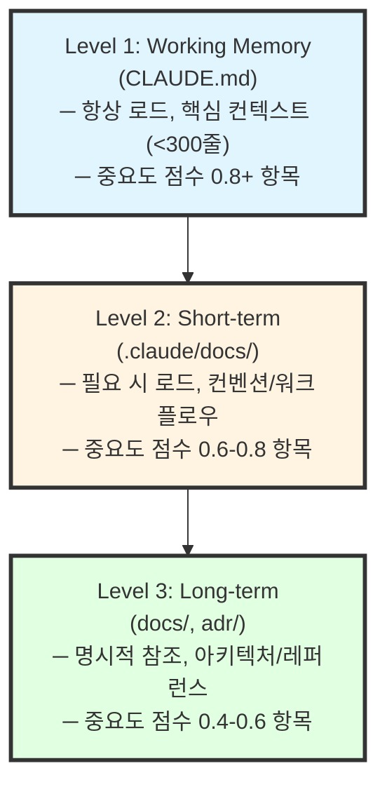
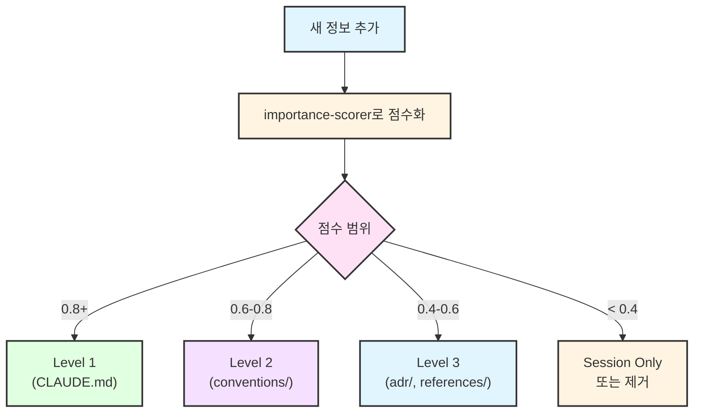
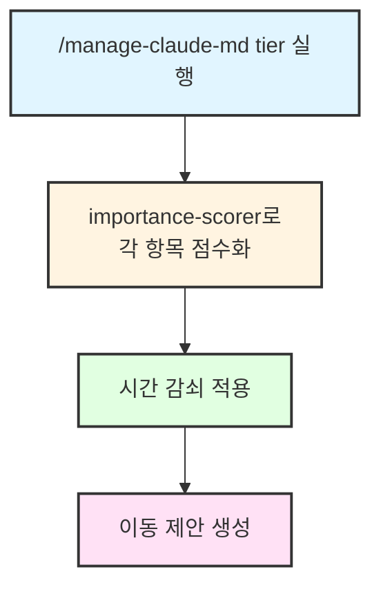

# CLAUDE.md 관리 스킬

CLAUDE.md 및 CLAUDE.local.md 파일을 체계적으로 관리하는 스킬.

## 개요

`CLAUDE.md` 파일은 Claude Code에게 프로젝트 컨텍스트를 제공한다:

| 파일 | 위치 | 용도 | Git |
|------|------|------|-----|
| `CLAUDE.md` | 프로젝트 루트 | 전체 프로젝트 컨텍스트 | 커밋 |
| `CLAUDE.local.md` | 프로젝트 루트 | 개인/로컬 설정 | .gitignore |
| 중첩 `CLAUDE.md` | 하위 디렉토리 | 디렉토리별 컨텍스트 | 커밋 |

## 3-Tier 메모리 계층

### 계층 구조



### 계층별 특성

| 계층 | 위치 | 로드 시점 | 용량 | 정보 유형 |
|------|------|----------|------|----------|
| **Level 1** | `CLAUDE.md` | 항상 | <300줄 | Quick Commands, 핵심 컨벤션 |
| **Level 2** | `.claude/docs/` | 필요 시 | 제한 없음 | 코딩 스타일, 테스트 규칙 |
| **Level 3** | `docs/adr/` | 명시적 참조 | 제한 없음 | ADR, 트러블슈팅, 레퍼런스 |

### 계층 간 이동 규칙



### 시간 감쇠 기반 자동 퇴출

```python
# 감쇠 함수
def decay_score(original_score, days_since_update):
    HALF_LIFE = 30  # 30일 반감기
    return original_score * (0.5 ** (days_since_update / HALF_LIFE))
```

| 원래 점수 | 30일 후 | 60일 후 | 90일 후 |
|----------|---------|---------|---------|
| 0.9 | 0.45 | 0.23 | 0.11 |
| 0.7 | 0.35 | 0.18 | 0.09 |
| 0.5 | 0.25 | 0.13 | 0.06 |

**자동 퇴출 조건**: 감쇠 점수 < 0.4 → 하위 계층으로 이동 제안

---

## 사용법

```bash
/manage-claude-md create              # CLAUDE.md 생성
/manage-claude-md create --local      # CLAUDE.local.md 생성
/manage-claude-md update              # CLAUDE.md 업데이트
/manage-claude-md review              # CLAUDE.md 리뷰 및 개선 제안
/manage-claude-md review --all        # 모든 CLAUDE.md 파일 리뷰
/manage-claude-md cleanup             # 중복/불필요 내용 정리
/manage-claude-md tier                # 계층 간 이동 분석 및 제안
```

---

## 작업별 상세

### 1. create (생성)

새로운 CLAUDE.md 또는 CLAUDE.local.md 파일을 템플릿 기반으로 생성한다.

#### 프로세스

1. 파일 존재 여부 확인
2. 프로젝트 타입 감지 (package.json, pyproject.toml 등)
3. 템플릿 기반 파일 생성
4. 프로젝트 타입에 맞게 커스터마이즈

#### CLAUDE.md 템플릿

```markdown
# 프로젝트 이름

프로젝트에 대한 1-2문장 설명.

## Quick Commands

\`\`\`bash
# 의존성 설치
npm install  # 또는: pip install -r requirements.txt

# 개발 서버 실행
npm run dev

# 테스트 실행
npm test

# 빌드
npm run build
\`\`\`

## 프로젝트 구조

\`\`\`
src/
├── components/    # 컴포넌트
├── utils/         # 유틸리티
├── types/         # 타입 정의
└── index.ts       # 엔트리 포인트
\`\`\`

## 핵심 컨벤션

- **코드 스타일**: [ESLint/Prettier 설정 따름]
- **네이밍**: [camelCase 변수, PascalCase 컴포넌트]
- **테스트**: [Jest, *.test.ts 형식]

## 아키텍처 노트

- [주요 설계 결정]
- [핵심 의존성과 용도]
- [따라야 할 패턴]

## 현재 작업 컨텍스트

[진행 중인 작업 정보]
```

---

### 2. update (업데이트)

기존 CLAUDE.md 파일에 내용을 추가하거나 수정한다.

#### 프로세스

1. 기존 파일 읽기
2. 추가/수정할 섹션 식별
3. 사용자 커스텀 내용 보존
4. 일관된 포맷 유지

#### 업데이트 예시

```markdown
## 업데이트 제안

다음 내용을 CLAUDE.md에 추가할 것을 권장합니다:

### 현재 작업 컨텍스트 섹션
\`\`\`markdown
### 최근 완료된 작업
- 인증 시스템 구현 (2026-01-21)
  - JWT 기반 토큰 인증
  - 리프레시 토큰 로직
\`\`\`

이 업데이트를 적용할까요? [Y/N]
```

---

### 3. review (리뷰)

CLAUDE.md 파일을 분석하고 개선점을 제안한다.

#### 분석 기준

| 기준 | 체크 항목 |
|------|----------|
| **정확성** | 명령어가 실제로 작동하는가? 경로가 유효한가? |
| **완전성** | 필수 섹션이 모두 있는가? 핵심 정보가 누락되었는가? |
| **간결성** | 불필요한 중복이 있는가? 너무 장황한가? |
| **최신성** | 오래된 정보가 있는가? 현재 상태를 반영하는가? |
| **유용성** | Claude에게 실제로 도움이 되는 정보인가? |

#### 리뷰 리포트 형식

```markdown
## CLAUDE.md 리뷰 리포트

### 파일: .claude/CLAUDE.md

#### 현재 상태
- 총 라인 수: 150
- 마지막 수정: 2026-01-15
- 섹션 수: 7

#### 발견된 이슈

| 심각도 | 위치 | 이슈 | 제안 |
|--------|------|------|------|
| 높음 | Line 45 | 오래된 명령어 | 수정 필요 |
| 중간 | Line 78-95 | 중복된 설명 | 통합 권장 |
| 낮음 | Line 120 | 오타 | 수정 |

#### 누락된 정보

1. **환경 변수**: 필요한 변수 목록
2. **테스트 명령어**: 테스트 실행 방법
3. **최근 작업**: 현재 진행 중인 작업

#### 제거 권장

1. README와 중복되는 설치 가이드
2. Claude가 추론 가능한 자명한 정보
```

#### 필수 섹션 체크리스트

```markdown
- [ ] 프로젝트 개요 (1-2문장)
- [ ] Quick Commands (빌드, 테스트, 실행)
- [ ] 프로젝트 구조 (주요 디렉토리)
- [ ] 핵심 컨벤션 (코딩 스타일, 네이밍)
- [ ] 현재 작업 컨텍스트 (CLAUDE.local.md 권장)
```

#### 품질 기준

| 기준 | 좋음 | 나쁨 |
|------|------|------|
| 길이 | < 300줄 | > 500줄 |
| 명령어 | 실제 작동 확인 | 추측 또는 오래됨 |
| 정보 | Claude에게 유용 | 자명하거나 중복 |
| 구조 | 명확한 섹션 구분 | 뒤섞인 정보 |

---

### 4. cleanup (정리)

중복, 오래된 내용, 불필요한 정보를 제거한다.

#### 프로세스

1. 중복 정보 식별 및 통합
2. 유사 섹션 병합
3. 자명한/추론 가능한 내용 제거
4. 장황한 설명 축소

#### 정리 대상

```markdown
### 제거 권장 항목

1. **중복 정보**: README와 겹치는 내용
2. **자명한 정보**: Claude가 코드에서 추론 가능
3. **오래된 정보**: 더 이상 유효하지 않은 내용
4. **과도한 상세**: 필요 이상으로 장황한 설명
```

---

### 5. tier (계층 관리)

메모리 계층 간 정보 이동을 분석하고 제안한다.

#### 프로세스

1. 모든 CLAUDE.md 섹션 분석
2. 각 항목의 중요도 점수 계산
3. 시간 감쇠 적용
4. 계층 이동 제안

#### 출력 형식

```markdown
## 메모리 계층 분석

### 현재 상태

| 계층 | 항목 수 | 용량 | 상태 |
|------|--------|------|------|
| Level 1 | 15개 | 280줄 | ⚠️ 용량 근접 |
| Level 2 | 8개 | 450줄 | ✅ 양호 |
| Level 3 | 12개 | 890줄 | ✅ 양호 |

### 이동 제안

#### Level 1 → Level 2 (강등 권장)

| 항목 | 원래 점수 | 현재 점수 | 이유 |
|------|----------|----------|------|
| 레거시 API 엔드포인트 | 0.75 | 0.38 | 60일 미참조 |
| 임시 워크어라운드 | 0.65 | 0.33 | 45일 미참조 |

#### Session → Level 1 (승격 권장)

| 항목 | 점수 | 이유 |
|------|------|------|
| 새 인증 아키텍처 | 0.92 | architecture + security |
| API 버저닝 전략 | 0.85 | design_pattern |

### 권장 조치

1. **즉시**: 2개 항목 Level 2로 이동
2. **권장**: 2개 항목 Level 1에 추가
3. **선택**: 오래된 3개 항목 Level 3으로 아카이브

조치를 진행할까요? [Y/N/선택적]
```

#### importance-scorer 연동



---

## 포함/제외 가이드라인

### 포함해야 할 것 (고가치)

1. **빌드/실행 명령어**: Claude가 자주 필요로 하는 명령어
2. **프로젝트 구조**: 디렉토리 구성 개요
3. **핵심 컨벤션**: 코딩 표준, 네이밍 패턴
4. **아키텍처 결정**: 사용 중인 설계 패턴
5. **환경 설정**: 필요한 환경 변수, 설정 단계
6. **알려진 함정**: 비직관적인 동작, 주의사항

### 포함하지 말 것 (저가치 또는 유해)

1. **자명한 정보**: Claude가 코드에서 쉽게 추론 가능
2. **중복 문서**: README나 docs에 이미 있는 정보
3. **장황한 설명**: 간결하게 유지, Claude는 컨텍스트를 이해함
4. **자주 변경되는 데이터**: 버전 번호, 날짜 등
5. **개인 선호**: CLAUDE.local.md 사용
6. **민감한 정보**: API 키, 인증 정보, 시크릿

---

## CLAUDE.local.md 가이드라인

개인/로컬 설정에 사용:

- 개인 워크플로우 선호
- 로컬 환경 특성
- 머신별 경로
- 임시 메모
- 실험적 지침

#### 예시

```markdown
# 로컬 Claude 설정

## 내 선호사항

- 상세한 설명 선호
- 응답에 파일 경로 항상 표시
- 코드 주석은 한국어로

## 로컬 환경

- Node 버전: 18.x (nvm 사용)
- 데이터베이스: 로컬 PostgreSQL (포트 5433)
- API 엔드포인트: http://localhost:3001

## 현재 작업

인증 모듈 리팩토링 진행 중.
```

---

## 모범 사례

### DO

1. **짧게 유지**: 300줄 이하 목표, Claude의 컨텍스트는 소중함
2. **정기 업데이트**: 오래된 정보 제거, 새 패턴 추가
3. **구체적으로**: "테스트가 있음"보다 "Vitest 사용"
4. **예시 사용**: 말로 설명하기보다 보여주기
5. **계층적 구성**: 쉽게 스캔할 수 있도록 헤더 사용
6. **버전 관리**: CLAUDE.md는 커밋, CLAUDE.local.md는 gitignore

### DON'T

1. 자명한 정보 포함
2. README 내용 중복
3. 장황한 설명
4. 자주 변경되는 데이터 포함
5. 민감한 정보 포함

---

## done 스킬 연동

`/done` 실행 후 자동 제안:

```markdown
작업이 완료되었습니다.
CLAUDE.md에 다음 내용을 추가할 것을 권장합니다:
- 최근 완료된 작업 섹션 업데이트

`/manage-claude-md review`를 실행할까요?
```

---

## 예시

### 예시 1: 기본 리뷰

```
User: /manage-claude-md review

Claude:
## CLAUDE.md 리뷰 리포트

### 분석 결과

| 항목 | 상태 |
|------|------|
| 정확성 | ⚠️ 2개 이슈 |
| 완전성 | ✅ 양호 |
| 간결성 | ⚠️ 중복 발견 |
| 최신성 | ❌ 오래된 정보 |

### 주요 발견

1. **오래된 명령어** (Line 23)
   - 현재: `yarn start`
   - 실제: `pnpm start`

2. **누락된 정보**
   - 환경 변수 목록
   - 테스트 실행 방법

### 권장 조치

1. 명령어 업데이트 (즉시)
2. 환경 변수 섹션 추가 (권장)
3. 중복 제거 (선택)

수정을 진행할까요?
```

### 예시 2: 새 파일 생성

```
User: /manage-claude-md create

Claude:
프로젝트 타입 감지: Python (pyproject.toml 발견)

CLAUDE.md 파일을 생성합니다...

✅ .claude/CLAUDE.md 생성 완료

다음 섹션이 포함되었습니다:
- 프로젝트 개요
- Quick Commands (uv 기반)
- 프로젝트 구조
- 핵심 컨벤션

필요에 따라 내용을 수정해 주세요.
```

---

## 관련 스킬

| 스킬 | 관계 | 설명 |
|------|------|------|
| [@skills/project-init/SKILL.md] | 호출처 | 프로젝트 초기화 시 호출 |
| [@skills/done/SKILL.md] | 연계 | 작업 완료 후 리뷰 제안 |
| [@skills/importance-scorer/SKILL.md] | 연계 | 메모리 계층 이동 시 점수화 |

---

## Changelog

| 날짜 | 버전 | 변경 내용 |
|------|------|----------|
| 2026-01-28 | 1.1.0 | user-invocable: false로 변경 (memory-workflow 내부 호출) |
| 2026-01-21 | 1.2.1 | 관련 스킬 섹션 추가 (project-init 역참조) |
| 2026-01-21 | 1.2.0 | 3-tier 메모리 계층, tier 명령, 시간 감쇠 기반 퇴출 추가 |
| 2026-01-21 | 1.1.0 | memory-review 기능 통합, 한국어화 |
| 2026-01-21 | 1.0.0 | 초기 생성 |

## Gotchas (실패 포인트)

- CLAUDE.md 수정 후 Claude Code 재시작 필요 — 즉시 반영 안 됨
- 중복 내용 제거 시 중요 컨텍스트 분실 가능 — 백업 후 수정
- 200줄 초과 시 컨텍스트 비대화 — 외부 링크로 분리
- 여러 CLAUDE.md 파일 간 충돌 가능 — 우선순위 확인
