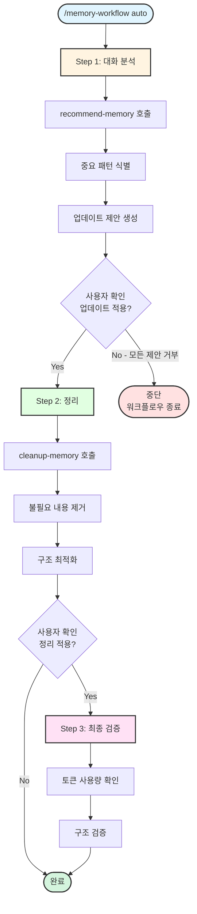

# memory-workflow

> CLAUDE.md 메모리 관리 통합 워크플로우

---

## 목적

1. **자동 추천**: 대화 분석 후 CLAUDE.md 업데이트 제안
2. **정리 최적화**: 불필요한 내용 제거, 토큰 절약
3. **통합 관리**: 생성, 수정, 리뷰를 하나의 워크플로우로 통합
4. **주기적 실행**: 10회/50회 대화마다 자동 실행 권장

---

## 사용법

```bash
# 자동 모드 (추천 → 정리)
/memory-workflow auto

# 개별 모드
/memory-workflow recommend    # 대화 분석 후 업데이트 추천
/memory-workflow cleanup      # CLAUDE.md 정리 및 최적화
/memory-workflow manage       # CLAUDE.md 생성/수정/리뷰

# 드라이런 (변경사항 미리보기)
/memory-workflow auto --dry-run
```

---

## 스킬 유형

**Composite Skill** - 3개 메모리 관리 스킬을 통합

| 순서 | 스킬 | 역할 | 실행 주기 |
|------|------|------|----------|
| 1 | [@skills/recommend-memory/SKILL.md] | 대화 분석 후 업데이트 추천 | 10회 대화 |
| 2 | [@skills/cleanup-memory/SKILL.md] | 정리 및 최적화 | 50회 대화 |
| 3 | [@skills/manage-claude-md/SKILL.md] | 생성/수정/리뷰 | 수동 |

---

## 실행 프로세스

### Mode 1: auto (자동 모드)



### Mode 2: recommend (추천 모드)

**직접 호출**: `/recommend-memory`

### Mode 3: cleanup (정리 모드)

**직접 호출**: `/cleanup-memory`

### Mode 4: manage (관리 모드)

**직접 호출**: `/manage-claude-md`

---

## AskUserQuestion 활용 지점

### 지점 1: 모드 선택

**시점**: 인자 없이 /memory-workflow 호출 시

```yaml
AskUserQuestion:
  questions:
    - question: "어떤 메모리 관리 작업을 수행할까요?"
      header: "모드 선택"
      multiSelect: false
      options:
        - label: "자동 (추천 → 정리) (권장)"
          description: "대화 분석 후 업데이트 추천 및 정리 자동 실행"
        - label: "추천 - 업데이트 제안만"
          description: "대화 분석 후 CLAUDE.md 업데이트 항목 제안"
        - label: "정리 - 최적화만"
          description: "불필요한 내용 제거 및 구조 개선"
        - label: "관리 - 생성/수정/리뷰"
          description: "CLAUDE.md 파일 직접 관리"
```

### 지점 2: 업데이트 적용 확인

**시점**: recommend-memory 완료 후

```yaml
AskUserQuestion:
  questions:
    - question: "제안된 업데이트를 적용할까요?"
      header: "업데이트 적용"
      multiSelect: true
      options:
        - label: "작업 컨텍스트 추가 (권장)"
          description: "새로 발견된 워크플로우/패턴 추가"
        - label: "명령어 추가"
          description: "자주 사용하는 명령어 기록"
        - label: "트러블슈팅 추가"
          description: "해결한 문제 기록"
```

**중단 로직**:
- 사용자가 **모든 옵션을 선택하지 않으면** (빈 배열 반환):
  - 워크플로우를 **즉시 중단**
  - "업데이트 제안이 모두 거부되어 워크플로우를 종료합니다." 메시지 출력
  - cleanup-memory 단계로 진행하지 않음
- 하나 이상 선택 시:
  - 선택된 항목만 CLAUDE.md에 추가
  - cleanup-memory 단계로 진행

### 지점 3: 정리 범위 선택

**시점**: cleanup-memory 실행 전

```yaml
AskUserQuestion:
  questions:
    - question: "정리 범위를 선택해주세요"
      header: "정리 범위"
      multiSelect: false
      options:
        - label: "자동 정리 (권장)"
          description: "importance-scorer 기준으로 자동 정리"
        - label: "전체 정리"
          description: "모든 섹션 검토 및 최적화"
        - label: "특정 섹션만"
          description: "지정한 섹션만 정리"
```

---

## 통합 효과

**Before** (분리 호출):
```bash
/recommend-memory        # Step 1: 추천
→ 수동 확인
/cleanup-memory          # Step 2: 정리
→ 수동 확인
/manage-claude-md review # Step 3: 리뷰
```

**After** (통합 호출):
```bash
/memory-workflow auto
→ 추천 → 정리 → 검증 자동 실행
→ 각 단계마다 사용자 확인
```

---

## 주기적 실행 가이드

| 대화 횟수 | 권장 액션 | 스킬 |
|----------|----------|------|
| 10회 | 업데이트 추천 | `/memory-workflow recommend` |
| 50회 | 정리 및 최적화 | `/memory-workflow auto` |
| 100회+ | 전체 리뷰 | `/memory-workflow manage review` |

---

## 관련 스킬

| 스킬 | 관계 | 설명 |
|------|------|------|
| [@skills/recommend-memory/SKILL.md] | 하위 | 대화 분석 후 업데이트 추천 |
| [@skills/cleanup-memory/SKILL.md] | 하위 | CLAUDE.md 정리 및 최적화 |
| [@skills/manage-claude-md/SKILL.md] | 하위 | CLAUDE.md 생성/수정/리뷰 |
| [@skills/importance-scorer/SKILL.md] | 관련 | 중요도 평가 기준 |
| [@skills/reset-counter/SKILL.md] | 관련 | 대화 카운터 리셋 |

---

## Changelog

| 날짜 | 변경 내용 |
|------|----------|
| 2026-01-28 | 초기 생성 - recommend/cleanup/manage 통합 |

## Gotchas (실패 포인트)

- CLAUDE.md가 200줄 초과하면 자동 압축 필요 — cleanup-memory 실행
- 메모리 업데이트 없이 컨텍스트 압축 시 중요 결정 분실
- recommend-memory는 10번 대화마다 실행 권장 — 수동 실행 필요
- 컨텍스트 압축 후 이전 결정 참조 불가 — ADR 필수
