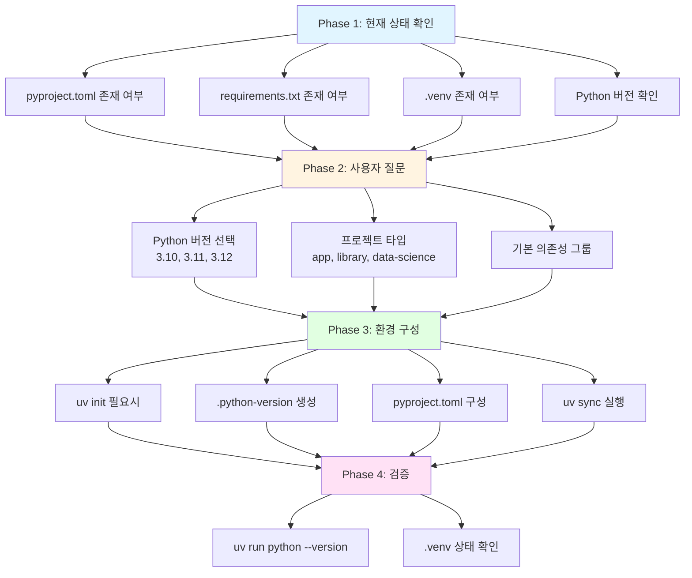
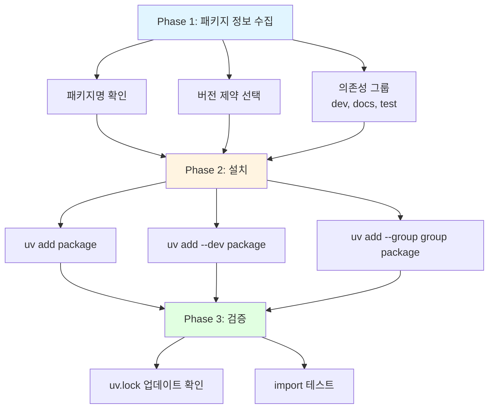
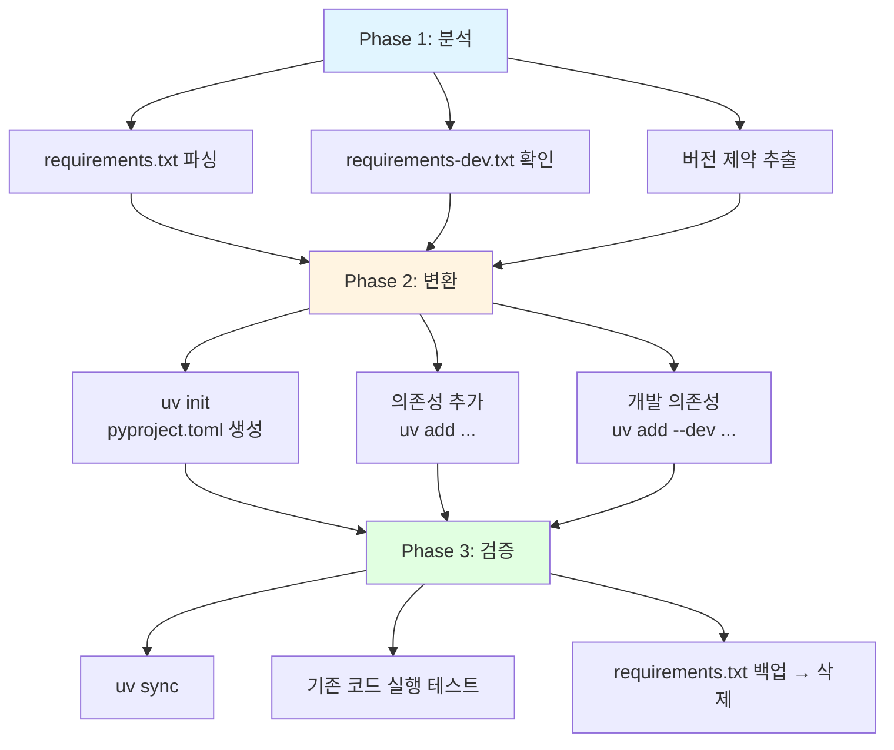
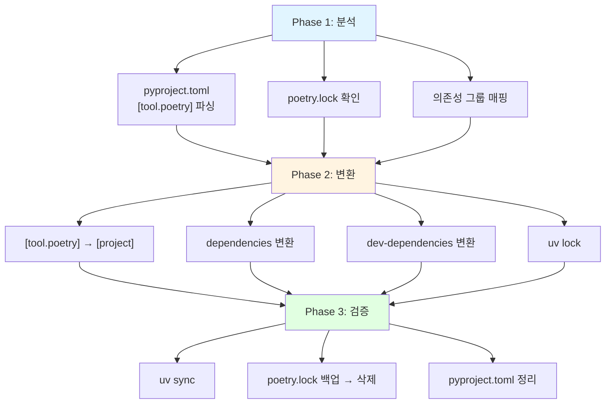
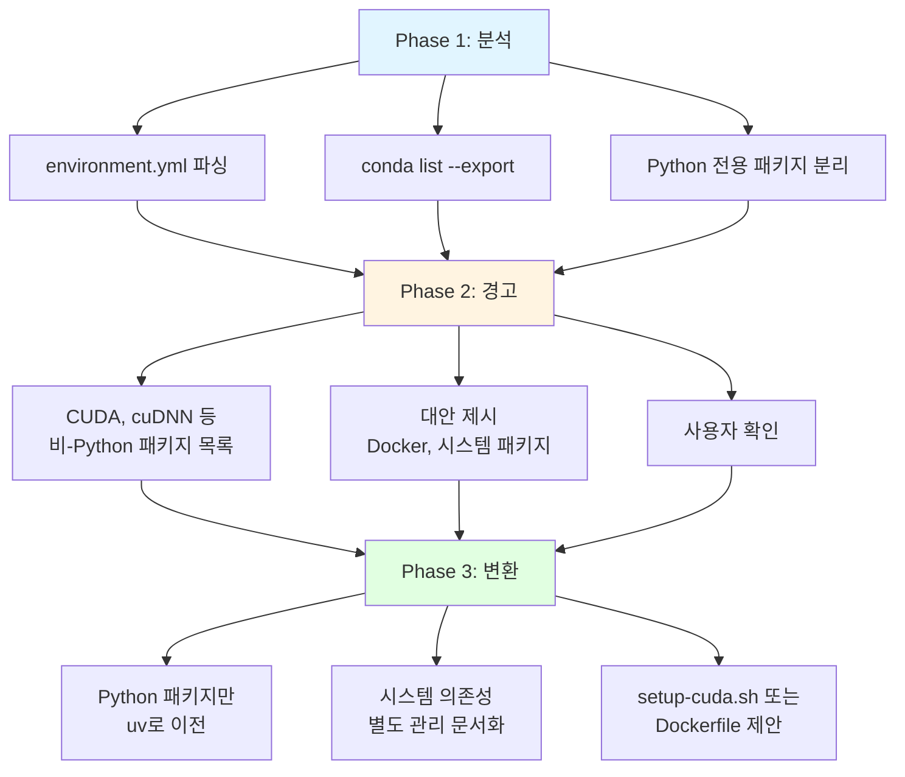
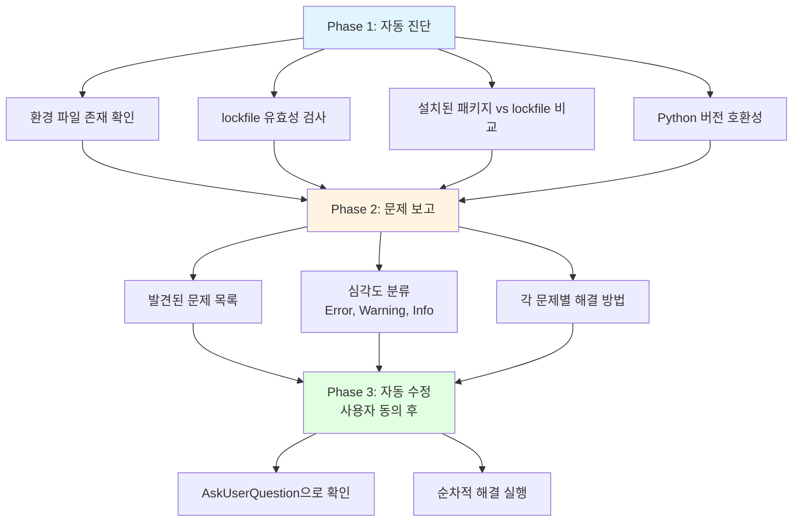

# setup-uv-env

> uv 기반 Python 가상환경 설정 및 관리

---

## 목적

1. **일관된 환경 구성**: uv를 사용한 표준화된 가상환경 설정
2. **의존성 관리 자동화**: pyproject.toml + uv.lock 기반 관리
3. **마이그레이션 지원**: pip, Poetry, Conda에서 uv로 전환
4. **베스트 프랙티스 적용**: 검증된 패턴으로 환경 구성

---

## 사용법

```
/setup-uv-env [action]
```

| Action | 설명 |
|--------|------|
| `init` | 새 프로젝트 환경 초기화 |
| `add` | 의존성 추가 (대화형) |
| `sync` | 환경 동기화 |
| `migrate` | 기존 프로젝트 마이그레이션 |
| `check` | 환경 상태 점검 |
| `doctor` | 문제 진단 및 해결 |

---

## Action 상세

### 1. init - 프로젝트 초기화

새 프로젝트 또는 기존 프로젝트에 uv 환경 설정.

#### AskUserQuestion 활용 지점

**지점 1: Python 버전 선택**

```yaml
AskUserQuestion:
  questions:
    - question: "Python 버전을 선택해주세요"
      header: "Python 버전"
      multiSelect: false
      options:
        - label: "3.11 (권장)"
          description: "안정적 | 대부분의 패키지 호환 | 성능 개선"
        - label: "3.12"
          description: "최신 | 성능 향상 | 일부 패키지 미지원 가능"
        - label: "3.13"
          description: "실험적 | 최신 기능 | 호환성 주의"
        - label: "3.10"
          description: "구버전 호환 | 안정적"
```

**지점 2: 프로젝트 타입별 의존성**

```yaml
AskUserQuestion:
  questions:
    - question: "기본 의존성을 추가할까요?"
      header: "의존성 설정"
      multiSelect: false
      options:
        - label: "예 - 프로젝트 타입에 맞게 추가 (권장)"
          description: "data-science: pandas, numpy | backend: fastapi | cli: click"
        - label: "아니오 - 최소 환경만"
          description: "수동으로 나중에 추가"
        - label: "커스텀 선택"
          description: "필요한 패키지만 선택"
```

#### 실행 프로세스



#### 명령어 시퀀스

```bash
# 1. uv 설치 확인
which uv || echo "uv not installed"

# 2. 프로젝트 초기화 (pyproject.toml 없으면)
uv init

# 3. Python 버전 고정
uv python pin 3.12

# 4. 기본 의존성 추가
uv add --dev pytest ruff mypy

# 5. 환경 동기화
uv sync

# 6. 검증
uv run python --version
```

---

### 2. add - 의존성 추가

대화형 의존성 추가 지원.

#### 실행 프로세스



#### 의존성 그룹 가이드

| 그룹 | 포함 패키지 | 명령어 |
|------|------------|--------|
| `dev` | pytest, ruff, mypy, pre-commit | `uv add --dev` |
| `docs` | mkdocs, mkdocs-material | `uv add --group docs` |
| `test` | pytest-cov, hypothesis | `uv add --group test` |

---

### 3. sync - 환경 동기화

팀원 변경사항 반영 또는 환경 초기화.

```bash
# 기본 동기화
uv sync

# 모든 그룹 포함
uv sync --all-extras

# 특정 그룹만
uv sync --group dev
```

---

### 4. migrate - 마이그레이션

기존 프로젝트를 uv로 전환.

#### 4.1 pip + requirements.txt



#### 4.2 Poetry



#### 4.3 Conda



---

### 5. check - 환경 점검

현재 환경 상태 진단.

```bash
# 점검 항목
echo "=== uv 상태 ==="
uv --version
which uv

echo "=== Python 상태 ==="
uv python list --installed
cat .python-version 2>/dev/null || echo "No .python-version"

echo "=== 가상환경 상태 ==="
ls -la .venv 2>/dev/null || echo "No .venv"
uv run python --version

echo "=== 의존성 상태 ==="
uv tree

echo "=== Lockfile 상태 ==="
ls -la uv.lock 2>/dev/null || echo "No uv.lock"
```

#### 출력 형식

```markdown
## 환경 점검 결과

| 항목 | 상태 | 상세 |
|------|------|------|
| uv 설치 | OK | v0.5.x |
| Python 버전 | OK | 3.12.0 |
| 가상환경 | OK | .venv/ 존재 |
| pyproject.toml | OK | 존재 |
| uv.lock | OK | 존재, 동기화됨 |
| 의존성 | OK | 15개 패키지 설치 |

### 권장 조치
- 없음 (환경 정상)
```

---

### 6. doctor - 문제 진단

일반적인 문제 자동 진단 및 해결.

#### 진단 항목

| 문제 | 원인 | 자동 해결 |
|------|------|----------|
| `.venv` 없음 | 초기화 안됨 | `uv sync` |
| lockfile 불일치 | OS/Python 버전 차이 | `uv lock --upgrade` |
| 패키지 import 실패 | 미설치 | `uv sync` |
| Python 버전 불일치 | `.python-version` 차이 | `uv python install` |

#### 실행 프로세스



---

## 프로젝트 타입별 기본 구성

### App (일반 애플리케이션)

```toml
[project]
name = "my-app"
version = "0.1.0"
requires-python = ">=3.10"
dependencies = []

[tool.uv]
dev-dependencies = [
    "pytest>=7.0",
    "ruff>=0.8.0",
    "mypy>=1.0",
]
```

### Library (배포용 라이브러리)

```toml
[project]
name = "my-lib"
version = "0.1.0"
requires-python = ">=3.10"
dependencies = []
classifiers = [
    "Development Status :: 3 - Alpha",
    "License :: OSI Approved :: MIT License",
    "Programming Language :: Python :: 3.10",
    "Programming Language :: Python :: 3.11",
    "Programming Language :: Python :: 3.12",
]

[build-system]
requires = ["hatchling"]
build-backend = "hatchling.build"

[tool.uv]
dev-dependencies = [
    "pytest>=7.0",
    "ruff>=0.8.0",
    "mypy>=1.0",
    "build>=1.0",
    "twine>=4.0",
]
```

### Data Science

```toml
[project]
name = "my-ds-project"
version = "0.1.0"
requires-python = ">=3.10"
dependencies = [
    "pandas>=2.0",
    "numpy>=1.24",
    "scikit-learn>=1.3",
    "matplotlib>=3.7",
]

[tool.uv]
dev-dependencies = [
    "pytest>=7.0",
    "ruff>=0.8.0",
    "mypy>=1.0",
    "jupyterlab>=4.0",
    "ipykernel>=6.0",
    "nbstripout>=0.6",
]
```

---

## 사용 예시

### 예시 1: 새 프로젝트 시작

```
User: /setup-uv-env init

Claude: 프로젝트 환경을 초기화합니다.

현재 상태를 확인했습니다:
- pyproject.toml: 없음
- requirements.txt: 없음
- .venv: 없음

[AskUserQuestion 호출]
question: "Python 버전을 선택하세요"
options:
  - "3.12 (Recommended)" - 최신 안정 버전
  - "3.11" - 널리 사용되는 버전
  - "3.10" - 호환성 중시

User: (3.12 선택)

Claude: Python 3.12로 설정합니다.

[AskUserQuestion 호출]
question: "프로젝트 타입을 선택하세요"
options:
  - "App" - 일반 애플리케이션
  - "Library" - 배포용 라이브러리
  - "Data Science" - 데이터 분석/ML

User: (Data Science 선택)

Claude: 환경을 구성합니다...

```bash
uv init
uv python pin 3.12
uv add pandas numpy scikit-learn matplotlib
uv add --dev pytest ruff mypy jupyterlab ipykernel
uv sync
```

환경 초기화 완료.
- Python: 3.12
- 가상환경: .venv/
- 의존성: 10개 패키지

`uv run python` 또는 `uv run jupyter lab`으로 시작하세요.
```

### 예시 2: 기존 프로젝트 마이그레이션

```
User: /setup-uv-env migrate

Claude: 기존 프로젝트를 분석합니다.

발견된 파일:
- requirements.txt (23개 패키지)
- requirements-dev.txt (8개 패키지)
- setup.py (레거시)

[AskUserQuestion 호출]
question: "마이그레이션을 진행할까요?"
options:
  - "진행 (Recommended)" - uv로 전환, 기존 파일 백업
  - "분석만" - 변환 계획만 출력

User: (진행 선택)

Claude: 마이그레이션을 시작합니다...

1. pyproject.toml 생성
2. requirements.txt 의존성 추가
3. requirements-dev.txt → dev 그룹 추가
4. uv lock 생성
5. uv sync 실행

마이그레이션 완료.
백업 파일: requirements.txt.bak, requirements-dev.txt.bak

검증:
- uv run python --version: 3.12.0
- uv run pytest: 통과
```

---

## Quick Reference

| 작업 | 명령어 |
|------|--------|
| 의존성 추가 | `uv add package` |
| 개발 의존성 | `uv add --dev package` |
| 환경 동기화 | `uv sync` |
| 스크립트 실행 | `uv run python script.py` |
| 테스트 실행 | `uv run pytest` |
| 린트 | `uv run ruff check .` |
| 포맷 | `uv run ruff format .` |
| lockfile 업데이트 | `uv lock --upgrade` |

---

## 관련 스킬

| 스킬 | 역할 | 연계 |
|------|------|------|
| [@skills/project-init/SKILL.md] | 프로젝트 초기화 | setup-uv-env 호출 |
| [@skills/scaffold-structure/SKILL.md] | 폴더 구조 생성 | 환경 설정 전 실행 |
| [@skills/quality-ruff/SKILL.md] | Ruff 설정 | uv add --dev ruff 후 |
| [@skills/quality-precommit/SKILL.md] | pre-commit 설정 | 환경 구성 후 |

---

## 레퍼런스

- [uv 베스트 프랙티스](@.claude/docs/references/research/uv-best-practices.md)
- [uv 공식 문서](https://docs.astral.sh/uv/)

---

## Changelog

| 버전 | 날짜 | 변경 내용 |
|------|------|-----------|
| 1.0.0 | 2026-01-21 | 초기 생성 - init, add, sync, migrate, check, doctor 액션 |

## Gotchas (실패 포인트)

- `uv sync` 후 `uv run` 사용 — 직접 `python` 또는 `pip` 실행 금지
- .python-version 파일 없으면 시스템 Python 사용 — 버전 불일치 위험
- lock 파일 없이 `uv add` 사용 시 재현성 깨짐
